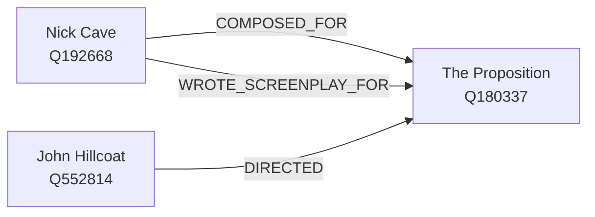

# Segue

A personal interest graph, with receipts.

A segue is how one thing leads into the next, and that move is the whole point. You put the things
you care about into segue — people, bands, films, books, places — and it pulls in their real
relationships from Wikidata. Then you ask it how two of them connect, and it answers with the
**route**, hop by hop, with the source behind every hop. Not "these are similar": *this* person
scored *that* film, which *this other* person directed.

Segue runs as an [MCP](https://modelcontextprotocol.io) server. You drive it from an MCP client —
Claude Code, Claude Desktop, or anything else that speaks the protocol — which calls its six tools
on your behalf. There is no UI, and whether that is pleasant enough is the open question the project
exists to answer.

**New here? Start with [the user guide](docs/user-guide.md)** — it takes you from an unbuilt
checkout to a graph you can ask questions of, with every example captured from a real run.

## What it gives you

Ask for the routes between Nick Cave and the director John Hillcoat, and among the answers are these
two:



**What that diagram shows.** Three entities. Nick Cave has two separate arrows to the film *The
Proposition* — one labelled `COMPOSED_FOR`, one labelled `WROTE_SCREENPLAY_FOR`. John Hillcoat has
one arrow to the same film, labelled `DIRECTED`. Cave and Hillcoat have no direct connection; the
film is the bridge, and there are two distinct ways across it.

Two relationships between one pair of nodes, kept apart rather than collapsed, and each hop carrying
the Wikidata claim that backs it. That is a multigraph with provenance on every edge, and it is the
property most of the design decisions are protecting. [The full response, with citations, is in the
user guide](docs/user-guide.md#6-ask-for-the-route).

## Quick start

```bash
./gradlew bootJar
java -Dspring.profiles.active=stdio -jar build/libs/segue-*.jar
```

That is the stdio transport, which is what an MCP client launching segue as a subprocess wants.
Point a client at it:

```json
{
  "mcpServers": {
    "segue": {
      "command": "java",
      "args": [
        "-Dspring.profiles.active=stdio",
        "-jar",
        "/absolute/path/to/segue/build/libs/segue-0.1.0-SNAPSHOT.jar"
      ]
    }
  }
}
```

A plain `java -jar build/libs/segue-*.jar` starts the Streamable HTTP transport instead — bound to
loopback, refusing any non-loopback `Origin` or `Host`, with no authentication because there is
nothing to authenticate to a server only you can reach. Both transports, both config blocks and the
`curl` handshake are in
[the user guide's "Connect a client" section](docs/user-guide.md#connect-a-client).

Your graph lives in one SQLite file, `~/.segue/segue.db` by default; `SEGUE_DB` moves it.

## The six tools

| Tool | What it does |
|---|---|
| `search_entities` | Free-text search for candidates carrying Wikidata QIDs |
| `add_entity` | Fetch one QID's canonical identity and put it in the graph |
| `expand_entity` | Discover an entity's relationships and record them as edges |
| `get_entity` | One entity, its neighbours grouped by relationship, and your rating |
| `find_paths` | Every route between two entities, ranked, with citations |
| `note_affinity` | Record what you think of one entity, 1 to 5 |

Six, and a seventh needs an ADR saying why —
[ADR 26, on the MCP tool surface](docs/adr/0026-mcp-tool-surface.md). What each one is for, and the
traps in each, are in [the user guide's tool reference](docs/user-guide.md#the-six-tools).

## The ideas underneath

Three properties shape almost every decision in the codebase.

- **It is a multigraph.** Two entities can be connected by several different relationships at once,
  and collapsing them loses real answers — as the diagram above shows.
- **Provenance is first class.** Every edge records who claimed it, when, and how much that claim is
  trusted. Corroboration across sources is a signal the ranking uses, so a well-sourced long route
  outranks a shaky short one — but only among routes that explain the same amount, because a route
  through a node half the graph touches is demoted whatever its sources say
  ([ADR 31](docs/adr/0031-path-ranking-by-confidence.md)).
- **Time has two dimensions.** When something was true in the world is independent of when segue
  learned it, and the two are never conflated ([ADR 20](docs/adr/0020-bitemporal-time-model.md)).

Two more decisions are worth knowing before you read any code. The append-only assertion log is the
source of truth and the graph is a projection of it
([ADR 19](docs/adr/0019-assertion-log-source-of-truth.md)). And entity kinds are a closed set of six
— PERSON, GROUP, WORK, PLACE, EVENT, CONCEPT — because "musician", "novelist" and "director" are
*roles*, expressed as edges. One Nick Cave node is all three at once and the enum never grows
([ADR 21](docs/adr/0021-six-kind-ontology.md)).

## The taste layer, and your privacy

`note_affinity(qid, rating, note?)` records what you think of one entity: a required integer rating
from 1 to 5, and optionally a note in your own words. Reading it back is part of `get_entity`; there
is no separate read tool and no way to list everything you have rated through a tool
([ADR 39](docs/adr/0039-affinity-capture-and-read.md) argues both).

**The two fields are not treated the same, and that is the decision worth knowing.** The rating is
ordinary data here: a model may read it back, weight a recommendation by it and talk about it,
because a 1-5 score is the list of things you already chose to put in the graph at a higher
resolution. **The note never reaches a model** — not through `get_entity`, not in `note_affinity`'s
own reply — because free text can say anything, and a tool result becomes context that leaves the
machine. `./gradlew listRatings` reads your notes back, on your machine.
[ADR 33](docs/adr/0033-taste-layer-separation.md) argues both sides of that split.

It **never touches the graph**. Affinity lives in its own table behind its own port, carries no
provenance and no corroboration, and is not an assertion — so the world graph can be exported or
shared with none of it attached. Re-rating overwrites; there is no history. Rating something
requires a Wikidata QID, so something Wikidata does not have cannot be rated at all. That is an
accepted cost of having one identity spine
([ADR 33](docs/adr/0033-taste-layer-separation.md), [ADR 22](docs/adr/0022-wikidata-identity-and-vocabulary.md)).

Affinity is personal data ([ADR 16](docs/adr/0016-privacy-and-data-handling.md)). It is never
logged — not the rating, not the note, not in an error message — and it lives in the SQLite file
under your home directory, outside this repository. **Never put a real rating or note in a fixture,
an ADR, a commit message or an example here**; this repository is public, and that, not repository
visibility, is the actual boundary (issue #37).

## Building and testing

```bash
./gradlew check    # format, tests, coverage, architecture rules — the full CI gate
```

No infrastructure to stand up: the graph engines are in-process and the store is one SQLite file.
`./gradlew liveTest` runs the tagged tests that call the real Wikidata and MusicBrainz APIs; they are excluded from
`check` on purpose.

The suite is layered — domain record invariants with no store, a contract test run against both
graph adapters, and ArchUnit rules that enforce the ADRs mechanically. `docs/developer-guide.md`
covers building, testing and extending segue in detail.

## Documentation

| Document | For |
|---|---|
| [User guide](docs/user-guide.md) | Getting segue running and actually using it |
| `docs/developer-guide.md` | Building, testing and extending it |
| [Architecture decision records](docs/adr/README.md) | Every design choice, with its alternatives and consequences |
| [The engine bake-off](docs/engine-bake-off.md) | The two-engine comparison that chose the graph database |
| [The retry-precondition measurement](docs/retry-precondition-evidence.md) | The sixty-run trace study behind ADR 46's retry precondition |
| [The retry pool-flush evidence](docs/retry-pool-flush-evidence.md) | Round 2: the eighty-one-run trace study behind ADR 46's second retry amendment |
| [The loopback-only flush measurement](docs/loopback-only-evidence.md) | Round 3: what the flush does once the test browser can reach nothing but loopback |

### Why the bake-off has its own page

This README used to open with it. Segue started as an experiment to decide, empirically, whether
Gremlin or RDF/SPARQL was the better home for a provenance-first graph: one domain model, one port,
two engines, four queries. That experiment is finished, it produced a genuine finding, and
[ADR 18](docs/adr/0018-graph-engine-gremlin.md) rests on it — so none of it has been deleted. But it
is a decision record about storage, and a decision record is the wrong front door for a project that
has since grown a Wikidata ingest, an MCP server on two transports and a taste layer. It now lives
at [docs/engine-bake-off.md](docs/engine-bake-off.md), unabridged.

## Status

Slice 0 — the domain model and the engine bake-off — is complete, and so are the increments built on
it: the source-adapter SPI, the Wikidata ingest with reverse lookup, the MCP server on both
transports, and the taste layer. Remaining work is tracked as GitHub issues.

Recommendations — the thing this README used to list as not built — now exist, as a dev-side tool
rather than a seventh MCP tool: `./gradlew recommend` ranks entities *absent* from a list of what you
already know by how much more of that list reaches them than their size in the graph predicts, and
explains each one with real cited routes. Why that scoring, why not PageRank, and why it is not a
tool a model can call are all in
[ADR 45](docs/adr/0045-recommend-by-normalised-lift-with-routes.md). The limits you will actually hit
today are written down honestly in [the user guide](docs/user-guide.md#honest-limits).

The open risk is unchanged from the original plan: whether MCP is a pleasant *authoring* interface,
or whether you want a UI within ten minutes.
