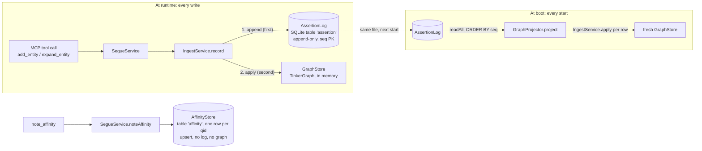
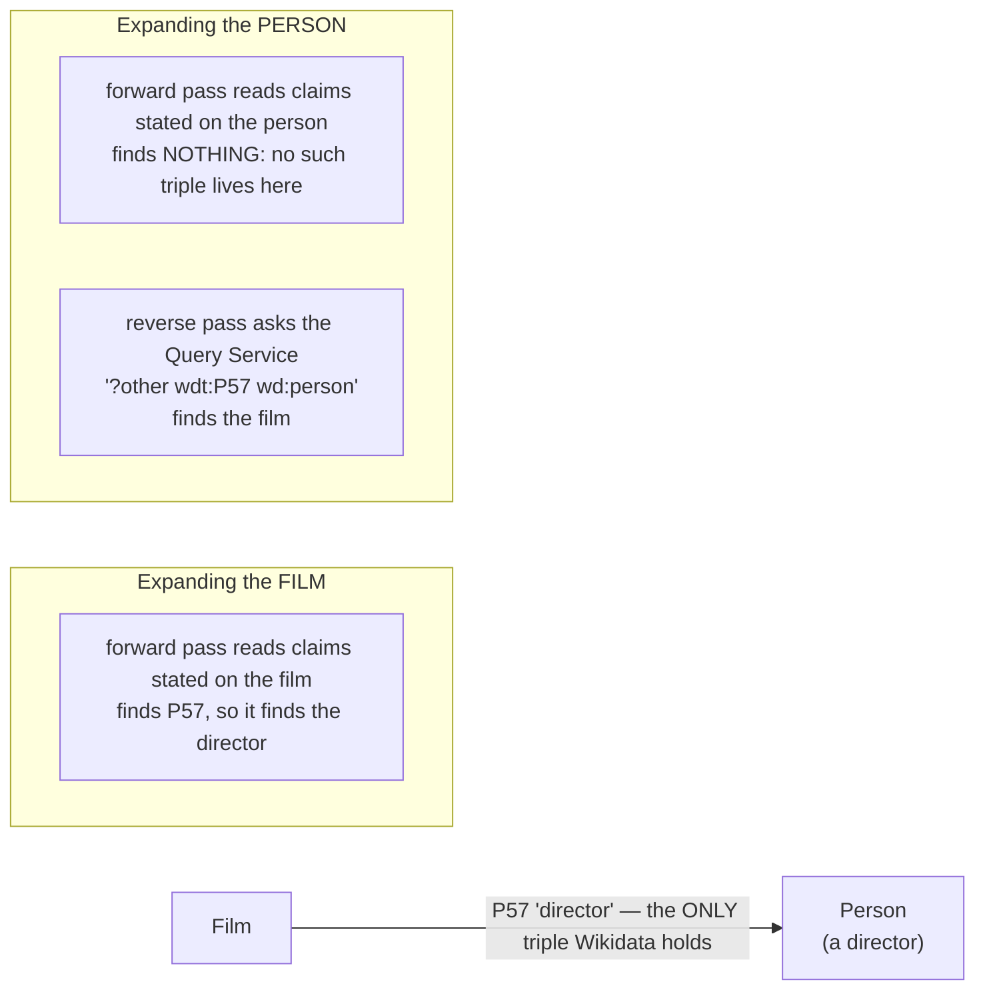
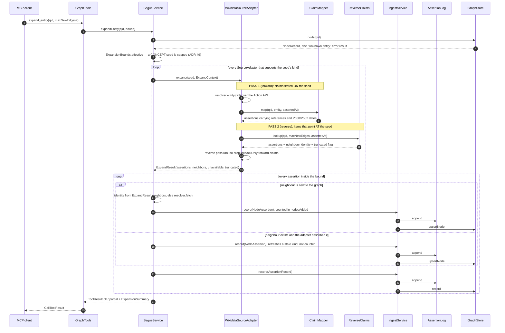

# Segue developer guide

Orientation and mechanism for someone about to change this codebase.

This guide answers **how the system fits together** and **where the load-bearing machinery is**. It
does not re-argue any decision: the [architecture decision records](adr/README.md) are the authority
on *why*, and every section below links to the ones that matter. Where this guide and an ADR
disagree, the ADR wins on intent and the code wins on fact — and the disagreement is a bug in one of
them, to be fixed rather than annotated.

Everything here was checked against the source in `src/main/java/com/robsartin/segue/` and
`src/test/java/com/robsartin/segue/arch/ArchitectureTest.java`, not against the ADRs.

## Contents

- [What segue is, in one pass](#what-segue-is-in-one-pass)
- [The model: what segue can represent](#the-model-what-segue-can-represent)
- [The layering](#the-layering)
- [The log is the truth; the graph is a projection](#the-log-is-the-truth-the-graph-is-a-projection)
- [Two-pass ingest](#two-pass-ingest)
- [The taste layer](#the-taste-layer)
- [Adding a source adapter](#adding-a-source-adapter)
- [The testing strategy](#the-testing-strategy)
- [The build and the gate](#the-build-and-the-gate)
- [Bulk seeding](#bulk-seeding)
- [Looking at the graph](#looking-at-the-graph)
- [Looking at what you have rated](#looking-at-what-you-have-rated)
- [Looking at the shape of your graph](#looking-at-the-shape-of-your-graph)
- [Taking something back out](#taking-something-back-out)
- [What to explore next](#what-to-explore-next)
- [Rating one card at a time](#rating-one-card-at-a-time)
- [Claiming something no source has](#claiming-something-no-source-has)
- [How to read an ADR against the code](#how-to-read-an-adr-against-the-code)

## What segue is, in one pass

Segue is an MCP server over a personal interest graph. Nodes are entities identified by Wikidata
QIDs; edges are relationships, each carrying the provenance of who claimed it. The payoff feature is
`find_paths`: given two entities, return every route between them, ranked so the best-evidenced
route wins rather than the shortest one.

Three facts explain most of the design:

1. **Nothing is stored as a bare fact.** The unit of ingest is an *assertion* — one source's claim
   that a relationship exists, with a confidence grade and a timestamp. Edges are what you get when
   assertions about the same `(from, type, to)` are folded together.
   See [ADR 19: the assertion log is the source of truth](adr/0019-assertion-log-source-of-truth.md).
2. **The graph is disposable.** It is rebuilt from the log at every boot. That is what makes the
   graph-engine choice reversible, and it is why the log is appended before the graph is touched.
   See [ADR 24: SQLite assertion log](adr/0024-sqlite-assertion-log.md).
3. **What the user likes is not a fact about the world.** Ratings live in a separate table behind a
   separate port and never enter the log or the graph.
   See [ADR 33: taste layer separation](adr/0033-taste-layer-separation.md).

The tool surface is fixed at six tools by
[ADR 26: the MCP tool surface](adr/0026-mcp-tool-surface.md); the tools themselves are the
`@McpTool`-annotated methods on `EntityTools`, `GraphTools` and `TasteTools`, and
`ToolSurfaceTest` fails if a seventh appears.

## The model: what segue can represent

Everything in the graph is one of **six kinds** of node, joined by relations drawn from **one flat
controlled vocabulary**. That is the whole shape, and it is deliberately smaller than the domains it
covers.

**This section is the rules. The code is the list.** Issue #46 found ADR 32's rules table naming
nine rules when `ArchitectureTest` enforced eighteen, and the fix was to make the ADR say that the
test is the list. Same discipline here: nothing below reproduces a vocabulary, a class mapping or a
weight table, because a second copy of one is a drift generator.

| Question | The authority |
| --- | --- |
| Which kinds are there? | `NodeKind` |
| Which relations are there, and is each one inverted, fallback-only, derived or symmetric? | `EdgeTypes` |
| Which Wikidata `P31` classes map to which kind? | `KindMapper` |
| What is a hop of each relation worth to a recommendation, and does its direction mean anything? | `RecommendationWeights` |

Counted on 2026-08-28 against those files, that is six kinds, fifteen relations and fifty-three
class mappings. The numbers are here to sanity-check a reading, not to be cited; two of the three
are expected to grow, and the first is not.

### Six kinds, closed, and roles are edges

`NodeKind` has six constants and is intended never to gain a seventh. "Musician", "novelist" and
"director" are **roles**, and a role is an edge — `PERFORMED`, `AUTHORED`, `DIRECTED` — so one Nick
Cave node is all three at once and the enum stays put. **Wanting to add `MUSICIAN` or `FILM` is a
signal that the model is being used wrong**, not a requirement to satisfy.
[ADR 21](adr/0021-six-kind-ontology.md) is the decision, and it states the cost honestly: a query
that genuinely wants "films only" filters on edge type or on the stored classes, because there is no
`FILM` kind to filter on.

The same ADR settles that there is **one flat relation namespace** rather than a vocabulary per
domain. Music, film and literature relations are all relations between the same six kinds, which is
why a cross-domain route needs no bridge.

**`CONCEPT` is the fallback, and two later rules depend on it staying one.** `KindMapper` whitelists
a short list of Wikidata classes and everything else falls through, so `CONCEPT` means "this could
not be placed" rather than "this is an idea". [ADR 31](adr/0031-path-ranking-by-confidence.md)'s
issue-#52 amendment demotes a route through a high-degree `CONCEPT` intermediate, and
[ADR 38](adr/0038-award-received-as-the-first-non-collaboration-edge.md) requires an award node to
be a `CONCEPT` — enforced by a test, because a `KindMapper` entry that placed awards somewhere else
would switch the hub rule off silently.

### The vocabulary is borrowed from Wikidata, never invented

Every relation a source states is anchored to a Wikidata property — `MEMBER_OF` is P463, `DIRECTED`
is P57, `RECEIVED_AWARD` is P166 — so adding one is a measurement rather than a naming exercise.
[ADR 22](adr/0022-wikidata-identity-and-vocabulary.md).

**The exceptions declare themselves in the type.** `EdgeType.wikidataProperty` is null for a
relation no source states: `COLLABORATED_WITH` is derived from co-credits and `SIMILAR_TO` arrives
from a similarity source. The null is the record that nothing was fetched, and `ClaimMapper` reads
the vocabulary as its ingest whitelist, so a null-property type simply never matches a claim.

### `inverted` records which end of the edge Wikidata states it on

Wikidata states most creative relations on the **work** — `film P57 person` — while an affinity
graph reads better from the person. `EdgeType.inverted` records that, so ingest flips it
mechanically and the stored edge reads `person DIRECTED film` (ADR 22).

**The flag fixes direction, not discovery**, and conflating the two is the easiest mistake to make
here. Expanding the person reads the person's own claims and finds nothing, because the triple is
not stored there; recovering it takes a second, reverse pass. See
[Two-pass ingest](#two-pass-ingest) and [ADR 36](adr/0036-reverse-lookup-via-sparql.md).

### `fallbackOnly` is for a property that is the other end of one already registered

Wikidata defines P527 ("has part") as the inverse of both P463 and P361 — one relationship, stated
from the opposite end — so reading both ends records one membership as two edges.
`EdgeType.fallbackOnly` marks that case, and the effect is that the property is read **only on the
degraded path**, where the pass that would have found the better-stated direction could not run.
ADR 36's issue-#33 amendment is the decision and the measurement; the mechanism is in
[The fallback-only subtraction](#the-fallback-only-subtraction).

The rule for a new property is short: **if it is Wikidata's inverse of one already in `EdgeTypes`,
mark it `fallbackOnly` or do not register it at all.** There is deliberately no inverted variant of
the factory — registering both ends of one inverse pair *as* inverted would mean the vocabulary held
the same edge twice by construction.

### Direction is read for recommendations, and not for routing

The same edge means different things to the two consumers, and that is deliberate.

- **`find_paths` is undirected.** `Hop.traversedBackwards` records which way the walk crossed an
  edge so the rendered citation reads correctly; it does not forbid the crossing. Nor does routing
  weigh relations against each other — `PathRanking` orders by hypothesis-last, then specificity
  (the hub rule), then weakest confidence, so **a shared influence and a shared award of equal
  confidence rank equally**. Every registered relation is legitimate evidence that two entities are
  connected. [ADR 31](adr/0031-path-ranking-by-confidence.md).
- **The recommender reads both the type and the arrow.** `RecommendationWeights` puts every relation
  in a tier, and separately marks whether its direction states a *debt*. A hop the
  candidate is the subject of — the candidate citing your list, rather than being cited by it — is
  worth a fraction of the same hop stated about it, and **only the candidate's own hop is asked**;
  discounting the hop out of your own entities would demote exactly the ancestors the tool exists to
  surface. [ADR 45](adr/0045-recommend-by-normalised-lift-with-routes.md) and its issue-#84
  amendment.

Tier and direction are two dimensions in one table row because neither is derivable from the other:
`BASED_ON` and `MEMBER_OF` are both collaborations and only one states a debt, while `INFLUENCED_BY`
and `BASED_ON` are both debts in different tiers. Direction of esteem is a **recommendation policy,
not a fact about the vocabulary**, which is why it lives in `RecommendationWeights` and not on
`EdgeType`.

### `NodeKind` is a derivation, not a fact

A node claim stores the raw `P31` classes the source stated, beside the kind derived from them, and
both projections re-derive the kind at projection time with no network.
[ADR 42](adr/0042-store-p31-and-rederive-kind-at-projection.md).

That is what makes an improvement to `KindMapper` reach entities the graph already holds. Before it,
the seventeen classes added across issues #49 and #52 could only take effect by re-fetching every
entity from Wikidata, which cost two full re-seeds. Three properties of the rule are load-bearing:

- **It is always on, never a flag.** An opt-in correction is one every future caller has to
  remember, and forgetting it is invisible.
- **A claim stating no classes keeps the kind it recorded.** Not every source is Wikidata, and one
  that classifies without stating classes has nothing to re-derive from.
- **When classes are stated the mapper is the authority, including when it answers `CONCEPT`.**
  Otherwise the whitelist would be a ratchet, where additions propagate and corrections never do.

The rule lives in `KindMapper`, beside the table it re-applies, because `GraphProjector` and
`LogProjection` both call it and two copies would be free to disagree about a graph and a picture of
that graph.

### Confidence is graded, and the grade records what could be seen

[ADR 23](adr/0023-quarantine-model-generated-assertions.md) fixes one confidence convention across
every adapter, and ADR 36 explains why the same relationship can arrive at two different grades:

- A **forward** Wikidata claim is read as a full statement, so its reference block and qualifiers
  are visible. `ClaimMapper` grades it 1.00 when it carries a reference and 0.80 when it does not.
- A **reverse** hit is a truthy `wdt:` triple, which exposes neither. `ReverseClaims` therefore
  grades it 0.80 unconditionally and records no `validFrom`/`validTo` — the honest reading of an
  unknown is the lower one, not the optimistic one.

Two consequences follow that look surprising until you know this. The two hops of one route can
carry different confidences, and `PathResult.weakestConfidence()` reports the shakier — a route is
only as trustworthy as its worst hop. And forward claims are concatenated **first**, before
`maxNewEdges` bites, so the better-evidenced ones survive truncation; see
[Ordering, bounds and degradation](#ordering-bounds-and-degradation).

### Adding a relation type

The pattern is ADR 38's, and the point of it is that the decision is made against a measurement
rather than against an intuition.

1. **Measure the hub size before anything else.** Ask the Query Service how many items point at the
   biggest node the property reaches. ADR 38 did exactly that for the four obvious candidates, and
   the answer decided the design: award received reached a 127-item node where genre, occupation and
   record label reached nodes two orders of magnitude larger *(measured 2026-08-25 against WDQS; the
   figures and the queries are in that ADR)*. A relation that connects everything to everything has
   stopped saying anything, and `PathRanking` cannot rescue it — a hub edge is perfectly confident,
   merely uninformative.
2. **Admit one property, not five.** One property produces a real graph to judge the next question
   against. ADR 38's open question 1 — whether the selection criterion is a threshold on hub degree,
   and what that threshold is — **is still open**, so there is no mechanical rule to apply yet, and
   registering a second property on the strength of the first is not licensed by it.
3. **Choose the factory from Wikidata's own modelling, not from taste.** Which end states the triple
   decides `direct` against `inverted`; whether the property is the inverse of one already
   registered decides `fallbackOnly`; a relation no source states at all is `derived`, with a null
   property. Get this wrong and the symptom is quiet: every citation `find_paths` prints reads
   backwards, or one relationship arrives as two edges.
4. **Weigh it for recommendations — both dimensions.** A tier, and whether its direction states a
   debt. `RecommendationWeightsTest.everyRegisteredTypeIsNamed` fails the build if the table has not
   been told about the new type, so a new relation costs a decision rather than inheriting one.
5. **Record an ADR**, including the candidates you declined and the numbers you declined them on.
   The declined ones are the part a later reader needs.

Registering the type in `EdgeTypes` is all that ingest needs: the forward whitelist, the reverse
property set and the direction rule are all derived from the vocabulary rather than hand-kept — see
[Three couplings that must stay coupled](#three-couplings-that-must-stay-coupled).

**Adding a `P31` class to `KindMapper` is a smaller move with the same discipline.** One line, with
the label *and* the description confirmed against Wikidata rather than inferred from the QID, and
preferably measured against a real graph — the classes added by issues #49 and #52 came from
counting what was actually landing in `CONCEPT`. Since ADR 42 the addition reaches every node the
graph already holds, at the next boot, offline.

## The layering

Packages live under `com.robsartin.segue`. The dependency graph below was derived by extracting
every `import com.robsartin.segue.*` from `src/main/java` — it is what the code does, not what the
ADRs describe.

```mermaid
graph TD
  app["app<br/>SegueApplication, SegueConfiguration, WikidataMusicBrainzIdentity"]
  mcp["mcp<br/>EntityTools, GraphTools, TasteTools, SegueService"]
  ingest["ingest<br/>IngestService, GraphProjector"]
  tinker["tinker<br/>TinkerGraphStore"]
  jena["jena<br/>JenaGraphStore"]
  sqlite["sqlite<br/>SqliteAssertionLog, SqliteAffinityStore"]
  wikidata["wikidata<br/>resolver, adapter, ClaimMapper, ReverseClaims"]
  musicbrainz["musicbrainz<br/>MusicBrainzClient, adapter, MusicBrainzIdentity"]
  port["port<br/>GraphStore, AssertionLog, AffinityStore, SourceAdapter, EntityResolver"]
  domain["domain<br/>records + EdgeTypes"]
  support["support<br/>UuidV7, QidList, ClassLabels, DefaultDatabase, RequiredDatabase"]
  seed["seed<br/>SeedCli, SeedResolver, Adjudicator"]
  export["export<br/>ViewSelector, DotWriter, GraphMlWriter"]
  ratings["ratings<br/>RatingsCli, RatingsRun, RatingsTable"]
  retract["retract<br/>RetractCli, RetractRun"]
  recommend["recommend<br/>RecommendCli, CandidateSweep, Routes"]
  rate["rate<br/>RateCli, RateRun, Deck, RateServer, Card"]
  own["own<br/>OwnCli, OwnRun"]
  census["census<br/>CensusCli, CensusRun, Census, CensusReport"]
  evaluate["evaluate<br/>EvaluateCli, HeldOut, Scoring, EvaluationReport"]

  app --> mcp
  app --> ingest
  app --> port
  app --> tinker
  app --> sqlite
  app --> wikidata
  app --> musicbrainz
  app --> domain
  mcp --> ingest
  mcp --> port
  mcp --> domain
  mcp --> support
  mcp -.->|"one class only"| wikidata
  ingest --> port
  ingest --> domain
  ingest -.->|"KindMapper only"| wikidata
  tinker --> port
  tinker --> domain
  jena --> port
  jena --> domain
  sqlite --> port
  sqlite --> domain
  wikidata --> port
  wikidata --> domain
  musicbrainz --> port
  musicbrainz --> domain
  port --> domain
  seed --> port
  seed --> domain
  seed --> wikidata
  export --> port
  export --> domain
  export --> ingest
  export --> sqlite
  export --> tinker
  export --> support
  export --> wikidata
  ratings --> port
  ratings --> domain
  ratings --> sqlite
  ratings --> support
  retract --> port
  retract --> domain
  retract --> ingest
  retract --> sqlite
  retract --> support
  recommend --> port
  recommend --> domain
  recommend --> ingest
  recommend --> sqlite
  recommend --> tinker
  recommend --> wikidata
  recommend --> support
  rate --> port
  rate --> domain
  rate --> ingest
  rate --> sqlite
  rate --> tinker
  rate --> wikidata
  rate --> support
  rate ==>|"the one dev-tool dependency"| recommend
  own --> port
  own --> domain
  own --> ingest
  own --> sqlite
  own --> support
  census --> port
  census --> support
  census --> domain
  census --> sqlite
  census --> wikidata
  census ==>|"one fold, not two"| export
  evaluate --> domain
  evaluate --> recommend
  evaluate --> port
  evaluate --> support
```



**What the diagram shows.** Dependencies point downward and never back up. `domain` sits at the
bottom and depends on nothing else in the project. `port` depends only on `domain`. The five
adapters (`jena`, `musicbrainz`, `sqlite`, `tinker`, `wikidata`) each depend on `port` and `domain`
and on no sibling adapter — five is the count since
[ADR 54](adr/0054-musicbrainz-as-the-second-source.md), that list is
`ArchitectureTest.ADAPTER_PACKAGES` and a test holds this sentence to it, and `musicbrainz` is the
one that had to declare its identity seam rather than import the adapter that could satisfy it. `ingest` depends on
`port` and `domain`, plus one dotted edge to `wikidata`:
`GraphProjector` re-derives each node's kind from the `P31` its claim stored, through
`KindMapper.rederive`, which is what makes a mapper improvement reach nodes the graph already holds
([ADR 42](adr/0042-store-p31-and-rederive-kind-at-projection.md)). `mcp` depends on `ingest`, `port`, `domain`
and `support`, plus its own dotted edge to `wikidata` (explained below). `app` depends on almost
everything, because wiring is its job. `support` depends on nothing, and the packages that use it
are the ones the diagram below draws an edge to it from — that half is derivation-checked by
`DeveloperGuideEnumerationsTest.shouldDrawEveryImportEdgeWhenTheGuideDiagramsTheLayering`, so read
the edges rather than a count in this sentence, which nothing checks. Today they are:
`mcp` (`UuidV7`), `export` and `rate` (`ClassLabels`), `export`, `recommend` and `rate`
(`QidList`), `export`, `ratings`, `recommend` and `rate` (`DefaultDatabase` — issue #179's one
resolution for the four dev tools that keep a default), and `retract` and `own`
(`RequiredDatabase` — the sentence those two refuse with, since #179 gave them no default at all;
it resolves the path it quotes back by calling `DefaultDatabase` itself, so the rule has one home
and the two claim tools depend on neither a default nor the class that computes one). One thing a reader might expect and will
not find: `app` does not import `jena` at
all — the reference engine is reachable only from tests. **This paragraph used to name a second,
that `app` imports nothing from `domain`; that stopped being true in ADR 54**, because
`WikidataMusicBrainzIdentity` validates a seed QID with `Qid.looksLikeAQid` before putting it in a
SPARQL query, so the bridge in `app` holds one `domain` type.

`seed`, `export`, `ratings`, `retract`, `recommend`, `rate`, `own` and `census` are the eight dev-side tools. None is
reachable from the application — nothing imports any of them, and each is entered through its own
`main` behind a Gradle `JavaExec` task — and their arrows are the interesting part, because each
has a different relationship with the data and a different fence to match.

- **`seed` reaches `wikidata` and stops.** It may not touch `sqlite`, `tinker`, `jena`, `ingest`,
  `mcp`, `app` or any other dev tool (`ArchitectureTest.DEV_TOOL_PACKAGES`): it cannot open the
  database even to read it, which is the fence that makes a tool reading a private list of names
  safe ([ADR 40](adr/0040-bulk-seeding-as-a-dev-tool.md)).
- **`export` reaches `sqlite`, `tinker` and `ingest`**, because reading the graph is its whole job,
  and it may build a throwaway projection ([ADR 41](adr/0041-graph-exporter-views-and-formats.md)).
- **`ratings` reaches `sqlite` and nothing else**, because it needs the least: a bulk read of the
  `affinity` table and the node claims in the log, no traversal and no projection
  ([ADR 43](adr/0043-listing-your-own-ratings.md)).
- **`retract` reaches `sqlite` and `ingest`, and was the first to write a world-fact claim.**
  It appends one `Retraction` through `IngestService` and may not hold a `GraphStore` at all — a
  retraction has no graph half ([ADR 44](adr/0044-retraction-as-a-new-claim.md)).
- **`recommend` reaches `sqlite`, `tinker`, `ingest` and `wikidata`**, because it replays the log
  into a throwaway projection and traverses it, and it writes nothing at all
  ([ADR 45](adr/0045-recommend-by-normalised-lift-with-routes.md)).
- **`rate` reaches the same four and `recommend` itself**, one of the two dependencies between
  dev tools (the other is `census → export`), for the candidate half of the deck. It is the other
  tool that writes — to the taste layer only, through `AffinityStore.updateRating`, never through
  `IngestService` ([ADR 46](adr/0046-the-rating-deck.md)).
- **`own` reaches `sqlite` and `ingest`, and is the second that writes a world-fact claim.** It
  appends one of the owner's own claims — a minted entity, an owner edge, or a merge — through
  `IngestService.claim`, and holds no `GraphStore`: those claims do have a graph half, but a
  dev-side tool has no running graph to apply it to, so the projection catches up at the next boot
  the way it does after a retraction ([ADR 24](adr/0024-sqlite-assertion-log.md)). Its sibling
  fence is `theOwnerClaimToolOpensNothingElse`, and the decision is recorded in
  [ADR 59](adr/0059-owner-claims-as-a-third-layer.md).
- **`census` reaches `sqlite`, `support`, `export` and `wikidata`, and is the only dev-side tool
  whose whole output is aggregates.** It folds the log through `export.LogProjection` rather than folding
  it again — a third fold of one log is the drift `BothFoldsAgreeTest` exists to catch — and counts
  what comes out. It writes nothing, and `--db` is required
  ([ADR 63](adr/0063-a-read-only-census-of-the-graph.md)).

Tools with opposite relationships to the store cannot share a package and keep any fence
meaningful, which is why ADR 41 made the first two siblings, ADR 43 added a third rather than a
view, and ADR 44 a fourth rather than a mode of one of them.

### The two claim tools require `--db`, and `./gradlew own` will not say "task not found"

`retractEntity` and `ownClaim` refuse to run unless `--db` names a database
([ADR 60](adr/0060-the-claim-tools-require-an-explicit-database.md)). The dev tools that do keep a
default — `SEGUE_DB` if set, otherwise `${user.home}/.segue/segue.db` — are exactly the callers of
`support.DefaultDatabase.resolve`, which is one grep rather than a count anybody has to maintain
here; `hoverableSvg` and `seed` are not among them because neither has a `--db` at all. These two
have no default left to resolve.

**Why these two and not the rest.** They are the tools that append a **first-person claim about the
world** to a log [ADR 19](adr/0019-assertion-log-source-of-truth.md) forbids editing. A wrong row
cannot be taken back, only appended over. `rate` writes too, and deliberately keeps its default: it
writes a rating, which is recoverable by re-rating, and it is the tool the owner uses most.

**`SEGUE_DB` does not satisfy the requirement**, and that is the clause worth reading twice. An
agent's shell is initialised from the owner's profile, so it inherits the variable. An environment
variable cannot tell the owner apart from an agent running as the owner; a flag typed per
invocation can. `--dry-run` does not exempt either tool either — the refusal fires before any
database is opened, so there is no second path to reason about and no invocation anyone has to
remember as exempt.

**`./gradlew own` resolves to `:ownClaim` and runs. It does not report an unknown task, and it never
will.** Gradle matches abbreviated task names by camel-case hump, and there is no per-project switch
to turn that off. That is exactly how issue #179 happened: an agent typed `./gradlew own
--args="mint --kind WORK --label x"` expecting `Task 'own' not found`, and instead minted a row in
the owner's real database, because `--db` was absent and the default was the owner's. If you are
about to expect that error, you will not get it. What you will get now is the refusal, which names
`--db` and the path the tool would once have used, so the corrected command is a copy-paste.

**Write `$HOME`, not `~`.** A tilde does not expand inside double quotes in either zsh or bash, so
`--args="--db ~/.segue/segue.db"` arrives as a literal tilde and the tool dies with `no segue
database at ~/.segue/segue.db`. Every example in this guide and in both task descriptions uses
`$HOME`.

**What catches a default coming back, in order.** The refusal tests in `RetractCliTest` and
`OwnCliTest` are the first line and the effective one: three of them red per tool against every
reintroduction that has been tried. Two ArchUnit rules are the second line, and they earn their
place by surviving what the tests cannot — an edit that wires the default in *and updates the tests
to match*, which is how a guard usually dies. `theClaimToolsHaveNoDefaultDatabase` forbids either
package from depending on `support.DefaultDatabase` at all;
`theClaimToolsTakeTheirDatabaseFromTheFlagAlone` forbids taking a `java.nio.file.Path` out of
`support` by any route, because both tools do depend on `support.RequiredDatabase` for the refusal
sentence and a `Path`-returning method added there would restore the default without the first rule
noticing.

Both rules are scoped to one package and one class name, so three routes pass them — the rule
re-implemented inline, a `String`-returning helper, or a `Path`-returning helper in any other
package. All three were planted and measured; all three are caught by the refusal tests. See
[ADR 60](adr/0060-the-claim-tools-require-an-explicit-database.md) for what that costs and why the
line is drawn there.

### What each package is for

| Package | Contents | Depends on |
| --- | --- | --- |
| `domain` | Records and the borrowed edge vocabulary (`EdgeTypes`), plus `KnownList` — the pure rules that turn a `--known` file and the ratings map into the populations the dev tools need: what counts as owned ([ADR 48](adr/0048-a-high-rating-counts-as-something-you-have.md)), what is suppressed, and what a revision pass may deal ([ADR 50](adr/0050-suppress-a-candidate-you-have-rejected.md)). `promoted` and `suppressed` are each read by both `recommend` and `rate`, so the two tools cannot apply different answers; `revisitable` is read inside `rate` alone — `recommend` has no revision pass — and lives here so `Deck.dealRevision` and `RateRun`'s count of the same population cannot drift apart. No third-party dependencies at all. | nothing |
| `port` | The seams: `GraphStore`, `AssertionLog`, `AffinityStore`, `SourceAdapter`, `EntityResolver`, and their small value types. | `domain` |
| `tinker` | The chosen Gremlin adapter ([ADR 18](adr/0018-graph-engine-gremlin.md)). | `port`, `domain` |
| `jena` | The RDF reference adapter, kept working as a cross-check. | `port`, `domain` |
| `sqlite` | `SqliteAssertionLog` and `SqliteAffinityStore` — two tables in one file, two connections. | `port`, `domain` |
| `wikidata` | The first source: resolution, expansion, and the two mapping passes. Plain Java, no Spring. | `port`, `domain` |
| `musicbrainz` | The second source ([ADR 54](adr/0054-musicbrainz-as-the-second-source.md)): `MusicBrainzClient` over `ws/2`, `MusicBrainzSourceAdapter`, and `MusicBrainzIdentity` — the MBID-to-QID seam it declares and may not implement, because an adapter may not import another adapter. Expansion only; no `EntityResolver`. Plain Java, no Spring. | `port`, `domain` |
| `ingest` | `IngestService` (the only write path) and `GraphProjector` (boot replay). | `port`, `domain`, `wikidata` (`KindMapper` only, [ADR 42](adr/0042-store-p31-and-rederive-kind-at-projection.md)) |
| `support` | Cross-cutting plain-Java helpers with no project dependencies — `UuidV7` (request correlation), `QidList` (the QID-file reader `export`, `recommend` and `rate` share), `ClassLabels` (the offline `P31` label table `export` and `rate` share; it moved here from `export` when `rate` needed it), `DefaultDatabase` (the one `--db`/`SEGUE_DB`/`${user.home}` resolution `export`, `ratings`, `recommend` and `rate` share — issue #179; the live list is whoever calls `resolve`, so grep rather than trust these four names), and `RequiredDatabase` (the refusal `retract` and `own` give when `--db` was not typed; it calls `DefaultDatabase` for the path it quotes back and hands out a `String`, never a `Path`, so neither claim tool can take a default from it). | nothing |
| `mcp` | The tool classes, `SegueService`, the view records, `CorrelationId`. Spring-aware. | `ingest`, `port`, `domain`, `support` |
| `app` | Entry point, all bean wiring, `application.yaml`, transport profiles, and `WikidataMusicBrainzIdentity` — the P434 bridge that implements `musicbrainz`'s identity seam, placed here because it is the only package ADR 32 lets see two adapters at once. Spring-aware. | everything it wires |
| `seed` | The bulk seeding tool ([ADR 40](adr/0040-bulk-seeding-as-a-dev-tool.md)): a name list to `name → QID`, run as `./gradlew resolveNames`. Plain Java, never opens a store. | `port`, `domain`, `wikidata` |
| `export` | The graph exporter ([ADR 41](adr/0041-graph-exporter-views-and-formats.md)): `ViewSelector` and the two writers, run as `./gradlew exportGraph`. Plain Java, read-only. | `port`, `domain`, `ingest`, `sqlite`, `tinker`, `wikidata`, `support` |
| `ratings` | The taste-layer reader ([ADR 43](adr/0043-listing-your-own-ratings.md)): every rating with its label, note and `updated_at`, run as `./gradlew listRatings`. Plain Java, read-only, offline. | `port`, `domain`, `sqlite`, `support` |
| `retract` | The retraction tool ([ADR 44](adr/0044-retraction-as-a-new-claim.md)): appends one `Retraction` claim so the projection stops showing an entity and its edges, run as `./gradlew retractEntity`. Plain Java, offline, and the only dev tool that writes a world-fact claim. Since #179 it has no default database: `--db` is required, and `SEGUE_DB` does not satisfy it ([ADR 60](adr/0060-the-claim-tools-require-an-explicit-database.md)). | `port`, `domain`, `ingest`, `sqlite`, `support` |
| `recommend` | The recommender ([ADR 45](adr/0045-recommend-by-normalised-lift-with-routes.md)): ranks entities absent from the known-list by how much more of that list reaches them than their size predicts, and explains each with real routes. Run as `./gradlew recommend`. The list is the supplied `--known` file plus everything rated 4 or 5 that the file does not name, through `KnownList.promoted` ([ADR 48](adr/0048-a-high-rating-counts-as-something-you-have.md)) — so a highly rated entity stops being offered back — and since [ADR 50](adr/0050-suppress-a-candidate-you-have-rejected.md) the sweep also takes `KnownList.suppressed` as a separate set, so an entity rated 2 or below stops being offered back too. Plain Java, read-only, offline, and since issue #85 it weights every candidate by the owner's ratings — `Recommendations.regardFor` over `AffinityStore.readRatings`, the note-free half of the taste layer. (This row said it "cannot see the taste layer at all" until the final review of issue #101; that was already false on `main`.) | `port`, `domain`, `ingest`, `sqlite`, `tinker`, `wikidata`, `support` |
| `own` | The owner-claim tool (issue [#92](https://github.com/robsartin/segue/issues/92)): mints a local entity Wikidata does not model, asserts an edge between two ids, or merges a local id into the QID it turned out to be — one operation per run, as `./gradlew ownClaim`. Plain Java, offline, and the second dev tool that writes a world-fact claim; it appends through `IngestService.claim` and holds no graph, so the projection catches up at the next boot. Deliberately not an MCP tool: an owner claim is exempt from the corroboration count, so a model must not be able to make one. Since #179 it has no default database: `--db` is required, `SEGUE_DB` does not satisfy it, and `./gradlew own` still resolves to `:ownClaim` — it refuses rather than reporting an unknown task ([ADR 60](adr/0060-the-claim-tools-require-an-explicit-database.md)). | `port`, `domain`, `ingest`, `sqlite`, `support` |
| `rate` | The rating deck ([ADR 46](adr/0046-the-rating-deck.md)): a loopback page on 127.0.0.1:8090 dealing one unrated entity per keystroke, run as `./gradlew rate`. Plain Java, offline, and the only dev tool that writes a rating. Composes its known list through the same `KnownList.promoted` `recommend` does ([ADR 48](adr/0048-a-high-rating-counts-as-something-you-have.md)), passes the same `KnownList.suppressed` to its sweep, and deals revisions over `KnownList.revisitable` ([ADR 50](adr/0050-suppress-a-candidate-you-have-rejected.md)). | `port`, `domain`, `ingest`, `sqlite`, `tinker`, `wikidata`, `recommend`, `support` |
| `census` | The graph census: nodes by kind, edges by type, source and corroboration, the claim rows and what retraction and merge did to them, the taste layer by score, degree quantiles against `Recommendations.MIN_CANDIDATE_DEGREE`, and what MusicBrainz reached. Run as `./gradlew graphCensus`. Plain Java, read-only, offline, and the whole output is aggregates — no label, no id, no note — so it is safe to paste. `--db` is required, and `SEGUE_DB` does not satisfy it. | `port`, `domain`, `sqlite`, `support`, `export`, `wikidata` |
| `evaluate` | The recommender's evaluation harness (ADR 65, landing with a later task in this series): holds out a deterministic slice of the entities you rated highly, runs the shipped candidate sweep from what is left over a fixed grid of scorers and degree floors, and reports where the held-out entities and the ones you rated down land. Run as `./gradlew evaluate`. Plain Java, read-only, offline, and the whole output is aggregates — no label, no id, no note, no rating — so it is safe to paste. `--db` is required, and `SEGUE_DB` does not satisfy it. | `port`, `domain`, `ingest`, `sqlite`, `tinker`, `wikidata`, `recommend`, `support` |

### Which rules a machine enforces

`src/test/java/com/robsartin/segue/arch/ArchitectureTest.java` is the authority here, and it is the
file to read if this table and it ever disagree. Its rules run over `src/main` only
(`ImportOption.DoNotIncludeTests`), so nothing below constrains test code.

| ArchUnit rule | What it forbids | Defends |
| --- | --- | --- |
| `domainHasNoThirdPartyDependencies` | anything in `domain` depending outside `domain`/`java`/`javax` | [ADR 18](adr/0018-graph-engine-gremlin.md) |
| `portDependsOnlyOnDomain` | `port` depending on anything but `domain` and itself | [ADR 18](adr/0018-graph-engine-gremlin.md) |
| `domainValueTypesAreRecordsOrEnums` | a `domain` class that is not a record, enum, package-private, or a private-constructor registry | [ADR 11](adr/0011-java-conventions.md) |
| `adaptersDoNotDependOnEachOther` | any dependency between two adapter packages, in either direction. One slices rule over `ADAPTER_PACKAGES`, so it covers all 20 ordered pairs five adapters make and a sixth adapter is one entry in that list. It replaced five pairwise rules that reached 16 of the 20 — `tinker`/`jena` → `sqlite`/`wikidata` were unforbidden, and `noPackageCycles` could not catch them because the pairwise rules forbade the return edge so no cycle could form (issue #140) | [ADR 32](adr/0032-layering-and-archunit.md), [ADR 54](adr/0054-musicbrainz-as-the-second-source.md) |
| `adaptersDoNotDependUpward` | any adapter depending on `ingest`, `mcp` or `app` | [ADR 32](adr/0032-layering-and-archunit.md) |
| `noPackageCycles` | any dependency cycle between slices of `com.robsartin.segue` | [ADR 32](adr/0032-layering-and-archunit.md) |
| `springOnlyInAppAndMcp` | `org.springframework.*` anywhere outside `app` and `mcp` | [ADR 25](adr/0025-source-adapter-spi.md), [ADR 32](adr/0032-layering-and-archunit.md) |
| `onlyIngestAppliesClaimsToTheGraph` | calling `GraphStore.record`, `GraphStore.upsertNode` or `AssertionLog.append` from outside `ingest` | [ADR 19](adr/0019-assertion-log-source-of-truth.md) |
| `seedNeverOpensAStore` | `seed` depending on `sqlite`, `tinker`, `jena`, `ingest`, `mcp`, `app` or every other dev tool (`ArchitectureTest.DEV_TOOL_PACKAGES`, so a new tool joins every fence at once) — it resolves names and must not open the database even to read it | [ADR 40](adr/0040-bulk-seeding-as-a-dev-tool.md) |
| `theExporterOnlyReads` | `export` calling `GraphStore.record`/`upsertNode` or `AssertionLog.append`, or depending on `IngestService`, or on every other dev tool (`ArchitectureTest.DEV_TOOL_PACKAGES`, so a new tool joins every fence at once), at all | [ADR 41](adr/0041-graph-exporter-views-and-formats.md) |
| `theExporterNeverSpeaksToANetwork` | `export` depending on `java.net`, `javax.net`, the whole `musicbrainz` package, or any class of this project's that reaches a network API itself or through a chain of other classes here — so no HTTP client is named and none has to be remembered. The last clause replaced a `..wikidata.WikidataClient` argument that was a class name passed to a package predicate and matched nothing (issue #139) | [ADR 41](adr/0041-graph-exporter-views-and-formats.md) |
| `theCensusOnlyReads` | `census` calling the three world-fact writes or either taste-layer write (`AffinityStore.put`, `updateRating`), depending on `IngestService`, or depending on any dev tool but `export`. `export` is permitted deliberately: the census counts `LogProjection`'s fold rather than writing a third one, and a third fold of one log is the drift `BothFoldsAgreeTest` exists to catch | [ADR 63](adr/0063-a-read-only-census-of-the-graph.md) |
| `theCensusOpensNothingElse` | `census` depending on `tinker`, `jena`, `ingest`, `mcp`, `app`, the whole `musicbrainz` package, `java.net`, `javax.net`, or any class of this project's that reaches a network. `wikidata` is not banned, for the exporter's reason — `KindMapper.rederive` is a static table | [ADR 63](adr/0063-a-read-only-census-of-the-graph.md) |
| `theRatingsToolOnlyReads` | `ratings` calling the three world-fact writes **or either taste-layer write, `AffinityStore.put` and `updateRating`** — the only rule anywhere guarding the rating write | [ADR 43](adr/0043-listing-your-own-ratings.md) |
| `theRatingsToolOpensNothingElse` | `ratings` depending on `tinker`, `jena`, `ingest`, `mcp`, `app`, `java.net`, `javax.net` or every other dev tool (`ArchitectureTest.DEV_TOOL_PACKAGES`, so a new tool joins every fence at once) | [ADR 43](adr/0043-listing-your-own-ratings.md) |
| `onlyTheRatingsToolReadsEveryRating` | calling `AffinityStore.readAll` from outside `ratings` — the bulk read exists for the owner's dev tool and for nothing on the MCP surface | [ADR 16](adr/0016-privacy-and-data-handling.md), [ADR 39](adr/0039-affinity-capture-and-read.md), [ADR 43](adr/0043-listing-your-own-ratings.md) |
| `theRetractionToolWritesOnlyRetractions` | `retract` calling the three world-fact writes, either taste-layer write (`AffinityStore.put`, `updateRating`) or `AffinityStore.readAll` — it appends a retraction through `IngestService` and writes nothing else, least of all a rating | [ADR 44](adr/0044-retraction-as-a-new-claim.md) |
| `theRetractionToolOpensNothingElse` | `retract` depending on `GraphStore` **as a type**, on `AffinityStore`, or on `tinker`, `jena`, `mcp`, `app`, `java.net`, `javax.net` or every other dev tool (`ArchitectureTest.DEV_TOOL_PACKAGES`, so a new tool joins every fence at once) — a retraction has no graph half, so the tool must not be able to hold one | [ADR 44](adr/0044-retraction-as-a-new-claim.md) |
| `theRecommenderOnlyReads` | `recommend` calling the three world-fact writes or either taste-layer write (`AffinityStore.put`, `updateRating`), or depending on `IngestService` at all | [ADR 45](adr/0045-recommend-by-normalised-lift-with-routes.md) |
| `theRecommenderReadsRatingsAndNeverNotes` | `recommend` depending on `AffinityRecord` **as a type**, or calling `AffinityStore.find` or `readAll` — it may hold the store and call the note-free `readRatings`, and nothing that carries free text | [ADR 33](adr/0033-taste-layer-separation.md), [ADR 39](adr/0039-affinity-capture-and-read.md), [ADR 45](adr/0045-recommend-by-normalised-lift-with-routes.md) |
| `onlyTheRatingsToolReadsANote` | calling `AffinityRecord.note()` from outside `ratings` and `sqlite` — the score is ordinary data, the note is the owner's and is read on their own machine | [ADR 33](adr/0033-taste-layer-separation.md), [ADR 43](adr/0043-listing-your-own-ratings.md) |
| `onlyTheRecommenderReadsEveryRating` | calling `AffinityStore.readRatings` from outside `recommend`, `rate` **and `census`** — the note-free bulk read belongs to the three dev-side tools that weight, deal or count by it, and ADR 26 still pins the surface at six tools | [ADR 26](adr/0026-mcp-tool-surface.md), [ADR 45](adr/0045-recommend-by-normalised-lift-with-routes.md), [ADR 63](adr/0063-a-read-only-census-of-the-graph.md) |
| `theRecommenderOpensNothingElse` | `recommend` depending on `jena`, `mcp`, `app`, `java.net`, `javax.net` or every other dev tool (`ArchitectureTest.DEV_TOOL_PACKAGES`, so a new tool joins every fence at once) — `rate` depends on `recommend` by design, and this is what keeps that trip one-way | [ADR 45](adr/0045-recommend-by-normalised-lift-with-routes.md) |
| `theRatingDeckWritesOnlyAffinity` | `rate` calling the three world-fact writes, or depending on `IngestService` **as a type** — the deck records what the owner thinks, never what the world says, and cannot route a claim through the one class allowed to write one | [ADR 46](adr/0046-the-rating-deck.md) |
| `theRatingDeckNeverReadsANote` | `rate` calling `AffinityRecord.note()` — it writes the score and must not be able to display the note | [ADR 33](adr/0033-taste-layer-separation.md), [ADR 46](adr/0046-the-rating-deck.md) |
| `theRatingDeckLogsNoRating` | any class in `rate` depending on `AffinityRecord` as a type, **with no exception** — the deck writes through `AffinityStore.updateRating`, which builds no record, so nothing here may hold a rating to log | [ADR 33](adr/0033-taste-layer-separation.md), [ADR 46](adr/0046-the-rating-deck.md) |
| `theRatingDeckOpensNothingElse` | `rate` depending on `jena`, `mcp`, `app` or every other dev tool bar one. `recommend` is deliberately allowed (the candidate sweep) and so is `java.net` — this is the one dev tool that is an HTTP server, fenced instead by the loopback bind and the `Origin` allowlist | [ADR 46](adr/0046-the-rating-deck.md) |
| `theOwnerClaimToolOpensNothingElse` | `own` depending on `GraphStore` **as a type**, on `AffinityStore`, or on `tinker`, `jena`, `mcp`, `app`, `java.net`, `javax.net` or every other dev tool (`ArchitectureTest.DEV_TOOL_PACKAGES`, so a new tool joins every fence at once) — an owner claim *does* have a graph half, unlike a retraction, but this tool has no running graph to apply it to, so the projection catches up at the next boot. The `AffinityStore` clause is what keeps the merge subcommand away from the ratings it carries at read time | [ADR 59](adr/0059-owner-claims-as-a-third-layer.md) |
| `theClaimToolsHaveNoDefaultDatabase` | `retract` or `own` depending on `support.DefaultDatabase` at all — the two tools that append a first-person claim require `--db` and have no default left to resolve. Second line of defence, not first: the refusal tests red three-per-tool against every reintroduction tried, and this holds when those tests are edited to match. `dependOnClassesThat` rather than a call predicate, so a method reference (`DefaultDatabase::resolve`, reported as *references*) or a field of that type is caught as readily as a call; javadoc naming the class in prose is not a dependency and is deliberately still allowed | issue [#179](https://github.com/robsartin/segue/issues/179) |
| `theClaimToolsTakeTheirDatabaseFromTheFlagAlone` | `retract` or `own` calling any `support` method that returns a `java.nio.file.Path`, or reading any `support` field of that type. The sibling rule forbids a *name*; this forbids the *capability*, and the gap between them was measured — a `Path`-returning method added to `support.RequiredDatabase` (which both tools already use for the refusal sentence) and wired in restores the default while leaving `theClaimToolsHaveNoDefaultDatabase` green. `Path` is the line because a `String` has to be parsed back by a line a reviewer can see, which is why `RequiredDatabase.refusal` returns one | issue [#179](https://github.com/robsartin/segue/issues/179) |
| `theCensusHasNoDefaultDatabase` | `census` depending on `support.DefaultDatabase` at all. A third rule rather than a wider one: ADR 60's two are named for claim tools, ADR 60 names both and is immutable, and its consequences say a third tool joins by hand | [ADR 63](adr/0063-a-read-only-census-of-the-graph.md), [ADR 60](adr/0060-the-claim-tools-require-an-explicit-database.md) |
| `theCensusTakesItsDatabaseFromTheFlagAlone` | `census` calling any `support` method that returns a `java.nio.file.Path`, or reading any `support` field of that type — the capability, where the rule above forbids the name | [ADR 63](adr/0063-a-read-only-census-of-the-graph.md), [ADR 60](adr/0060-the-claim-tools-require-an-explicit-database.md) |
| `ownerClaimsAreMadeThroughTheirFactories` | calling — or referencing — the constructor of `LocalEntity`, `OwnerEdge` or `SameAs` from outside `domain` and `sqlite`. Those constructors enforce only what Wikidata's grammar fixes, so that an append-only row stays decodable after a convention moves; the conventions themselves (two leading zeros, the controlled relation vocabulary) live in `minted()`, `claimed()` and `declared()`. This rule is what makes every *maker* of a claim go through them, with no second copy of a rule to fall out of date. `sqlite` is exempt because `readRow` reconstructs rather than claims | [ADR 22](adr/0022-wikidata-identity-and-vocabulary.md), [ADR 19](adr/0019-assertion-log-source-of-truth.md), [ADR 58](adr/0058-stand-in-identifiers-cannot-be-allocatable.md) |
| `bridgedIdentitiesAreBuiltThroughTheirFactory` | calling — or referencing — the constructor of `BridgedIdentity` from anywhere but the record itself. `BridgedIdentity.describing` *drops* a row whose class id is not a QID, answering `undescribed`; the constructor *throws*. The two are not interchangeable in a bridge: `MusicBrainzSourceAdapter` catches only `MusicBrainzIdentityUnavailableException` and `SegueService.expandEntity` wraps `adapter.expand` in no `try`, so an `IllegalArgumentException` from a producer aborts a whole expansion across every adapter — and `NodeRecord` refuses the same value only from inside `IngestService.apply`, after the claim has been appended. Rules run over `src/main` only, so the test doubles that build rows directly are outside the import rather than exempted | [ADR 19](adr/0019-assertion-log-source-of-truth.md), [ADR 58](adr/0058-stand-in-identifiers-cannot-be-allocatable.md), issue [#163](https://github.com/robsartin/segue/issues/163) |
| `nothingWritesToStandardOut` | reading `System.out` anywhere except the one named exception, `SegueApplication` | [ADR 28](adr/0028-mcp-transports.md) |
| `nothingWritesToStandardError`, `noPrintStackTrace`, `noJavaUtilLogging` | bypassing SLF4J | [ADR 30](adr/0030-structured-logging.md) |
| `affinityNeverTouchesTheWorldFactLayer` | a taste-layer type depending on the log, the graph, `IngestService` or the claim records | [ADR 33](adr/0033-taste-layer-separation.md) |
| `theWorldFactLayerNeverTouchesAffinity` | `ingest` or any graph/source adapter depending on a taste-layer type | [ADR 33](adr/0033-taste-layer-separation.md) |
| `onlyJackson3` | Jackson 2's `core`/`databind`/`datatype` packages | [ADR 35](adr/0035-jackson-3-single-json-library.md) |
| `theBootFoldsOnce` | any ingest class but `IngestService` calling `Equivalences.in`, `folding`, `standIns`, `nodesTheFoldHolds`, `retractedStandIns` or `localsOfMerges`, or `Retractions.in` — the boot builds one `Fold` and every reader takes what it holds. The package rather than `GraphProjector` alone, because a fence naming one class cannot see a package-private helper that folds and is called from the replay. `IngestService` is the single exception: `claim`'s pre-append gate folds on the live path, where there is no boot fold to reuse | [ADR 64](adr/0064-fold-the-log-once-per-boot.md) |

### Which rules are only convention

These are true of the code today and nothing will stop you breaking them:

- **Adapters depend on `port` and `domain` only.** The upward half is enforced, and since issue
  #140 so is the sibling half — every ordered pair, not a list of them. **The downward restriction
  is the part still unenforced**: an adapter could import `support` and the build would stay green.
  [ADR 32](adr/0032-layering-and-archunit.md) records that gap explicitly.
- **`ingest` depends on `port` and `domain` only.** No rule says so. Only `noPackageCycles` would
  notice, and only if the new dependency closed a cycle.
- **`mcp` does not reach into an adapter.** It does, once: `SegueService` imports
  `com.robsartin.segue.wikidata.WikidataUnavailableException` so it can catch source failure and
  turn it into a readable tool result. That is the dotted edge in the diagram. No rule forbids it —
  `adaptersDoNotDependUpward` guards the opposite direction — and generalising it (a port-level
  `SourceUnavailableException`) would be a deliberate change, not a tidy-up.
- **Tool names match MCP's charset and length rules.** Enforced by reflection in `ToolSurfaceTest`,
  not by ArchUnit; annotation *attribute values* are not what ArchUnit's structural rules are for.

## The log is the truth; the graph is a projection

Every write goes through `IngestService`, and `IngestService` does two things in a fixed order:
append to the log, then apply to the graph. The graph holds no state the log cannot reproduce.



**What the diagram shows.** Top: at runtime a tool call reaches `SegueService`, which calls
`IngestService.record`; that appends the claim to the SQLite `assertion` table first and applies it
to the in-memory graph second. Bottom: at boot, `GraphProjector.project` reads the whole log in
sequence order and replays each row into a fresh graph through the same apply step. The dotted line
is the same database file surviving between runs. Separately, `note_affinity` reaches
`SegueService.noteAffinity` and writes the `affinity` table directly — it touches neither the log
nor the graph.

### The ordering, and why it is not an accident

`IngestService.record` refuses what it cannot keep, then appends to the log, then applies to the
graph. The last two are deliberately **not** atomic. If the graph write fails, the log is ahead of
the graph — the recoverable direction, because the next boot replays it. The reverse order would
lose the claim permanently and leave the log authoritative in name only. Do not "fix" this by
wrapping both in a transaction that rolls the log back.

**That recoverability has a precondition, and issue #233 is what happens without it.** The log is
ahead recoverably only if the claim can eventually project. An edge naming an entity the graph holds
no node for cannot: `TinkerGraphStore.requireVertex` and `JenaGraphStore.requireKnown` both refuse
it, `GraphProjector.project` is fatal on the first failure, and ADR 19 forbids removing the row — so
the live call fails once and every boot after it fails at that row. `record` therefore asks the
store's own precondition, through `GraphStore.node`, **before** the append, and refuses with
`UnknownEndpointException` naming the endpoint. The stores are unchanged: their throw is the last
line of defence and a store must keep it whatever a producer does. Note the repair the refusal names
is only correct at that moment — appending the missing node claim does **not** rescue a log that
already carries such a row, because replay is positional and the later claim lands after the row that
needed it. For a log that already carries one, the repair is to retract the endpoint (ADR 44), which
withdraws the edge without deleting anything.

### Replay shares the apply step

`GraphProjector.project` does not have its own switch over assertion kinds. It calls the same
package-private `IngestService.apply` that live ingest uses — since #178 with the log's
`Equivalences` beside the store, so that a merge's endpoints are folded on the way in. Two copies of that
dispatch would be free to drift, and a rebuilt graph that silently differs from the one it replaced
defeats the point of keeping a log. Replay is fatal on the first failure and names the 1-based
sequence number: a log that will not project is corruption to surface at boot, not to limp past.

### The boot folds the log once

The boot used to read the log once and then derive the fold from that one row list several
times — the retractions, the folding `Equivalences`, the stand-ins, and the held node set the
pre-flight checks against (ADR [64](adr/0064-fold-the-log-once-per-boot.md) has the count) — with
the emptied-canonical-id fixed point paid inside more than one of them. `GraphProjector.project` now builds a single `Fold` (in `domain`, beside `Equivalences` and
`Retractions`, a carrier that decides nothing) and hands it to the pre-flight, the stand-in seeding
and the replay loop. Every fold rule stays where it was and every log-taking static keeps its
signature, so the dev tools still fold per run and are deliberately out of scope.
`ArchitectureTest.theBootFoldsOnce` is what stops a second fold arriving: it forbids every class in
`ingest` but `IngestService` — whose live path has no boot fold to reuse — from calling the
log-taking statics at all, so the boot's fold comes through `Fold.of` or not at all. The package
rather than `GraphProjector` alone, because a helper class that folds and is called from the replay
is a second boot fold a one-class fence cannot see. ADR [64](adr/0064-fold-the-log-once-per-boot.md) has the decision, the
rejected alternatives and the dated before/after measurement.

### Nodes are claims too

`LoggedAssertion` is a sealed interface permitting `NodeAssertion`, `AssertionRecord` and
`Retraction`. Nodes being claims is what makes replay complete — a mutable node table would be
state not derived from the log, which would break the invariant quietly. `IngestService.apply`
pattern-matches on the two claim kinds: `NodeAssertion` becomes `graph.upsertNode`,
`AssertionRecord` becomes `graph.record`. It **throws** on the third; see below.

### The fold has a second rule, and both projections apply it

Two things now happen between reading a row and applying it, and both are shared rules called from
`GraphProjector` and from `LogProjection` (the exporter's fold):

| rule | lives in | what it does | ADR |
| --- | --- | --- | --- |
| `KindMapper.rederive` | `wikidata` | re-derives a node's kind from the `P31` classes the claim stored | [42](adr/0042-store-p31-and-rederive-kind-at-projection.md) |
| `Retractions.survives` | `domain` | drops the rows a retraction reaches, and the retraction row itself | [44](adr/0044-retraction-as-a-new-claim.md) |

One rule, two callers, in both cases for the same reason: a graph and a picture of that graph must
not be able to disagree. `BothFoldsAgreeTest` runs one deliberately awkward log through both and
compares the node and edge sets, and it was confirmed to fail when either fold stops applying the
rule. `Retractions` sits in `domain` rather than beside a caller because, unlike `KindMapper`, a
retraction is nobody's vocabulary — it is the log's own.

`IngestService.apply` throws if it is ever handed a `Retraction`. That is unreachable through
either projection, and it is a guard rather than a path: reaching it means a caller replayed the
log without applying the rule, which would produce a graph still holding edges somebody took back
out. A silent no-op there is the one response that would hide exactly that.

One visible consequence: the boot log line "replayed N assertions" is deliberately no longer the
row count. On a log with retractions in it, the difference is the point.

### Where the graph engine sits

`GraphStore` is the seam. `TinkerGraphStore` is what `SegueConfiguration` wires;
`JenaGraphStore` is the reference implementation kept alive by the contract tests and by nothing
else. Path *ranking* deliberately lives above the port in `domain/PathRanking`, so both engines
order results identically and neither can drift — see
[ADR 31: rank paths by weakest confidence](adr/0031-path-ranking-by-confidence.md). The cap on how
many routes come back is a constant in `PathRanking`; read it there rather than trusting a number
quoted anywhere else.

## Two-pass ingest

**This is the least obvious mechanism in the codebase and the easiest to break by simplifying.**
`WikidataSourceAdapter.expand` makes two network calls, to two different endpoints, and both are
load-bearing.

### The problem it solves

Wikidata states each relation exactly once, on one of the two entities it connects — and usually not
on the one you are expanding.



**What the diagram shows.** Wikidata holds one triple, `film P57 person`, stated on the film.
Expanding the film reads its own claims and finds the director. Expanding the person reads the
person's claims and finds nothing at all, because the triple is not stored there — only a query
asking "which items point at this person through P57?" recovers it. `EdgeType.wikidataInverted`
fixes the stored *direction* of the edge; it does nothing about *discovery*, which is a different
problem and needs a second call.

The measured effect of adding the second pass, and everything else about the decision, is in
[ADR 36: reverse lookup via SPARQL](adr/0036-reverse-lookup-via-sparql.md).

**Before running expansions to improve a recommendation list, read
[Expanding a top candidate demotes it](#expanding-a-top-candidate-demotes-it--expand-the-top-candidates-is-an-anti-pattern).**
Expanding a candidate raises the degree its own score is divided by, so the strategy that reads as
obvious is self-defeating.

### The full call, end to end



**What the diagram shows.** An `expand_entity` tool call reaches `SegueService`, which refuses
immediately if the seed is not already in the graph. For each source adapter supporting the seed's
kind, the Wikidata adapter runs the forward pass (`ClaimMapper` over the entity fetched from the
Action API) and then the reverse pass (`ReverseClaims`, one SPARQL query to the Query Service),
dropping fallback-only forward claims once the reverse pass has succeeded. `SegueService` then walks
the bounded assertion list; for each assertion naming a neighbour the graph has never seen it takes
identity from the adapter if the adapter supplied it and otherwise fetches it, records the node
through `IngestService`, and only then records the edge. Every write is log-then-graph. The call
returns a single `ToolResult` whose outcome is `ok` or `partial`, never a thrown exception.

That was not true for one case until issue #233: an edge naming the seed at neither end had its
second endpoint resolved by nobody, and the store's exception escaped the facade after some rows were
already committed. `IngestService` now refuses such an edge before the append and `expandEntity`
catches the refusal, skips the assertion and names the endpoint in `detail` — the same treatment an
unresolvable neighbour already got.

**The requested bound is resolved through `ExpansionBounds.effective` before anything else sees it**
(issue #112, [ADR 49](adr/0049-a-kind-scoped-ceiling-on-concept-expansion.md)). A `CONCEPT` seed is
capped; every other kind's request passes through unchanged. It is a ceiling on the request rather
than a smaller default, so a caller cannot ask past it and a caller asking for less than it still
gets what they asked for. Because the effective number is what builds the `ExpandContext`, it is
also the number the reverse query spends server-side — a bounded `CONCEPT` expansion does not fetch
five hundred rows and discard most of them.

**Identity the adapter supplied is recorded for a neighbour that already exists, too** (issue #55).
A node's kind comes from `KindMapper`'s whitelist, which grows as it is measured against real data,
so recording identity only for absent nodes froze every old node at whatever the mapper said the day
it was discovered — 73% of the CONCEPT nodes with degree ≥ 2 in a real graph were works or groups
the mapper had since learned to classify, and ADR 31's hub rule was demoting routes through them.
`upsertNode` is last-writer-wins and ADR 19 already treats a changed belief as a new claim, so the
refresh is a correction rather than an edit. It is bounded on both sides: an existing neighbour
nobody described is left alone rather than fetched (that would be a round trip each for every
neighbour of every expansion), and a refresh never increments `nodesAdded`, which answers how much
the graph grew. Note it is a different rule from the `described.putIfAbsent` first-writer-wins one a
few lines above it in the same method: that one settles two sources disagreeing *within one call*,
this one re-reads the *same* source *across runs*.

**Inline identity is no longer only Wikidata's reverse pass** (issue #163,
[ADR 61](adr/0061-the-bridge-returns-classes.md)). `MusicBrainzSourceAdapter` fills `neighbors()`
too, out of the Wikidata-backed P434 bridge it already spends one batched Query Service round trip
on: a MusicBrainz-discovered neighbour can arrive with a kind, a label and its raw classes instead
of costing a `fetch` each. **It is guarded rather than unconditional**, and the guard is the whole
decision — an identity the bridge could not describe (no classes, or a label that came back as the
bare QID) is omitted, and the `fetch` happens exactly as it did before. Emitting an undescribed one
would erase classes, for the two reasons in the paragraph above: an adapter's neighbour is recorded
for an existing node too, and `upsertNode` is last-writer-wins on `instanceOf`.
[ADR 55](adr/0055-what-the-musicbrainz-adapter-refuses.md) measured that erasure and declined
`neighbors()` on it; ADR 61 reverses that half on the bridge that removes it, and carries both the
measurement and the alternatives it rejected. One thing to know while reading a log: **the neighbour
claim carries `sourceId` `wikidata`, because the kind, label and classes are Wikidata's facts; the
edge still carries `musicbrainz`.**

**And a node also corrects itself at the next boot, from the classes it stored** (issue #60, ADR
42). A node claim carries the raw `P31` values beside the kind derived from them, so both
projections — `GraphProjector` at boot and `LogProjection` in the exporter — re-derive the kind
through `KindMapper.rederive` with no network at all. A `KindMapper` improvement therefore reaches
every node the graph already has for free, rather than only the ones an expansion happens to touch
again. The log is not rewritten: it keeps what the source said and what was made of it at the time,
and the projection is the part that is rebuilt. Two limits worth knowing: a claim that states no
classes keeps its recorded kind (not every source is Wikidata), and claims written before ADR 42
have no classes to re-derive from, which is why the graph was re-seeded once more when that ADR
landed.

### Three couplings that must stay coupled

Each of these exists because a hand-kept second list silently stopped covering a relation type. They
look like duplication and are not:

| Coupling | Where | What breaks if you split it |
| --- | --- | --- |
| The forward whitelist **is** `EdgeTypes` | `ClaimMapper.BY_PROPERTY`, built in a static block from `EdgeTypes.all()` | Registering a new edge type stops changing what ingest reads |
| The reverse property set **is** the forward whitelist minus fallback-only | `ClaimMapper.reverseProperties()`, consumed by `ReverseClaims` | The reverse pass stops asking about newly registered types — the exact failure the reverse pass was added to fix |
| Direction is the same rule both ways | `ReverseClaims.assertion()` applies `ClaimMapper`'s rule with the subject swapped | Edges are stored in different directions depending on which pass discovered them |

`ClaimMapper` also throws at class-initialisation time if two `EdgeType`s claim the same Wikidata
property, because `Map.put` would otherwise silently keep the last one and drop the other from
ingest with no error.

### The fallback-only subtraction

Some Wikidata properties are the inverse of others already registered. Asking the reverse question
about both ends of such a pair records one relationship twice. `EdgeType.fallbackOnly` marks that
case, and it acts in two places:

- `ClaimMapper.reverseProperties()` leaves the property out of the SPARQL `VALUES` clause, so the
  reverse pass never asks about it. `ReverseClaims` also ignores such a row if one arrives anyway.
- `WikidataSourceAdapter` drops the *forward* fallback-only claims whenever `reverse.lookup`
  returned rather than threw — **before** `maxNewEdges` is applied, so a duplicate cannot spend a
  slot a real relation could have used.

When the Query Service is unreachable there is no better direction to defer to, so those claims are
kept and the expansion degrades gracefully instead of returning nothing. Registering a property that
is Wikidata's inverse of one already in `EdgeTypes` reintroduces the duplicate: mark it
`fallbackOnly` or do not register it. The measurement and the reasoning are in
[ADR 36](adr/0036-reverse-lookup-via-sparql.md)'s issue-#33 amendment.

**All of this is `wikidata`'s alone.** The forward whitelist, the reverse property set and the
subtraction between them live in that package, and a second source neither inherits them nor is
measured against them: `MusicBrainzSourceAdapter` makes no reverse pass and has no fallback-only
claims to drop, because it reads one `ws/2` response and maps a two-entry relation whitelist of its
own. What it contributes to the same expansion, besides those relations, is **neighbour identity** —
see the bridge in the paragraphs above and
[ADR 61](adr/0061-the-bridge-returns-classes.md). Widening the bridge did not touch any of the three
couplings or this subtraction, and a change here that claims to be "the same fix for MusicBrainz" is
a sign of a mechanism being merged that was never shared.

### Ordering, bounds and degradation

- **Forward claims are concatenated first**, before `maxNewEdges` is applied. Forward claims can
  carry references and validity qualifiers; a truthy `wdt:` triple carries neither, so when the
  bound bites the better-evidenced claims survive.
- **The bound is spent server-side** in the reverse query, as `ORDER BY DESC(?sitelinks) LIMIT n+1`.
  The extra row is what makes `truncated` an observation rather than a guess.
- **A `CONCEPT` seed's bound is lowered before the adapter is called at all**
  ([ADR 49](adr/0049-a-kind-scoped-ceiling-on-concept-expansion.md)). `SegueService.expandEntity`
  resolves the request through `ExpansionBounds.effective` and builds the `ExpandContext` from the
  result, so the ceiling reaches `ReverseClaims` as the SPARQL `LIMIT` like any other bound. The
  measurement behind the number is in the ADR; the short version is that expanding a broad subject
  hits the reverse lookup's 501-row cap, and 99.9% of the `CONCEPT`s in the real graph sit below the
  ceiling anyway. A ceiling that bites is reported as `partial` and names itself, which is the same
  rule as everything else in this list.
- **Reverse-discovered edges are graded lower and carry no validity dates**, because a truthy triple
  exposes neither references nor qualifiers. That is a priced-in trade, not a bug.
- **Nothing throws.** An unreachable Action API returns `ExpandResult.unavailable()`; a Query
  Service that fails *after* the Action API succeeded returns the forward claims with
  `sourceUnavailable` set. The caller is a language model, and a partial result it can see beats an
  exception it can only retry.
- **`ReverseClaims` validates the seed QID before interpolating it into SPARQL.** That string
  originates in a model-supplied tool argument; the regex check is the injection defence.

If you are tempted to collapse the adapter to a single call, read
[ADR 36](adr/0036-reverse-lookup-via-sparql.md) first. The second pass is the whole fix.

## The taste layer

"I like this" is a claim about the user. "This band had these members" is a claim about the world.
[ADR 33](adr/0033-taste-layer-separation.md) keeps them apart, and
[ADR 39](adr/0039-affinity-capture-and-read.md) settles the shape of the first one.

Mechanically:

- `AffinityRecord` (`domain`), `AffinityStore` (`port`), `SqliteAffinityStore` (`sqlite`) and
  `TasteTools` (`mcp`) — plus the `AffinityView` the tool layer returns. The taste layer has **no
  package of its own**: each class sits where its layer's convention puts it.
- The affinity table lives in the same SQLite file as the assertion log, on its own connection, with
  no foreign key to anything. The join between the two layers happens exactly once, in
  `SegueService.getEntity`, above both ports.
- `AffinityStore` has no `append`, and that absence is a decision the interface's Javadoc explains.
  It has **two** bulk reads, and which one you may call is the boundary: `readAll` returns whole
  rows including the note and is reserved to the `ratings` dev tool
  ([ADR 43](adr/0043-listing-your-own-ratings.md)); `readRatings` returns a `Map<String, Integer>`
  and is reserved to `recommend` and — since [ADR 46](adr/0046-the-rating-deck.md) — `rate` (issues
  #85 and #101). Both reservations are ArchUnit rules. See
  [Looking at what you have rated](#looking-at-what-you-have-rated).
- `note_affinity` is the only writer. There is no read tool: `get_entity` carries the rating back,
  and listing every rating is a Gradle task rather than a seventh tool.
- **The rating crosses to a model; the note does not** (issue #85, amending
  [ADR 33](adr/0033-taste-layer-separation.md)). `AffinityView` has no note field, and
  `onlyTheRatingsToolReadsANote` fails the build if anything outside `ratings` and `sqlite` calls
  `AffinityRecord.note()`. `NoteNeverLeavesThroughAToolTest` drives every `@McpTool` method the
  `mcp` package carries — discovered by classpath scan, not listed — against a store holding one
  invented note, and asserts the JSON of every result is free of it.

### The two rules, and why they read differently

Because the boundary is not a package, the two ArchUnit rules match on **type name** rather than on
package name. `AFFINITY_TYPES` is a `DescribedPredicate<JavaClass>` matching any class under
`com.robsartin.segue` whose simple name contains `Affinity` or equals `TasteTools`.
`WORLD_FACT_TYPES` is an explicit set of fully-qualified names: `GraphStore`, `AssertionLog`,
`IngestService`, `LoggedAssertion`, `AssertionRecord`, `NodeAssertion`, `EdgeRecord`, `Provenance`.

| Rule | Direction | Catches |
| --- | --- | --- |
| `affinityNeverTouchesTheWorldFactLayer` | taste → world | giving `AffinityRecord` a `Provenance` so it "looks like everything else", or appending a "user rated this" row to the log |
| `theWorldFactLayerNeverTouchesAffinity` | world → taste | `IngestService` learning that ratings exist, or a source adapter being able to emit one |

Two consequences worth knowing before you add a class:

- **Naming a new class `*Affinity*` opts it into the first rule automatically.** That is usually what
  you want. If you name a taste-layer class something else, it is silently unguarded.
- **`WORLD_FACT_TYPES` is a literal list.** A new world-fact type is not covered until someone adds
  it to that set.

### The logging trap

[ADR 30](adr/0030-structured-logging.md) puts a logger in every service class, which makes the
reflex that improves the rest of `SegueService` wrong in exactly one method.
`SegueService.noteAffinity` logs nothing — not on success, not on any of its three refusals — and its
error strings never echo the rating or the note back. Separately, the sqlite-jdbc driver logs every
statement it executes at TRACE: the SQL text, never the bound parameters. The affinity write is a
prepared statement with `?` placeholders and must stay one, or a rating and a note would reach a log
line written by no code in this repository. `AffinityIsNeverLoggedTest` asserts both halves.

This repository is public. Any affinity example in a test, a document or a commit message must be
invented.

## Adding a source adapter

### Why the SPI is two interfaces

[ADR 25](adr/0025-source-adapter-spi.md) splits resolution from expansion because they are different
capabilities with different implementors. A statistical similarity source can expand an entity it is
given but has nothing to resolve a free-text name against; folding both into one interface would
force it to implement `search` and `fetch` by throwing. Wikidata happens to implement both, which is
what makes the split easy to miss.

| Interface | Answers | Implemented by |
| --- | --- | --- |
| `SourceAdapter` | "what relationships does this source claim about this entity?" | any source with relations to offer |
| `EntityResolver` | "what entity does this name refer to, and what is its identity?" | only sources with an identity space |

`SourceAdapter` is `id()`, `supports(NodeKind)` and `expand(NodeRecord, ExpandContext)` returning an
`ExpandResult`. `EntityResolver` is `id()`, `search(query, kind, limit)` and `fetch(qid)`. Read the
current signatures in `src/main/java/com/robsartin/segue/port/`; the SPI snippet in `CLAUDE.md`
predates `ExpandResult` and is stale on the return type.

`ExpandResult` carries four things, and the last three exist because an empty assertion list is
ambiguous on its own:

- `assertions` — what the source claims.
- `neighbors` — identity for entities on the far end, when the source already knows it. Optional; an
  absent neighbour falls back to a `fetch`. This is an optimisation only the adapter can supply, and
  it stopped an expansion needing one HTTP round trip per discovered neighbour. **Supply one only
  where you can describe it as fully as a `fetch` would**
  ([ADR 61](adr/0061-the-bridge-returns-classes.md)): `SegueService` records a supplied neighbour
  whether or not the node already exists, and `upsertNode` is last-writer-wins on `instanceOf`, so a
  neighbour emitted without classes takes away the classes a node already had — and one emitted with
  a *narrower* class list than the source would give a fetch takes away the difference, with nothing
  marking the result partial. A real label and the whole class list, or nothing: omitting one costs
  a `fetch`, which is the fallback working, and a thin one costs data nothing gets back.
- `sourceUnavailable` — the source could not be reached at all.
- `truncated` — there was more, and this is a prefix of it.

### A worked sketch: adding a similarity source

Suppose a "listeners also liked" service. It expands and does not resolve, so it implements one
interface:

```java
package com.robsartin.segue.similarity;

public final class SimilaritySourceAdapter implements SourceAdapter {

  private static final String SOURCE_ID = "similarity";   // also the provenance sourceId

  @Override public String id() { return SOURCE_ID; }

  @Override public boolean supports(NodeKind kind) {
    return kind == NodeKind.GROUP || kind == NodeKind.PERSON;   // narrow, honestly
  }

  @Override public ExpandResult expand(NodeRecord seed, ExpandContext ctx) {
    // 1. call the service, bounded by ctx.maxNewEdges()
    // 2. emit AssertionRecord, never EdgeRecord
    // 3. SIMILAR_TO is a derived type: confidence well below 1.00, no validity dates
    // 4. on failure: return ExpandResult.unavailable(), do not throw
  }
}
```

What you have to do, and in what order:

1. **New package under `com.robsartin.segue`, and then go and find the fences it did not
   inherit.** Adapters are siblings; it must not import `tinker`, `jena`, `sqlite`, `wikidata` or
   `musicbrainz`, and it must not import `ingest`, `mcp` or `app`. **Extending the sibling rules is
   not the whole of it, and this step used to say it was.** Several rules in `ArchitectureTest` name
   adapter packages as literal strings, so a package they have never heard of is simply outside
   their subject or their object list — no compile error, no red test, nothing said. Adding
   MusicBrainz took eight rule changes for that reason, one of them
   `theWorldFactLayerNeverTouchesAffinity`, which is [ADR 33](adr/0033-taste-layer-separation.md)'s
   privacy fence in a public repository. Read every rule that names an adapter package as a literal
   and decide, one at a time, whether yours belongs in it —
   [ADR 54](adr/0054-musicbrainz-as-the-second-source.md) records what that cost last time, and
   `ArchitectureTest` is the authority on what the rules currently say. **Then watch each rule you
   write or widen go red** against a scratch class that violates it, before relying on it.
2. **Plain Java, no Spring.** `springOnlyInAppAndMcp` fails the build otherwise, and the point is
   that the adapter is testable with no application context.
3. **Emit `AssertionRecord`, never `EdgeRecord`, and never touch a store.** `IngestService` is the
   only writer.
4. **Pick the confidence grade deliberately.** See
   [ADR 23: quarantine model-generated assertions](adr/0023-quarantine-model-generated-assertions.md).
   A source that guesses must not be graded like one that cites.
5. **Keep `id()` stable, unique and printable.** Provenance is keyed on it, the audit query
   (`GraphStore.assertedBy`) is how you find the blast radius when a source turns out to be wrong,
   and since [ADR 56](adr/0056-attribute-a-shortfall-to-its-source.md) it is also what a partial
   `expand_entity` result names when it says which source fell short. `SourceAdapters`' constructor
   refuses a blank id, one carrying a tab or a newline, and two adapters sharing one — so a mistake
   here fails at startup rather than surfacing as a message that names an ambiguity.
6. **Wire it in `SegueConfiguration.sourceAdapters`.** That bean returns a `SourceAdapters` record
   wrapping the list — a bare `List<SourceAdapter>` bean would collide with Spring's own
   collection-injection machinery.
7. **Register a new edge type only through the vocabulary.** `EdgeTypes` is the single whitelist;
   adding a Wikidata-backed property that is the inverse of an existing one reintroduces the
   duplicate-edge bug. See [ADR 38](adr/0038-award-received-as-the-first-non-collaboration-edge.md)
   for the standard a new property is held to, and the questions it deliberately leaves open.

Nothing in the graph layer changes. That is the design rule the split exists to keep, and since
[ADR 54](adr/0054-musicbrainz-as-the-second-source.md) it is a measurement rather than an intention:
a second production source landed with no change to `domain`, `port`, `tinker`, `jena` or `ingest`,
and none to `mcp/SegueService` either. *(That is a measurement of ADR 54's branch, not a standing
guarantee: [ADR 56](adr/0056-attribute-a-shortfall-to-its-source.md) later changed `port` and
`mcp/SegueService` — not to add a source, but to make a shortfall say which source it belongs to.)* **What that ADR also records is everything the rule does not
cover** — the architecture fences above, an HTTP client of your own, an identity bridge that may not
live in your package, and a `maxNewEdges` that `SegueService` now shares between adapters and spends
in the order `SegueConfiguration.sourceAdapters` lists them.

## The testing strategy

The suite is layered on purpose, and each layer catches something the layer below it cannot.

| Layer | Where | What only it can catch |
| --- | --- | --- |
| Domain unit tests | `domain/*Test` | Record invariants, the ranking comparator, edge folding |
| **Contract test, run against both engines** | `port/GraphStoreContract`, extended by `TinkerGraphStoreContractTest` and `JenaGraphStoreContractTest` | One engine drifting from the other. This was a standalone bake-off program; making it a contract test turned the cross-engine comparison into a merge gate |
| Shared fixture | `fixture/Fixture` | Nothing by itself — but it deliberately contains two different edge types between one pair, edges from two sources, overlapping band tenures, and a tempting low-confidence shortcut, so the multigraph, corroboration, time-travel and ranking tests all have something real to be wrong about |
| Fixture self-test | `fixture/FixtureIsOwnerOnlyEdgeMatchesTheDataTest` | `Fixture.isOwnerOnlyEdge` regressing quietly and reading as an engine defect when it fires through `GraphStoreContract`. The guard derives the owner-only triples straight from `Fixture.assertions()` — exactly once, by the owner — and checks the predicate against that derivation, independent of `GraphStore` and both engines, so a fixture regression fails at the fixture layer and names it (#217) |
| Stubbed HTTP | `wikidata/StubWikidataServer` and `musicbrainz/StubMusicBrainzServer`, each on the JDK's own `HttpServer` | Deterministic, offline coverage of parsing, retries, `Retry-After`, and both ingest passes. One per adapter, duplicated rather than shared: ADR 32 keeps adapters siblings down to the test helpers |
| Offline end-to-end | `ingest/WikidataIngestEndToEndTest`, `mcp/SharedAwardRouteTest`, `musicbrainz/CorroborationAcrossSourcesTest` | A source response → log → graph → replay, with no network — and, since [ADR 54](adr/0054-musicbrainz-as-the-second-source.md), two sources through one `expandEntity` landing on one edge with `corroboration() == 2` |
| Spring context | `mcp/ToolSurfaceTest`, `app/*Test` | That the starter's own annotation scanner actually finds the tool beans, and that the transports are configured as intended |
| **Real subprocess** | `app/StdioPurityTest` | Output written by a *dependency* or by the framework's own startup. See below |
| Architecture | `arch/ArchitectureTest` | An invariant an ADR states being quietly abandoned |
| Stand-in identifiers | `arch/StandInQidsDenoteNothingTest`, `fixture/FixtureQidsDenoteNothingTest` | An id a test invents turning out to denote a real Wikidata entity. The first sweeps every file under `src/test` — in Java only the text inside a string literal or a text block, in a resource the whole file — and reds on any id Wikibase's grammar would admit, so an id that is deliberately real has to be allowed by name, at the files it may appear in and in the context it appears — a string literal in code, or an annotation's argument — with the reason it is real ([issue #216](https://github.com/robsartin/segue/issues/216)). The second pins `Fixture`'s own constants, and `WikidataLiveSmokeTest` asks the real API, because a regex asserted offline would have passed on the day the fixture was wrong ([ADR 58](adr/0058-stand-in-identifiers-cannot-be-allocatable.md), [ADR 62](adr/0062-reserve-a-shape-for-a-merges-canonical-side.md)) |
| Documentation | `arch/AdrIndexTest`, `arch/DeveloperGuideEnumerationsTest`, `arch/DocumentationLinksTest`, `own/DeveloperGuideOwnClaimExamplesTest`, `retract/DeveloperGuideRetractionExamplesTest` | This guide's enumerations drifting from the code — the ArchUnit rule table, the layering diagram's packages and edges, the package table's rows, and the live-tagged and stub-server names in the row above. Each set is re-derived from the tree and compared in both directions ([issue #145](https://github.com/robsartin/segue/issues/145)); `docs/adr/README.md` dropping a row, or a row disagreeing with the ADR it names ([issue #170](https://github.com/robsartin/segue/issues/170)); and every relative link in `README.md` and `docs/**/*.md` naming a file or an anchor that does not exist, or written in a shape the sweep cannot read ([issue #168](https://github.com/robsartin/segue/issues/168)) |
| **Live, tagged and excluded** | `@Tag("live")` on `WikidataLiveSmokeTest`, `PersonSeededRouteLiveTest`, `SharedAwardRouteLiveTest`, `MusicBrainzLiveSmokeTest`, `WikidataMusicBrainzIdentityLiveTest`, `MusicBrainzProbeLiveTest` — six classes, and `liveTest` includes any `live` tag, so a new one joins with no build change; the last of them carries a second `probe` tag that `liveTest` excludes and `mbProbe` includes, because it needs a copy of the log and not just the network | Either upstream API changing, a wrong identifier baked into a fixture, a P434 bridge that agrees with a stub but not with Wikidata, and — for the probe — what this graph would actually gain from a change, which no fixture can measure |

Three of those deserve more than a table row.

### `GraphStoreContract` is the bake-off

Both `GraphStore` implementations must satisfy the same abstract test. Its assertions compare full
result **sets**, not first elements — comparing only the shortest path is precisely what let a
multigraph bug pass CI once, when the RDF adapter's neighbour query walked nodes rather than edges
and collapsed two distinct relationships into one. If you add a `GraphStore` method, add it to the
contract.

### `StdioPurityTest` is not redundant with `nothingWritesToStandardOut`

On the stdio transport, stdout carries the JSON-RPC protocol and nothing else. That is defended
twice, and the two defences see different things. The ArchUnit rule scans this project's source, so
it cannot see a dependency's own write or the framework's startup output. `StdioPurityTest` launches
the built application as a real subprocess, performs a genuine MCP handshake, calls tools, and
asserts that every line on stdout parses as JSON. Flipping the banner back on under the `stdio`
profile leaves the ArchUnit suite green and turns `StdioPurityTest` red — which is the whole
argument for keeping both.

`SegueApplication` is the single named exception to the ArchUnit rule: `main` captures the real
stdout and redirects `System.out` to stderr before Spring runs, then hands the captured stream to
the MCP transport. That is why the exemption is by class name rather than by package.

### ArchUnit rules are executable ADRs

Each rule in `ArchitectureTest` carries a `.because(...)` naming the decision it defends. When a rule
fails, the message tells you which ADR you are about to contradict — so the choice is "amend the
ADR" or "change the code", not "delete the test".

## The build and the gate

Gradle, not Maven. The wrapper is committed. Versions live in `gradle/libs.versions.toml` and are
never named in `build.gradle.kts` or in prose — including here. The JDK toolchain, the `release`
target and the coverage thresholds all live in `build.gradle.kts`; read them there.

```bash
./gradlew check           # the full CI gate
./gradlew test            # tests only
./gradlew spotlessApply   # fix formatting
./gradlew liveTest        # tagged live tests against the real Wikidata and MusicBrainz APIs
./gradlew resolveNames    # bulk name to QID, the seeding tool (ADR 40); needs network
./gradlew exportGraph     # a bounded view of the graph to DOT or GraphML (ADR 41); read-only
```

### What `./gradlew check` actually runs

`check` is Gradle's standard lifecycle task, and this build attaches to it:

1. **`spotlessCheck`** — google-java-format over `src/**/*.java`, plus unused-import removal,
   trailing-whitespace and final-newline checks. It is a separate gate from compilation: formatting
   failures fail the build. `./gradlew spotlessApply` fixes them.
2. **`test`** — the JUnit suite, **excluding** `@Tag("live")`.
3. **`jacocoTestReport`** — attached to `check` explicitly in `build.gradle.kts`.
4. **`jacocoTestCoverageVerification`** — line, instruction and branch minimums, also attached
   explicitly. The thresholds are in `build.gradle.kts`.
5. **`javadoc`** — every doclint group except `missing`, with `-Werror`, so a `{@link}` that no
   longer resolves, malformed HTML or a misplaced tag fails the build. `missing` is excluded on
   purpose: this project's records do not document their components, and requiring that is separate
   work. The options and the reasoning are in `build.gradle.kts`.

`ArchitectureTest` is an ordinary JUnit test class, so the architecture rules run as part of the
`test` step.
There is no separate arch task.

The `test` task also sets things that are easy to break:

- `segue.database` is pointed at a file under `build/`. Without it every `@SpringBootTest` would
  inherit the production default and open the developer's real graph.
- **This override is a `systemProperty`, not a `src/test/resources/application.yaml`.** Spring Boot
  resolves `classpath:/application.yaml` to the *first* match, and test resources come first — such a
  file does not override one key, it shadows main's entire configuration. Do not add one.
- `--enable-native-access=ALL-UNNAMED` for sqlite-jdbc's native library.
- `jdk.httpclient.allowRestrictedHeaders=host`, so `StreamableHttpTransportTest` can forge a `Host`
  header and prove the DNS-rebinding defence answers 421.
- `segue.mainRuntimeClasspath`, so `StdioPurityTest` launches a subprocess against exactly what this
  build just compiled rather than a possibly stale jar.
- `segue.requireBrowser` and `segue.requireGraphviz`, forwarded from the environment variables
  `SEGUE_REQUIRE_BROWSER` and `SEGUE_REQUIRE_GRAPHVIZ`. **Two dependencies this repository cannot
  vendor.** `DeckBehaviourTest` and `HeadlessChromeNetworkTest` need a real Chrome
  ([ADR 52](adr/0052-test-the-deck-page-in-a-real-browser.md)); `WhatAHoverShowsTest` and
  `ImagemapRecipeTest` need a real Graphviz `dot`, because the `<title>` a browser shows and the
  imagemap the guide's recipe produces are both written by Graphviz and cannot be asserted from
  here. Absent the dependency each skips, so `./gradlew check` is green on a machine without one.
  **CI sets both, and then the skip is an `AssertionError` naming the binary and the flag** — the
  workflow installs Chrome and Graphviz precisely so those tests run, and a check that never ran is
  not a check that passed (issues #93 and #164). Set them locally when you want the same answer CI
  will give you.

### Why `liveTest` is separate

`liveTest` is a second `Test` task that includes only `@Tag("live")` and is never up-to-date. Those
tests need the network and can fail for reasons that have nothing to do with a change, so they are
not a merge gate.

They are not optional either, and the reason is specific: a fixture asserts whatever its author
wrote. The live smoke test caught a wrong QID on its first run — a plan had used an identifier that
belonged to a different person entirely, and every fixture-backed test would have carried that error
forever. **Run `./gradlew liveTest` deliberately when you touch ingest.**

`liveTest` runs the live *smoke* tests and not the probe below. `MusicBrainzProbeLiveTest` carries a
second tag, `probe`, which `liveTest` excludes and `mbProbe` includes — because a smoke test needs
the network and nothing else, while the probe needs a copy of the assertion log named on the command
line and fails without one. Reached by the `live` tag alone it would make `liveTest` red on every
machine, so the two tasks are `live` minus `probe` and `probe`.

`mbProbe` is the second task in that family and is not a smoke test: it is the instrument behind
[ADR 55](adr/0055-what-the-musicbrainz-adapter-refuses.md)'s magnitudes, kept so they can be
re-derived rather than re-attested. It reads **a copy of the assertion log, never the log itself** —
make one first, `cp $HOME/.segue/segue.db /tmp/segue-probe.db`, and name it:

```bash
./gradlew mbProbe -Dsegue.probe.db=/tmp/segue-probe.db
```

**It refuses the real database**, and anything else under `$HOME/.segue`, symlinks included; with no
`-Dsegue.probe.db` at all it fails with the copy step rather than skipping, because a green run that
never happened is the failure this repository keeps finding. The figures it prints are a measurement
of the day it is run, and ADR 55's are a measurement of August 2026: the two tables share a shape,
not a sample.

## Bulk seeding

`seed` turns a list of names into a `name → QID` mapping. It is a **dev-side tool**, not a seventh
MCP tool: ADR 26 pins the surface at six, and importing nine hundred names is a batch job with a
resume file rather than a conversation. ADR 40 is the decision.

```bash
./gradlew resolveNames --args="--list $HOME/names.csv"
```

The list is three columns — `name,kind,status`. Output is a mapping file and a review file beside
it, plus a summary in the log. **None of those files may enter this repository.** A list of who
someone listens to, reads and watches is the personal data ADR 33 governs, this repository is
public, and `*.csv` is gitignored beside `*.db`. Every name in a test, a fixture or a document here
is invented, and that is not a style choice.

### How it decides

Names are folded first, so several spellings of one act cost one lookup — 913 rows are 887 acts.
Then, per act, `search` on the literal spelling, one batched `wbgetentities` for every candidate the
whole chunk produced, and a pure decision in `Adjudicator`. A fallback spelling — a stripped `(N)`
suffix, a stripped honorific — is tried only if the literal one did not settle it, because a
fallback is a guess about what the user meant.

Auto-accept needs three independent signals to agree: the name (label or alias, with a label match
outranking an alias match), the kind (`P31` for the `NodeKind`, and `P106` for a person's
occupation), and a sitelink margin over the runner-up. Anything else goes to review with the reason
and the best candidate, so a person can accept or correct a line without repeating the search.

`P106` here is a **resolver filter, not an edge**. Issue #32 kept it out of the graph vocabulary
because "novelist" is a 36,000-item hub; reading it to choose between six humans with one name
creates no edge.

### Two things this is not allowed to do

It never writes. `ArchitectureTest.seedNeverOpensAStore` forbids `seed` from depending on `sqlite`,
`tinker`, `jena`, `ingest`, `mcp` or `app`, so it cannot open the database even to read it, and
cannot quietly become an MCP tool. Every sibling dev tool is on the same list, so it cannot reach
one and open a store through that instead. It also never needs the network in `check`: the
judgement is a pure function, and everything that speaks HTTP is tested against
`StubWikidataServer`.

## Looking at the graph

`export` turns the graph into a picture. It is a **dev-side tool** like `seed`, not a seventh MCP
tool, and it is **read-only**: it never appends to the log and never writes the graph.
[ADR 41](adr/0041-graph-exporter-views-and-formats.md) is the decision.

Two exports of one unchanged log are byte-identical, because nodes and edges are emitted in **log
order** — the position of the first surviving claim that names them — so a diff between two runs
shows a change to the graph and nothing else (issue #207).

```bash
# one entity and its edges, to depth 2
./gradlew exportGraph --args="--view neighbourhood --qid Q42 --depth 2 --out $HOME/one.graphml"

# the best route between two entities, as find_paths ranks it — the .dot names the format
./gradlew exportGraph --args="--view route --from Q42 --to Q7 --out $HOME/route.dot"

# only the entities on a list, and the edges between them
./gradlew exportGraph --args="--view subgraph --qids $HOME/names-qids.csv --out $HOME/seeds.graphml"

# everything — needs the explicit flag, and prints its size first
./gradlew exportGraph --args="--view full --all --out $HOME/all.graphml"
```

`--db` defaults the way the server's does: `SEGUE_DB` if set, otherwise
`${user.home}/.segue/segue.db`. `--out` has no default, deliberately — the output belongs outside
the working tree, and a tool that picks a path for you is a tool that writes one into the
repository.

### The format comes from the file name unless you say otherwise

`--out` names a format as plainly as `--format` does, so the extension is read (issue #57, ADR 41's
amendment):

| what you pass | what gets written |
|---|---|
| `--out r.dot`, `--out r.gv` | DOT |
| `--out r.graphml`, `--out r.xml` | GraphML |
| `--out r.txt`, `--out r` | DOT, the residual default |
| `--out r.dot --format dot` | DOT — the two agree |
| `--out r.dot --format graphml` | **refused**, naming both the flag and the extension |

Case does not matter (`.DOT` is `.dot`) and only the file name is read, so `graphs.dot/r.graphml`
is GraphML.

**A contradiction is refused rather than resolved, and there is no override flag.** Neither answer
is safe: obeying `--format` writes the misnamed file that produced issue #57 — GraphML in
`route.dot`, success reported, then `syntax error in line 1 near '>'` inside Graphviz on the XML
declaration — and obeying the extension silently overrules something typed on purpose. When the two
disagree one of them is a typo, and nothing in the parser can tell which. Fix the flag or rename
the file; either is one edit.

The residual default is **DOT**, and it applies only when neither the flag nor the extension says
anything. It renders in one command with a tool that is already installed, where GraphML needs
Gephi first. Every example above that wants GraphML says so in the file name.

### The split that matters: selection, then serialisation

This is the part to preserve when changing anything here.

- **`ViewSelector` chooses what goes in the picture.** It produces a `GraphView` — a description, a
  list of `ViewNode`, a list of `ViewEdge` — and mentions no format anywhere. This is the durable
  layer: the stated destination for this work is an interactive app, and a UI reuses it whole.
- **A `ViewWriter` turns a `GraphView` into bytes.** `DotWriter` and `GraphMlWriter` are pure
  functions of the view: no store, no query, no clock, so both unit-test against invented fixtures
  with no database and no network.
- **They meet in two trivial places**: the `OutputFormat` enum, which maps a command-line word — or
  an `--out` extension — to a writer, and `ExportRun`, which selects, optionally decorates, reports
  the size, passes on whatever the writer says it had to do to the view, and hands over. That last
  one is `ViewWriter.note(GraphView)`: `ExportRun` prints it without knowing which format answered,
  which is how the suppression below gets reported without a format concern leaking in here.

Adding JSON is a third enum constant, its extensions, and a third writer. If you ever find yourself asking a
question about DOT inside `ViewSelector`, that is the bug.

### Why two readers

`route` and `neighbourhood` go through `GraphStore` — the real traversal and the shared
`PathRanking`, so an exported route is the route `find_paths` returns rather than a second
implementation that drifts.

`full` and `subgraph` go through `LogProjection`, which folds `AssertionLog.readAll()`. `GraphStore`
has no enumerate-all method and adding one would widen the port that exists to make the engine
choice reversible; [ADR 19](adr/0019-assertion-log-source-of-truth.md) makes the log the right place
to ask, because the graph is its projection. `LogProjection` performs the same fold the graph does,
so the two paths cannot disagree about what an edge is.

One number looks like a contradiction and is not: a depth-2 neighbourhood of 179 nodes carried 227
edges, while a subgraph over those same 179 nodes carried 256. The neighbourhood walks outward and
never traverses the edges *between* two nodes at its frontier; the subgraph keeps every edge whose
ends are both on the list.

### Two things this is not allowed to do

It never writes. `ArchitectureTest.theExporterOnlyReads` forbids `export` from calling
`GraphStore.record`, `GraphStore.upsertNode` or `AssertionLog.append`, and from depending on
`IngestService` at all — the second half is the one no other rule covers, and without it a class
here could route a claim through the one legitimate writer. It also forbids depending on any sibling
dev tool, so the exporter cannot borrow a looser fence than its own. `GraphProjector` is
deliberately allowed: the bounded views need a projection, and the exporter replays the log into a throwaway
in-memory `TinkerGraphStore` exactly as the application does at boot. Nothing durable changes.

It never fetches. `ArchitectureTest.theExporterNeverSpeaksToANetwork` forbids `export` from
depending on `java.net`, `javax.net`, the whole `musicbrainz` package, or **any class of this
project's that reaches a network API itself or through a chain of other classes here** — so an
export is a pure function of one database file. That last clause names no HTTP client, which is the
point: it covers `WikidataClient` and `MusicBrainzClient` and whatever a third source brings,
and it covers `WikidataEntityResolver`, which holds a client and touches `java.net` nowhere itself.
It replaced a `..wikidata.WikidataClient` argument that was a class name passed to a package
predicate and matched nothing (issue #139). That rule arrived with the tooltips below, because that
is the change that creates the temptation: the name of a Wikidata class is one HTTP call away, and
one call per node is 132 round trips for a depth-1 neighbourhood.

It carries no affinity unless asked. [ADR 33](adr/0033-taste-layer-separation.md) is why a
world-fact export is uncontroversial — the world graph can be shared or made public without
carrying personal data — and `--include-affinity` is what makes that stop being true. The tool says
so at the point of export, before the view exists and long before the file does. `*.dot` and
`*.graphml` are gitignored beside `*.csv` and `*.db`; that is the second lock, not the first.

### Which layout engine

For DOT, use `sfdp` or `neato` above a few hundred nodes. `dot` is a hierarchical layout for
directed acyclic structures and degrades badly on a dense multigraph. Above a few thousand nodes,
stop using Graphviz: that is what the GraphML writer is for, and why it carries `kind`, `label`,
`instanceOf`, `typeCode`, `confidence` and `sourceId` as attributes a tool can filter and colour on.

### Why DOT says the kind twice

A DOT node carries `NodeKind` as **both** its shape and its fill, and that redundancy is the point:
shape survives greyscale printing and colour-blind viewing, colour survives being scaled down, and
neither survives both. The fills are tinted Okabe-Ito colours — the established colour-universal
palette from Okabe and Ito's "Color Universal Design", not one picked by eye — dark enough to stay
apart and light enough for black labels at WCAG AAA; `DotWriter.fill` records which six and why
PERSON and GROUP get the most-separated pair. GraphML gets none of this on purpose: it already
carries `kind` as an attribute and Gephi colours on it natively, so there the presentation stays
the reader's.

### What a node is, not just which kind it is

Every node claim stores its raw `P31` (ADR 42), and the exporter spends it twice.

**In DOT, every node carries a `tooltip`** naming the classes it is an instance of — "concert tour"
or "television special", the channel with no budget, and the only one that reaches the long tail.
**Hovering a rendered SVG will not show it**; see "why hovering an SVG shows a QID" below. A
real graph has 861 distinct classes and the top 40 still only cover 96.6%; six fills were never
going to describe that. The names come from `ClassLabels`, a table in the source of about 45 classes
read from Wikidata's own `labels/en`, and **an unknown class shows as its bare QID** rather than a
guess — useless and true beats useful and sometimes wrong. Adding a class to that table is one line
and needs the label AND description confirmed, exactly like `KindMapper`'s whitelist.

**WORK, and only WORK, is shaded by its class.** Four shades of the one yellow — album, musical
work/composition, single, film — with every other WORK class keeping plain WORK yellow. WORK is 81%
of a real graph and 106 classes wide and those four are 31/21/14/10% of it; PERSON is one class at
100%, GROUP is 75% "musical group", and CONCEPT's 458 classes are too flat for four shades to be
honest. The shades move along one lightness ladder and never change hue, and the whole ten-fill set
was re-scored under the three colour-blindness simulations: the palette's worst pair is unchanged
(ΔE 11.9, PLACE against CONCEPT), no shade comes nearer another kind than ΔE 17.3, and black labels
stay AAA everywhere (7.55:1 at worst). `PaletteSeparationTest` re-runs that arithmetic on every
build, so changing a fill without checking fails the build rather than the reader.

**In GraphML the same `P31` arrives as an `instanceOf` attribute** — raw QIDs, space-separated — and
nothing else: no tooltip, no fill, no shade. Gephi shows attributes on hover and filters and colours
on them natively, so "select every album" is a filter there and a colour here.

### What an edge says, and when it stops saying it out loud

**Every DOT edge carries a `tooltip`** naming the relationship and both of its ends —
`Steve Martin -RECEIVED_AWARD-> Writers Guild of America Award` — which lands in the same place a
node's does. The endpoints are in there because in a hub the edges lie on top of each other, and
"which one did I just point at" is the question.

**Above `DotWriter.LABEL_BUDGET` — 40 — edges, the visible label is dropped and the tooltip is all
there is.** Measured on slices of one real depth-1 neighbourhood under `sfdp` (issue #70): 26 edges
reads cleanly, 38 has a couple of pairs touching, 51 starts overprinting, and at 144 the hub is a
block of text with the entity's own name buried in it. The count is of **edges**, because a label is
drawn per edge — and that is also why nothing here asks what `ViewKind` it is. A `route` keeps its
labels because a route is two or four edges, which is the same rule that keeps them on a small
`subgraph`.

**When it drops them it says so**, before the file exists, beside the counts:

```
132 node(s), 144 edge(s)
144 edge(s) is past the 40 this picture can label legibly, so the DOT edge labels are dropped.
Each edge keeps its type in a tooltip, but Graphviz puts that in xlink:title and a browser
hovering the SVG shows the QIDs instead (issue #81): render -Tsvg and run hoverableSvg over it,
which moves each tooltip to where a browser looks (issue #99), or read the types from GraphML,
which carries typeCode on every edge whatever the size
```

That sentence comes from `DotWriter.note`, not from `ExportRun`, so the class that stays
format-blind can report a format's decision without learning what format it is holding. **GraphML
is untouched by any of this** — `typeCode` is an attribute there at every size, which is why the
note points at it. There is deliberately no flag to force labels back on: the picture it would
produce is the one that made this a bug.

### Why hovering an SVG shows a QID

**A browser will not show either tooltip, and DOT cannot make it.** Graphviz puts a `tooltip` in
`xlink:title`, which browsers ignore; the mechanism they implement is the `<title>` **element**,
and Graphviz writes that from the object's **name**. So a rendered node reads

```xml
<g id="node1" class="node">
  <title>Q16473</title>                       <- what a browser shows on hover
  <g id="a_node1"><a xlink:title="human">     <- where the class actually is
```

and hovering gives `Q16473`, or `Q16473->Q1415017` on an edge. Nothing redirects it — `id` sets the
`<g>`'s id and leaves `<title>` alone, and the class cannot become the node name because names are
identities: two nodes named `human` **silently merge into one**. An edge has no name at all, so its
`<title>` is always `tail->head` and a relationship type cannot reach it however the nodes are
named. [ADR 41](adr/0041-graph-exporter-views-and-formats.md)'s issue-#81 amendment has the full
sweep against the real binary.

**The attribute stays because it is not inert.** Both routes below read it — one moves it, the
other renders it as an HTML `title` — so everything a reader wants is already in the rendered file.
It is simply on an element browsers do not consult.

`WhatAHoverShowsTest` renders through the real Graphviz binary and asserts on `<title>` *content*
rather than on the presence of an attribute — which is exactly the assertion whose absence let this
ship. It skips where Graphviz is not installed, so **CI installs it**: the runner image has no
`dot`, and without that step the test would report success while executing nothing.

### So how do I see them

**Render the SVG, then rewrite it.** The "cannot" above is a property of DOT, not of the file DOT
produced. Once Graphviz has written the SVG the class and the relationship are both in it, one
attribute away from the element a browser reads, and `hoverableSvg` moves them:

```bash
./gradlew exportGraph --args="--view neighbourhood --qid Q42 --out $HOME/one.dot"
dot -Tsvg -o $HOME/one.svg $HOME/one.dot
./gradlew hoverableSvg --args="--in $HOME/one.svg --out $HOME/one-hoverable.svg"
```

It is a third step rather than something `exportGraph` does, because the exporter never shells out
to anything: an export is a pure function of one database file, and the SVG does not exist until
you have run `dot` yourself. It writes a copy rather than editing in place, and running it twice
over the same file changes nothing.

**Why a browser then shows the right one.** SVG resolves a tooltip to the *nearest* ancestor
carrying a `<title>` child, so the inserted one wins over the group's own without anything being
deleted. `HoverableSvg` copies each `xlink:title` into a `<title>` element on the anchor that
carried it — the attribute stays where it was, the outer `<title>` stays the QID, and a tool that
reads either keeps working. All that changes is which one the browser finds first.

**It titles the edge label too, and that is not a detail.** Graphviz puts a node's label inside the
anchor, but an edge's label outside it — still a *child* of `<g class="edge">`, and a sibling of the
`<g id="a_edgeN">` that wraps the anchor:

```xml
<g id="edge1" class="edge">
  <title>Q901-&gt;Q902</title>              <- what a bare hover shows
  <g id="a_edge1"><a xlink:title="…">…</a></g>
  <text …>MEMBER_OF</text>                 <- the visible label, outside the anchor
</g>
```

Rewriting only the anchors therefore leaves the visible relationship label — the thing a reader is
likeliest to point at, drawn on every view under the 40-edge budget — still resolving to the two
QIDs. That was found by hit-testing the rendered label in Chrome, not by reading the file, and it is
pinned by a test.

**What is checked, and what is not.** `WhatAHoverShowsTest` renders through the real binary, runs
the rewrite, and asserts on the string a browser would resolve for four separate hover targets — a
node's shape, a node's label, an edge's line and an edge's label — by walking to the nearest
ancestor with a `<title>`, which is the rule the browser applies. What no test here does is confirm
that the browser then *paints* the tooltip: that is native browser chrome, and it appears in no DOM
and in no screenshot. It was checked by hand instead — in Safari during issue #81, in both
directions, and again in Chrome for issue #99 by hit-testing all four targets and reading back the
`<title>` the browser resolved. Both readings are recorded on their issues; neither is automated,
and no test in this repository should be read as covering it.

### The same picture as a PNG, with an imagemap

`dot -Tcmapx` renders the same `tooltip` as an HTML `title` on an `<area>`, which every browser
shows. **An imagemap does nothing on its own**, though: it needs a page binding it to the picture,
and the map Graphviz writes is named after the view, so there is no fixed name to paste. Issue #99
is what the recipe here used to be missing — it stopped at the first line, produced two files and
no page, and a reader following it exactly got nothing and no way to tell why. So the recipe writes
the page and renames the map:

```bash
dot -Tpng -o graph.png -Tcmapx -o graph.map graph.dot
{ echo ''
  sed '1s|.*|<map id="graph" name="graph">|' graph.map
} > graph.html
```

`ImagemapRecipeTest` reads that block **out of this file** and runs it, so the recipe cannot rot
into one that does not work: it executes it against a real `DotWriter` render and asserts that the
page's `usemap` names the map the recipe wrote and that the areas carry the class and the
relationship. It cannot check that the tooltip is painted, for the reason given above; that half
was read by hand in Chrome, by hit-testing the image and reading back the `<area>` the browser
returned.

Use this where the deliverable has to be a bitmap. Otherwise prefer the SVG: it scales, and it
needs no second file kept beside it.

## Looking at what you have rated

`ratings` lists the taste layer for the person who owns it. It is a dev-side tool, arriving
after `seed` and `export`, and like both of them it is deliberately not a seventh MCP tool.
[ADR 43](adr/0043-listing-your-own-ratings.md) is the decision.

```bash
# what do I love — the default ordering
./gradlew listRatings --args="--out $HOME/ratings.txt"

# what did I change my mind about
./gradlew listRatings --args="--sort recent --out $HOME/ratings.txt"
```

`--db` defaults the way the server's does: `SEGUE_DB` if set, otherwise
`${user.home}/.segue/segue.db`. `--out` has no default, for the same reason `exportGraph`'s has
none.

Each row is a rating, the label the graph knows the entity by, when it last changed, the qid and
the note. A rating whose entity the graph has no claim about reads `(not in the graph)` and is
counted in the summary — [ADR 39](adr/0039-affinity-capture-and-read.md) requires an entity to be
in the graph before it can be rated, but the graph around a rating can be rebuilt and the rating
has to outlive it.

### Why this is not `list_affinity`

ADR 39 declined a bulk MCP read on [ADR 16](adr/0016-privacy-and-data-handling.md)'s data
minimisation: it is the one call that would put the whole taste layer in front of a model. **That
reasoning stands.** What it also did, unintentionally, was lock out the owner — and affinity is the
one thing in segue that cannot be regenerated, because there is no source to re-fetch it from and
[ADR 39](adr/0039-affinity-capture-and-read.md) keeps no history.

So ADR 43 changed the caller rather than the surface. `AffinityStore` now has a `readAll()`, and
`ArchitectureTest.onlyTheRatingsToolReadsEveryRating` forbids any class outside `..ratings..` from
calling it. That rule is load-bearing rather than decorative: `ToolSurfaceTest` counts tools, and a
bulk read reaching the surface would arrive as a *field on an existing tool*, which it would not
notice. `find(qid)` stays available everywhere — that is what `get_entity` and `AffinityOverlay`
use.

### The output is a file, and the log lines are counts

Not a style preference. [ADR 30](adr/0030-structured-logging.md) makes SLF4J the only logging API
and `nothingWritesToStandardOut` forbids `System.out` project-wide, so "print it to the terminal"
means "log it" — and [ADR 33](adr/0033-taste-layer-separation.md) says affinity is never logged.
The listing goes to the file; every note the tool emits is a count or a path.

`RatingsAreNeverLoggedTest` drives the real `main` with a Logback appender attached and asserts
that no log line from anywhere carries a label, a note **or a qid**. That last one is the point:
since no line names an entity, no line can attribute a rating to one. It is the sibling of
`AffinityIsNeverLoggedTest`, drawn one line further in — that test can demand total silence because
`note_affinity` has nothing to say, and this tool is a command a person runs and watches.

`*.txt` is gitignored beside `*.db`, `*.csv`, `*.dot` and `*.graphml`, and the file names itself as
personal data on its own first line. Second and third locks; the first is writing it outside the
working tree.

### Three things this is not allowed to do

It never writes. `ArchitectureTest.theRatingsToolOnlyReads` forbids `ratings` from calling
`GraphStore.record`, `GraphStore.upsertNode`, `AssertionLog.append` **or either taste-layer write,
`AffinityStore.put` and `AffinityStore.updateRating`**.
Those last clauses exist nowhere else in the project — the other rules guard the three world-fact
writes, and nothing guarded the *rating* write, because until this tool the only class outside
`mcp` holding an `AffinityStore` looked up one qid at a time.

It opens nothing else. `theRatingsToolOpensNothingElse` bans `tinker`, `jena`, `ingest`, `mcp`,
`app`, every sibling tool and `java.net`. It needs a bulk read of the `affinity` table and the node
claims in the log, both through `sqlite`; no traversal, so no engine, and no projection, so no
`ingest`. The sibling tools are banned so this one cannot inherit their looser fences — `export`
may use `GraphProjector`, and this may not.

It never fetches a label. That is why `java.net` is on the list: a rating whose entity has left the
graph is exactly the row that makes an HTTP lookup look like an improvement. A listing of personal
data is a pure function of one local file.

### Naming is load-bearing here

`affinityNeverTouchesTheWorldFactLayer` matches by simple **name**, so:

| class | named | because |
| --- | --- | --- |
| `AffinityRow` | opts *into* the taste fence | it holds a rating and a note, and must never grow a `Provenance` |
| `RatingsRun`, `Labels` | deliberately out of it | they hold an `AssertionLog`, which that fence forbids |

The join between the two layers happens above both ports and nowhere else (ADR 33). Here the class
names say which side of that line each one is on — rename either and the build tells you.

## Looking at the shape of your graph

```bash
# every count there is, over the database you name
./gradlew graphCensus --args="--db $HOME/.segue/segue.db"
```

It prints one block of counts and writes nothing. **`--db` is required and `SEGUE_DB` does not
satisfy it**, for the reason [ADR 60](adr/0060-the-claim-tools-require-an-explicit-database.md) gives
about the two claim tools, arriving at a read from a different direction: an agent's shell inherits
the variable, and this output is the shape of your whole graph and taste layer. Write `$HOME`, not
`~`.

### What it is for

Three questions this repository has left open need a number nobody has, and all three are aggregates
over the one database nobody but you may open:

- how many merges the real graph holds, which [ADR 59](adr/0059-owner-claims-as-a-third-layer.md)'s
  residual says is unmeasured;
- where the whole graph's degree distribution sits relative to
  `Recommendations.MIN_CANDIDATE_DEGREE`, which [ADR 57](adr/0057-the-floor-reports-itself.md)
  re-opens on figures `FloorReading` takes over one recommender run's candidate pool — nothing
  reports the nodes that pool never considers;
- how much of what MusicBrainz reached the graph can describe, which
  [ADR 55](adr/0055-what-the-musicbrainz-adapter-refuses.md) and issue #167 left open.

`CensusReport` is the authority on which counts are emitted and in what order; this chapter does not
list them, because a list here would be a second copy going stale on its own. What it prints is a
header line, then a section heading per group with its counts indented under it, labels padded to
one width and the numbers right-aligned in another — both widths derived from the census itself, so
a six-figure count moves the column rather than jutting out of it.

### Why the output is safe to paste

Every value is an integer, and every label is a literal in `CensusReport` but for two it reads off
the log — the edge type codes and the source ids, in `of type …` and `backed by …`. Those are
vocabulary rather than entities, and the test's "nothing `Q`-shaped anywhere" clause covers them;
what the remaining labels interpolate is a score or a corroboration count, which are numbers. No
qid, label or note reaches the output, so [ADR 51](adr/0051-what-an-adr-may-quote.md)'s line — an
aggregate over your data may be published, an entity presented as yours may not — is satisfied by
construction rather than by care. `CensusIsSafeToPasteTest` holds it: it feeds a graph containing a
label, a note and a `Q` id inside that note, captures every log line at TRACE, and asserts that none
of the three appears anywhere. ADR 51 says its rule cannot be tested in general and explains why;
this is the one artefact where it can be, and
[ADR 63](adr/0063-a-read-only-census-of-the-graph.md) records why.

That guarantee is about the census itself, not about everything a run can put on your terminal: a
refusal names the database path you gave it, and a run that fails prints a stack trace like any
other tool's — one out of the log decoder can carry a malformed row's own id text. Neither is a log
line, so the test cannot see either; ADR 63 records the limit, and the answer is to read what you
paste when a run has failed.

One thing to expect when you do paste it: the lines arrive through SLF4J, and this tool has no
Spring context, so `logback-spring.xml` is never loaded and Logback's own default layout goes in
front of every line, on stdout. The prefix is the same on every line, so the aligned column survives
— ADR 63 records it as a limit rather than a feature.

### It counts the export's fold, not a second one

`Census` names its sections, and the ones whose `of` takes a `LogProjection` and nothing else count
that fold alone — the same fold `exportGraph` draws and, through `Equivalences` and `Retractions`,
the same rules `GraphProjector` replays at boot. Of the rest, the claims section reads the raw log
rows beside it, and the taste section the score map through `AffinityStore.readRatings` as well as
both. A census
with a fold of its own could disagree with the picture about how many nodes there are, which is the
drift `BothFoldsAgreeTest` exists to catch. That is why `census` depends on `export`, the second of
the two dependencies between dev tools.

### Three things this is not allowed to do

- **Write, or reach a sibling other than `export`.** `theCensusOnlyReads` forbids the three
  world-fact writes, both taste-layer writes, `IngestService` — and every dev tool but `export`,
  which is the one clause that had to be argued for.
- **Name anything.** There is no per-entity output and no `--out`; the counts go to the terminal
  through SLF4J, because `nothingWritesToStandardOut` bans `System.out` project-wide and there is
  nothing here a log line may not carry.
- **Reach the network or an engine.** `theCensusOpensNothingElse` bans `tinker`, `jena`, `ingest`,
  `mcp`, `app` and `musicbrainz`, and names `REACHES_A_NETWORK` rather than any HTTP client.

## Taking something back out

```bash
# what would this remove? Nothing is written.
./gradlew retractEntity --args="--db $HOME/.segue/segue.db --qid Q12345 --reason 'resolved to the painters, not the band' --dry-run"

# do it
./gradlew retractEntity --args="--db $HOME/.segue/segue.db --qid Q12345 --reason 'resolved to the painters, not the band'"
```

### It is a claim, not a deletion

Nothing is removed from the log, ever. `retractEntity` appends one `Retraction` row and the
projections stop showing what it retracts — the same shape ADR 42 gave node kinds, where a later
row changes what the projection *says* without rewriting what was *recorded*. Read
[ADR 44](adr/0044-retraction-as-a-new-claim.md) before changing anything here; the reason deletion
was refused is the whole decision, and it is short.

### What it reaches, and what it leaves

The unit is the **entity**: its node claims, and every edge claim with it at either end. Not one
edge (the case this exists for is a wrongly-*resolved* entity, where the whole expansion is wrong),
and not one expansion (that would leave the wrong identity in the graph, still findable and still
rateable — and an expansion is not identifiable from what the log records).

It reaches **backwards only**, by position in the log. Claims appended after a retraction stand,
which is why re-adding an entity is how it comes back and why there is no un-retract verb.

**One consequence of a retraction is not positional, and the two statements have to be read
together.** What a retraction *removes* is backwards-only, as above. What it *empties* is not. If
the retracted id is a local id the owner had merged, the canonical id that merge stood in for is
left with no node at all, and every edge naming that id is withdrawn from both projections whatever
its position — including one claimed *after* the retraction, and including one an ingest run
records later against that canonical QID, which is a real Wikidata id somebody can arrive at
again. The reason is bootability: a node either exists in the folded graph or it does not, so an
edge naming one that does not stops `GraphProjector` at the next boot on a row
[ADR 19](adr/0019-assertion-log-source-of-truth.md) forbids deleting — and a backwards-only rule
here would re-create the exact break the withdrawal exists to close, which was measured before it
was ruled on. [ADR 44](adr/0044-retraction-as-a-new-claim.md)'s 2026-09-03 amendment argues why the
two reaches differ.

It does **not cascade**. Retract a wrongly-expanded group and the neighbours that expansion
discovered stay behind as nodes with no edges. Their claims are not wrong, and cascading would
delete neighbours that correct expansions also reached. An orphan node is invisible to `find_paths`
and shows up in a `full` or `subgraph` export.

### Three things this is not allowed to do

| it cannot | rule | why |
| --- | --- | --- |
| write anything but a retraction | `theRetractionToolWritesOnlyRetractions` | no graph write, no direct `AssertionLog.append`, and never a taste-layer write (`AffinityStore.put` or `updateRating`) — a retraction is about the world-fact layer, and a rating is the one thing here that cannot be regenerated |
| hold a `GraphStore` at all | `theRetractionToolOpensNothingElse` | a retraction has no graph half; `GraphStore` cannot remove anything and ADR 41 already refused to widen that port for a dev tool. `IngestService.retract` is static so that satisfying a constructor could never become the reason this tool held a graph |
| reach a network, an engine or a sibling tool | `theRetractionToolOpensNothingElse` | a decision about your own graph is a pure function of one local file; a dependency on any sibling tool would let this inherit a different fence |

### Why this is not a seventh MCP tool

`ToolSurfaceTest.retractIsNotATool` is what says so, beside `assertEdgeIsNotAToolYet`. The reason
is not tool-count arithmetic: the caller of an MCP tool is a language model, and a model that
proposes retractions of its own is a different and much larger question than "can a wrong entity be
taken back out". ADR 26 already holds back `assert_edge` because a model cannot tell a plausible
relationship from one it knows; a tool that *removes* claims hands the same faculty a stronger
verb. ADR 44 leaves that question closed and does not decide it either way.

### The graph you are looking at right now is stale

A retraction changes the projection, and the projection is rebuilt at boot. A running server keeps
the old edges until it restarts — the tool's last line says so. That is ADR 24's contract reached
from the other side, not an oversight.

**Restart it before you ingest anything else.** The ingest gate asks the running graph
(`GraphStore.node`, issue #233), so until the server restarts it will accept a claim naming the
entity you just retracted — and the next boot cannot get past that row. Opening that window takes
two writers on one database, which is not the single writer [ADR 24](adr/0024-sqlite-assertion-log.md)
assumes: retracting is a dev tool in its own process
([ADR 60](adr/0060-the-claim-tools-require-an-explicit-database.md)), so a server left running
through a retraction is the only way there. If a log already carries such a row, retract the same id
again — it reaches backwards past the edge, the edge stops projecting, and nothing is deleted. ADR
24's 2026-09-04 amendment for issue #234 is the ruling, the measurement and the alternatives.

### The migration, and the one that is coming

`SqliteAssertionLog` gained a `reason` column, added with `ALTER TABLE ... ADD COLUMN` and guarded
by reading `PRAGMA table_info` rather than a version table: "does this column exist" has an exact
answer here, and a version number is a second source of truth a hand-edited file can contradict.
This is the real migration ADR 42 said the next schema change would need, and it was tested against
a copy of the live database as well as from a fixture that writes the old schema by hand. Do the
same for the next one.

## What to explore next

```bash
# the measured defaults: lift, `Recommendations.MIN_CANDIDATE_DEGREE`, twenty-five candidates, three routes each
./gradlew recommend --args="--known $HOME/known.csv --out $HOME/next.txt"

# turn the dial, and read the two lists side by side
./gradlew recommend --args="--known $HOME/known.csv --out $HOME/raw.txt --scorer raw"
./gradlew recommend --args="--known $HOME/known.csv --out $HOME/deep.txt --min-degree 25 --top 50"
```

`--known` is a file of QIDs — one per line, or ADR 40's mapping file unchanged. **It is no longer
the whole list**: see the next subsection. `--out` has no
default, because the output is personal data: it is your known-list plus what the graph makes of it,
and the file says so on its first line. Read
[ADR 45](adr/0045-recommend-by-normalised-lift-with-routes.md) before changing the scoring; almost
every number in it was measured rather than chosen.

### The list is the file plus what you rated highly

`RecommendRun` does not use `QidList.read(--known)` directly. It wraps it in
`KnownList.promoted(fromFile, ratings)`, which appends every entity rated at or above
`KnownList.PROMOTION_RATING` that the file does not already name
([ADR 48](adr/0048-a-high-rating-counts-as-something-you-have.md), issue #106). `RateCli.known`
composes the same list for the deck; those two are the only `--known` readers in `src/main`
(`ExportRun`'s `QidList.read` reads `--qids` for a subgraph view, which is a different thing).

The reason is that the file means **"acts I have seen live"** — ADR 40 produced it from a concert
history — while `--known` means "things I have". Everything liked but never attended fell in the
gap, so the recommender could offer back an entity the owner had rated 5. Measured on the real
graph: 167 ratings sat on entities the file does not name, 87 of them a 4 or a 5.

Two things follow that are easy to trip over.

- **Promotion removes as well as reweights.** A promoted entity is on the known-list, so
  `CandidateSweep` filters it out of the candidate pool entirely. That is the intent — it is the
  failure ADR 48 was written against — but it means the candidate pool shrinks as the owner rates.
- **Two runs a rating apart can differ from identical arguments.** The list is no longer
  reproducible from the file alone, and a saved output is only interpretable alongside the taste
  layer as it stood when it ran. `KnownList.promoted` sorts the promoted portion for the same
  reason `Recommendations.rank` breaks ties on qid: `Map` iteration order is not guaranteed, and
  two runs over unchanged ratings must still agree.

The threshold is 4 and ADR 48 says plainly that it is a judgement rather than a measurement, which
is unusual for a number in this area.

### And a rating of 2 or below takes it off the table entirely

ADR 48 left suppression unbuilt against two ratings below neutral, and set an arithmetic re-open
condition. Issue #119 let the deck deal candidates at a lower degree floor, one 177-card pass at
floor 5 rated **72 of 177** below neutral, and
[ADR 50](adr/0050-suppress-a-candidate-you-have-rejected.md) is the decision that followed.

`RecommendRun` and `RateRun` — the only two `CandidateSweep.over` call sites in `src/main` — pass
`KnownList.suppressed(ratings)` alongside the composed known-list, and `CandidateSweep` tests it at
the point the known-list check already was. Three things about that are easy to get wrong.

- **It is a separate parameter, not a wider known-list.** The sweep reports `knownFound` and
  `knownMissing`, and a rejected entity is not known; unioning the two would change what those
  counts describe. A suppressed entity is also still allowed to be an *intermediate* — the seed loop
  never consults the set — because "you know two things and this connects them" is a fact about the
  graph whatever the owner thinks of the connector.
- **It is suppression rather than a negative weight, and the reason is arithmetic.**
  `Recommendations.regardFor` centres on `NEUTRAL_RATING`, so its lowest output is `1/3` — still
  positive. Admitting a rejected entity to the known-list would make it *boost* whatever it
  connects to. A real negative signal needs weights below zero, which rewrites every downstream
  number in ADR 45 into something with no defined reading.
- **The boundary is `KnownList.SUPPRESSION_RATING`, and it is 2 because 3 is exactly neutral.**
  A 3 already weighs what no rating weighs, so it is the absence of a judgement rather than a
  rejection. On the table measured for ADR 50 there are 117 threes, 6 of them on the `--known` file
  and so already excluded as known; a boundary at 3 would newly suppress the other **111**, entities
  that had only been shrugged at.

**Measured effect, on a copy of the real database (ADR 50 has the full figures):** at a floor of
12 — the default when ADR 50 was written — the candidate pool went 1,027 → 1,011 and 7 of the top 25
left, every one of them suppressed, including ranks 1 and 2. At floor 5, where those ratings were
actually collected, the pool went 1,676 → 1,604 and 16 of the top 25 left, again every one
suppressed. **The effect is purely subtractive**: no score changes and the survivors keep their
relative order exactly, so the list simply loses its rejected members and backfills from below.

**The limitation ADR 50 records was a limitation of the floor, and issues #117 and #118 moved it.**
ADR 50 states that floor 12 sees only 16 of the 72 off-list suppressed entities while floor 5 sees
all 72, so most of the owner's rejections were invisible to a default-floor run. The default has
since come down to the second of those two floors (`Recommendations.MIN_CANDIDATE_DEGREE`, moved by
ADR 45's 2026-08-29 amendment), so a default run is now the case that sees all 72. What does *not*
go away is the reason the floor is awkward at all: in-graph degree partly measures what segue has
*fetched* rather than how obscure something is, so
suppressing an entity that was only ever offered because it had been under-fetched is still a
judgement made on incomplete information. **The "nothing re-opens the question" half of that
sentence was true until issue #135** — every run now emits a reading of the floor, and
[ADR 57](adr/0057-the-floor-reports-itself.md) states what in that reading re-opens it.

### The score, in one formula

```
score(candidate) = ( Σ over shared intermediates z of  weight(z) / discount(degree z) )
                   / normalisation(degree of the candidate)
```

Both knobs are on `Scorer`, and `--scorer` picks a point on the spectrum: `raw`, `adamic-adar`,
`resource-allocation`, `lift`. **The second knob is the one that matters.** Discounting the busy
*intermediate* is not enough, because a candidate connected to everything shares its intermediates
with everything; dividing by the candidate's own degree is what turns a popularity ranking into a
surprise one. Run `--scorer raw` against a real graph once: it returns the most famous entities in
it, which is the thing this feature exists to escape.

Dividing by the candidate's degree rewards a small denominator, so a **degree floor is not
optional** — `--min-degree`, defaulting to `Recommendations.MIN_CANDIDATE_DEGREE`. Without one the
answer is whatever is thinnest.

**The floor reports itself, and reading it is how you tell a drifted run from a wrong one**
([ADR 57](adr/0057-the-floor-reports-itself.md), issue #135). Two header lines in every output file,
and the same figures as notes before the file exists: how many candidates cleared the floor and at
what median degree, how many of the ranked entries sit exactly on it, how many have every edge they
carry already counted as evidence, and how many entities the floor held out — with the single-edge
ones counted apart. `FloorReading` is the authority on the figures. The floor is an absolute count
and degree grows with ingest, so the number is a default measured on one graph rather than a
constant; ADR 57 records the baseline and names the one condition that says to re-run the two-floor
comparison. Nothing fails a build when it drifts. What changes is that a drifted run looks
different.

### Expanding a top candidate demotes it — "expand the top candidates" is an anti-pattern

**Read this before running a batch of expansions, not after.** `lift` divides by the candidate's
own degree, and `expand_entity` raises exactly that number. So expanding a candidate lowers its own
score, and expanding the ones at the top of the list is the most reliable way to remove them from
it. Measured on the real graph (issue #117): after a batch of expansions that included it, **the
entity at rank 1 dropped out of the top 25 entirely**, and an entity that had *not* been expanded
took its place.

Nothing is broken. Two readings of that are both defensible, and
[ADR 45](adr/0045-recommend-by-normalised-lift-with-routes.md)'s 2026-08-29 amendment records the
decision between them along with the figures — the short version is that both readings are still
live: the demotion may be the measurement improving, and it may be the ranking tracking ingest
history rather than the world.

Three practical consequences:

- **A candidate's disappearance after an expansion is not the recommender changing its mind about
  it.** It usually means the expansion worked.
- **Expanding candidates does not grow the candidate pool either.** A node discovered by expansion
  arrives with one edge, and the floor excludes it — deliberately, because a degree-1 candidate has
  exactly one intermediate, so the only part of its score that is about the node itself is the
  weight of that one edge. Lowering the floor did not change that and was not meant to. **Issue
  #134 asked whether it should and the answer is no** ([ADR 57](adr/0057-the-floor-reports-itself.md)):
  ranking such nodes was measured as unusable, and listing them is thousands of rows in an order
  nothing justifies. What the run does instead is **count** them, in the floor reading above — so
  growth is visible even though it is not ranked. If you want one of them ranked, expand it:
  `expand_entity` needs only that the entity be in the graph, and a discovered node already is.
- **There is no expansion this guide can tell you will move a candidate UP.** Expanding the
  *intermediate* is the obvious next guess and the mechanism does not support it: each evidence term
  is `weight / discount(degree of the intermediate)` (`Scorer`), so raising that intermediate's
  degree makes every term already running through it *smaller*, and a `CONCEPT` intermediate taken
  to `PathRanking.HUB_DEGREE` stops being evidence at all — 143 intermediates were excluded as hubs
  in both runs behind ADR 45's 2026-08-29 amendment. Expanding a *known* entity does add
  intermediates, and so terms, but its new edges also land on other nodes and raise their degrees,
  candidates included. Neither was measured, so read that as mechanism rather than as advice.
  Expanding a candidate is worth doing when the aim is to *know more about it* — just re-run
  `recommend` afterwards expecting the list to move, rather than reading the new list as a verdict
  on the old one.

### Edge type carries more of the signal than the arithmetic does

`RecommendationWeights` is the table, and it is the authority on which tiers exist and what each is
worth; the tiers run from influence at the top down to aboutness at the bottom. Three consequences
worth knowing before touching it:

- Halving collaboration is what stops one band's discography counting as thirty reasons. The
  artefact is visible in the report's own "N of yours through M shared intermediates" column — run
  `--scorer resource-allocation` and look for a candidate reached by **one** of your entities
  through a hundred intermediates.
- `RECEIVED_AWARD` is deliberately not zero. Awards were the first relation the vocabulary had for
  work with no co-credit to share ([ADR 38](adr/0038-award-received-as-the-first-non-collaboration-edge.md)),
  so zeroing them blinds the recommender to a whole domain.
- `ABOUT` sits below it, and the reasoning is in the constant's own javadoc rather than here. The
  short version: it is admitted for the same reason awards were, but a body choosing a winner is
  stronger evidence than two authors happening to pick the same topic
  ([ADR 47](adr/0047-main-subject-as-the-route-through-what-a-book-is-about.md)). The javadoc also
  records the hub-degree wrinkle that was deliberately *not* corrected for by tuning the number.

Adding a relation type to `EdgeTypes` fails `RecommendationWeightsTest.everyRegisteredTypeIsNamed`
until it has been weighed here. That is deliberate: inheriting a default is not a decision.

### Hubs are excluded, not demoted, and it is the same rule routing uses

`PathRanking.isHub` is public for exactly this: a busy `CONCEPT` (issue #52) or a body stating a
recognition class (issue #66) is refused as an intermediate before any route through it exists.
Routing *demotes* a hub route because "what connects me to the Rock and Roll Hall of Fame" is a
question with an answer; recommending *excludes* one because "you were both inducted" is not a
recommendation. One implementation, two readings — do not write a second copy.

### Every candidate arrives with routes, from the real traversal

`Routes` asks `GraphStore.paths` for the candidate's best reachers, ranks with the shared
`PathRanking` and renders with `PathResult.render()` — the same three steps `find_paths` takes. A
score with no receipts is not a segue recommendation, and there is one notion of a good route in
this project. Explanations are built only for the ranked and bounded list; doing it for a thousand
candidates would be a thousand traversals thrown away.

### The affinity seam, wired

`CandidateSweep` multiplies every connection out of a known entity by a
`ToDoubleFunction<String>` of that entity's qid. `RecommendCli` builds it:
`Recommendations.regardFor(affinity.readRatings())`. A rating of 3 weighs 1.0, a 5 weighs 5/3, a 1
weighs 1/3, and an unrated entity counts as a 3 — so **an empty `affinity` table produces exactly
the ranking ADR 45 measured**, and three things rated 5 outweigh six rated 2.

`Recommendations.EQUAL_REGARD` is still there: it is what `regardFor` returns for an empty map, and
what every test that is not about affinity passes.

**The fence narrowed rather than opening** (issue #85). It used to ban `AffinityStore` as a type;
it now bans `AffinityRecord` as a type and `find` and `readAll` as calls. The old argument survives
literally — eight hundred single-qid `find` calls are a bulk read spelled slowly — and the one
method left, `readRatings`, returns a `Map<String, Integer>` with nowhere to put a note.
`RecommendCli` is the only class in the package that touches the store; everything below it still
sees a function.

**It has now met real ratings, and the reading is not what it looks like.** The `affinity` table
held zero rows when this landed, and `AffinityWeightedRecommendationTest` still demonstrates the
movement against invented ratings in a scratch database — that is what the gate exercises, because
the real ratings are personal data and stay out of the repository. What the real data added is a
warning about how to read the weighting: 973 ratings — the overwhelming majority of them a 4 or a
5 — moved **one** entity in the top 25 against no ratings at all
([ADR 46](adr/0046-the-rating-deck.md)'s issue-#109 amendment). A list of things you already chose cannot disagree with itself. The movement that
finally arrived came from changing *membership* rather than from reweighting existing members —
promotion adding to the known-list ([ADR 48](adr/0048-a-high-rating-counts-as-something-you-have.md))
and then suppression removing from the candidate pool
([ADR 50](adr/0050-suppress-a-candidate-you-have-rejected.md)). Each ADR records its own
before/after measurement; they were taken against different rating snapshots and are not a
like-for-like comparison of the two levers.

### Four things this is not allowed to do

| it cannot | rule | why |
| --- | --- | --- |
| write anything | `theRecommenderOnlyReads` | no graph write, no `AssertionLog.append`, no taste-layer write (`AffinityStore.put` or `updateRating`), and no `IngestService` to route one through |
| see a note | `theRecommenderReadsRatingsAndNeverNotes` | it may read every score; `find`, `readAll` and `AffinityRecord` are the three ways free text could reach this package, and all three are banned |
| reach a network or a sibling tool | `theRecommenderOpensNothingElse` | a recommendation is a pure function of one local file, and a dependency on `retract` would let a read-only tool inherit a writing fence |
| name an entity in a log line | `RecommendationsAreNeverLoggedTest` | the list is derived from your known-list, so ADR 33's "never logged" applies; every log line is a count or a path |

### Why this is not a seventh MCP tool

The best case any dev-side tool has had, and it still lost. *"What should I explore next?"* really is
a conversational question — unlike seeding, exporting, listing ratings or retracting. What settles it
is what the question needs: a file naming everything you already know, which is the personal data
[ADR 40](adr/0040-bulk-seeding-as-a-dev-tool.md) refused to hand a model, or the taste layer as the
known-list, which needs the bulk read ADR 39 refused. **The second half of that sentence has since
been partly overtaken and the conclusion is unchanged**: since
[ADR 48](adr/0048-a-high-rating-counts-as-something-you-have.md) the known-list *is* partly derived
from the taste layer, through the bulk read ADR 46 had already granted to the two dev-side tools.
What has not moved is the first half — the file is still required, still lives outside the
repository, and is still not something a model may be handed. ADR 45 records a re-open condition rather than
shutting the door: a *bounded* version — "given these five things I have rated, what next?" — is an
argument on its own terms, and it amends ADR 26 rather than arriving as a field on an existing tool.

## Rating one card at a time

`rate` is a dev-side tool, and like the others it is deliberately not a seventh MCP tool.
[ADR 46](adr/0046-the-rating-deck.md) is the decision — read it before changing the Origin
check or the ordering; both are narrower or stricter than they look, on purpose.

```bash
# serve everything on your list that has no rating yet, on 127.0.0.1:8090
./gradlew rate --args="--known $HOME/known.csv"
```

`--known` is the same file `recommend` takes, and it goes through the same
`KnownList.promoted` composition
([ADR 48](adr/0048-a-high-rating-counts-as-something-you-have.md)): the deck's known cards are the
file plus everything rated 4 or 5 that the file does not name. It adds no known cards, because a
promoted entity is rated by definition and the default deck deals only unrated ones. **It does not
stop the deck offering back something you rated highly, either — `Deck.deal` already skipped every
already-rated candidate before this, and still does.** What changes is which candidates the sweep
produces: promoted entities leave the candidate pool, suppressed ones leave it too
([ADR 50](adr/0050-suppress-a-candidate-you-have-rejected.md)), and the sweep seeds from a larger
known set, so different entities fill the same slots. `RateCli`'s `--min-degree` defaults to the same
`Recommendations.MIN_CANDIDATE_DEGREE` `recommend`'s does — by reference, not by a second copy of
the number `RateRun` used to hold (issue #119) — so at those defaults the deck's candidates and
`./gradlew recommend`'s agree, which is what ADR 46's issue-#101 review made true and this keeps
true. Move it the same way `recommend --min-degree` does, to rate one floor's candidate list against
another's instead of only reading about the difference — the method ADR 45 used and issues #117 and
#118 re-used to move the default down:

```bash
./gradlew rate --args="--known $HOME/known.csv --min-degree 12"
```

`--db` defaults to `SEGUE_DB` if it is set and
`${user.home}/.segue/segue.db` otherwise, which is what `export`, `ratings` and `recommend` do too
(`seed` has no `--db`: it never opens a store). `retract` and `own` are the exceptions and require
the flag ([ADR 60](adr/0060-the-claim-tools-require-an-explicit-database.md)); this sentence named
`retract` among the defaulting tools until issue #179 changed that.
`--port` defaults to `RateCli.DEFAULT_PORT`, 8090 rather than 8080, so the deck and a running MCP
server never address each other by accident; `--port 0` asks the OS to pick one, and the tool logs
which. Open the printed address in a browser: `1`–`5` rates and advances, `s` or space skips
without recording anything, `b` goes back.

### Reconsidering a rating you already gave: `--revise`

```bash
# deal only the entities you already rated exactly 3, instead of the unrated ones
./gradlew rate --args="--known $HOME/known.csv --revise 3"
```

`--revise <rating>` (1–5, the same range `RatingScale` defines and `AffinityRecord` enforces
everywhere else) switches the deck from its default selection to `Deck`'s `dealRevision`: instead
of everything unrated, it deals every known entity currently holding exactly that rating. This exists because a rating of 3 is an
arithmetic no-op — `Recommendations.regardFor` centres its weighting on `NEUTRAL_RATING`, so a 3
weighs exactly the same as no rating at all — and the deck used to have no way back to an entity
once it held any rating, 3 included. See [ADR 46](adr/0046-the-rating-deck.md)'s 2026-08-28
amendment (issue #109) for what a real 973-rating session measured before this was built.

**The card shows the rating it already has, and that is the point.** A revision card that hid its
current value would invite a considered rating to be re-guessed blind — a 2 becoming a reflexive 4
on a second look reads as new information rather than the re-judgment it actually is, which is
worse than not offering revision at all. `deck.html` renders it as a filled banner ("Currently
rated N — this is a revision, not a new card"), the one element on the card with a real background
fill rather than just coloured text, so it cannot be mistaken for an ordinary caption. **The number
it shows is what the session has written, falling back to what the server dealt**: `RateServer`
holds the deck as it stood at startup, so pressing `b` after re-rating a card would otherwise
re-announce the value that card no longer has.

**`--revise` walks `KnownList.revisitable`, which is the composed known-list unioned with the
suppressed set** — one method, called by both `Deck.dealRevision` and the "up for reconsideration"
count in `RateRun.buildDeck`, so the count and the deal cannot disagree about the population.

`--revise 4` and `--revise 5` reach entities the file never named because
[ADR 48](adr/0048-a-high-rating-counts-as-something-you-have.md) put the promoted entities on the
known-list. **`--revise 1` and `--revise 2` reach entities the file never named for the opposite
reason**: a suppressed entity is deliberately *not* on that list, so
[ADR 50](adr/0050-suppress-a-candidate-you-have-rejected.md) widened the walk instead. That is not a
convenience — `AffinityStore` has no delete, so re-rating to 3 or above is the *only* way to undo a
rejection, and a suppression that could not be dealt would recreate issue #109's trap one layer out.

A rating of 3 is below the promotion threshold and above the suppression one, so **`--revise 3`
still cannot reach a three on an entity absent from the file** — 111 of them, on the table measured
for ADR 50, up from the 78 ADR 48 recorded. It is the last of issue #106's populations still
unreachable, and ADR 50 says plainly that it wants its own issue.

`--revise` deals no candidates: a candidate is by definition absent from the known-list and
therefore unrated, so there is nothing about it to reconsider, and mixing discovery into a revision
pass would change what the pass measures. With no `--revise`, behaviour is exactly what the rest of
this section describes.

**`--min-degree` together with `--revise` is refused, not silently accepted (issue #119).**
Revision mode runs no candidate sweep, so the floor has nothing to filter; `RateCli.parse` catches
the combination and names both flags in the refusal, on the same reasoning `export`'s `--format`
contradiction check uses — a flag that looks like it moved something but did not is worse than one
the parser refuses outright.

### Three card shapes, because they answer different questions

`Card.known`, `Card.candidate` and `Card.rated` are readable in full in `Card.java`; the shape each
produces is the point. The first two split on "why is this here"; the third, added by `--revise`
(issue #109), is a known card plus the rating the entity currently holds, and answers "what did you
say last time" instead. A known entity already earned its place on your list, so the useful thing to show is
how much of the graph hangs off it — the same in-graph degree `Deck` sorted the deck by, so a card
near the top visibly explains its own position. A candidate is something you may never have heard
of, so the useful thing is the routes that reached it. Those come from `Routes.bestFor` by way of
`Deck.routeLines`, and **two** steps are shared with `find_paths`: `GraphStore.paths`, then the
same `PathRanking.rank`. The third is not shared. `SegueService.findPaths` hands the ranked routes
to `ViewMapper.toPathViews` and returns structured `PathView` records; the deck calls
`PathResult.render()`, whose only two callers in `src/main` are dev-side — `RecommendationReport`
and `Deck.routeLines`. The route *set* differs too: `Routes.MAX_HOPS` is 2 where `find_paths`
defaults to 4, and `bestFor` keeps only the top-ranked route per reaching entity. No card shape
carries a note field; there is nowhere on a `Card` to put one, in any of the three.

### No session file: the deck is "everything unrated", recomputed every run

This describes the default mode — no `--revise` — where `RateCli` reads every existing rating
once, with `AffinityStore.readRatings()`, and `Deck.deal` excludes anything already rated from both
the known list and the candidate stream — that exclusion is the entire resume mechanism. There is
no position to persist, nothing to corrupt, and nothing
left lying around between runs; quitting mid-deck costs nothing, and the next run picks up
whatever is still unrated. `Deck`'s class javadoc is the authority on the ordering itself — degree
descending for known entities, a candidate mixed in roughly every fifth card — and is worth reading
before changing either number. It now says which of the two modes each of its claims belongs to;
under `--revise` there is still no stored position, and the same degree-descending order applies to
a selection made the other way round.

### Ratings are the only thing it writes

**And it writes them through `AffinityStore.updateRating`, never `put`.** `put` writes the whole
row, note column included, which is right for `note_affinity` — the one caller that has a note to
write — and wrong here: it wrote `note = NULL` over every entity the deck re-rated. That was
unreachable until `--revise`, because the deck could only deal unrated entities and a note requires
a rating; `dealRevision` deals exactly the rated population, which is where notes live.
`updateRating` has nowhere to put a note and its SQL never names the column, so an existing note
survives and an inserted row simply has none. `RateServer` uses it in both modes and could not tell
them apart if it wanted to. See [ADR 46](adr/0046-the-rating-deck.md)'s second 2026-08-28
amendment.

Four ArchUnit rules hold the boundary: `rate` may call `AffinityStore.updateRating` and nothing
that appends to the assertion log or touches the graph; it may never call `AffinityRecord.note()`;
no class in the package may depend on `AffinityRecord` at all, with no exception — `RateServer`
used to be named as one, and lost it when its write stopped constructing a record; and it may not
reach `jena`, `mcp`, `app` or any dev tool but `recommend` (`ArchitectureTest.DEV_TOOL_PACKAGES`),
the sibling fence every dev tool carries. The bounds of the scale live on `RatingScale`, which carries no rating, so a class
that only needs to say "1 to 5" — `RateCli`'s usage string and its `--revise` check — can say it
without naming the type that carries one.

The fourth rule, `theRatingDeckOpensNothingElse`, has two deliberate holes, and both are argued in
its javadoc. `recommend` is allowed, because the candidate half of the deck IS that tool's
`CandidateSweep`, `Routes` and `Sweep`; the trip is one-way, because
`theRecommenderOpensNothingElse` bans the return. `java.net` is allowed, because this is the one
dev tool whose shape is an HTTP server — what the network ban buys `ratings`, `recommend` and
`retract` is bought here by the loopback bind and the `Origin` allowlist instead.

`ArchitectureTest.onlyTheRecommenderReadsEveryRating` also now names `..rate..`, beside
`..recommend..`, as one of the packages allowed to call `AffinityStore.readRatings()`. That
widening is the ADR-level decision the rule's own javadoc asks for — see ADR 46 rather than
assuming a bulk read that was reserved to one dev tool now belongs to any of them. Issue #227
widened it a second time, to `..census..`, on the same ADR-level argument — see
[ADR 63](adr/0063-a-read-only-census-of-the-graph.md).

### Why this is not a controller in the running app, and not a seventh MCP tool

The Spring app already serves HTTP on `127.0.0.1:8080`, so the machinery to do this exists there —
and that is the objection: it would put a taste-layer *writer* on the MCP server's own port, and
[ADR 32](adr/0032-layering-and-archunit.md) confines Spring to `app` and `mcp` for a reason that
has nothing to do with this feature. A seventh MCP tool is a question six ADRs have each already
answered no — [ADR 39](adr/0039-affinity-capture-and-read.md),
[ADR 40](adr/0040-bulk-seeding-as-a-dev-tool.md),
[ADR 41](adr/0041-graph-exporter-views-and-formats.md),
[ADR 43](adr/0043-listing-your-own-ratings.md),
[ADR 44](adr/0044-retraction-as-a-new-claim.md) and
[ADR 45](adr/0045-recommend-by-normalised-lift-with-routes.md) — and **no one ground is shared by
all six**, which is why ADR 46's Alternatives section lists them one ADR at a time rather than
summarising. Some do borrow from each other, and the list says which. Do not paraphrase the six as
a single reason; read it. ADR 46's own ground is the one it takes from ADR 45:
`rate` reuses the recommender's `CandidateSweep`, `Routes` and `Sweep` for its candidate cards
without reopening the question, because the input is still ADR 40's file of everything you already
have, and handing that to a model is what ADR 40 already refused.

## Claiming something no source has

```bash
# which id would this take, and what would it say? Nothing is written.
./gradlew ownClaim --args="mint --db $HOME/.segue/segue.db --kind WORK --label 'A Self-Pressed Record' --dry-run"

# do it — the tool answers with the id it allocated
./gradlew ownClaim --args="mint --db $HOME/.segue/segue.db --kind WORK --label 'A Self-Pressed Record'"

# join it to something the graph already holds
./gradlew ownClaim --args="assert --db $HOME/.segue/segue.db --from Q00900042 --to Q12345 --type INFLUENCED_BY --dry-run"
./gradlew ownClaim --args="assert --db $HOME/.segue/segue.db --from Q00900042 --to Q12345 --type INFLUENCED_BY"

# Wikidata caught up: say the local id was that item all along
./gradlew ownClaim --args="merge --db $HOME/.segue/segue.db --local Q00900042 --canonical Q12345 --dry-run"
./gradlew ownClaim --args="merge --db $HOME/.segue/segue.db --local Q00900042 --canonical Q12345"
```

Every example above is executed by `DeveloperGuideOwnClaimExamplesTest`, which splits each `--args`
string the way a shell would and hands it to `OwnCli.parse` — the boundary that decides whether a
line is correct to type. A flag renamed in the tool reds this chapter, and so does an example this
guide writes in a shape the test cannot read. `DeveloperGuideRetractionExamplesTest` does the same
for [Taking something back out](#taking-something-back-out); `arch.GuideExamples` is the extraction
they share.

`--db` is required, `SEGUE_DB` does not satisfy it, and `./gradlew own` resolves to `:ownClaim` and
runs rather than reporting an unknown task. All three are the subject of
[The two claim tools require `--db`](#the-two-claim-tools-require---db-and-gradlew-own-will-not-say-task-not-found)
above and are not restated here. Read
[ADR 59](adr/0059-owner-claims-as-a-third-layer.md) before changing anything in this chapter: owner
claims are a third layer, first-person like affinity and projected to the graph like a world fact,
and that combination is the whole decision.

### Three operations, one per run

`mint` says "this exists, and Wikidata does not model it". `assert` says "I know this relationship
holds". `merge` says "this local entity turned out to be that Wikidata item". One operation per
invocation, exactly as `retractEntity` does one retraction per run — so minting something and then
asserting an edge to it is two commands, and the second sees the first because it replays the log.

**The report comes before the append**, `RetractRun`'s order for `RetractRun`'s reason: you are told
the *labels* of everything the claim touches while the log is still untouched, because the failure
being guarded is a QID that is not the entity somebody thought it was. `--dry-run` stops there and
says `dry run: nothing was appended`. Without it the last line is `appended. The running graph is
rebuilt from the log at the next boot (ADR 24), so a server that is up does not see this claim until
it restarts` — ADR 24's contract reached from the other side, the same way a retraction reaches it.

### A mint costs an id, and the id is never handed back

`mint` allocates the identifier itself: `Q00` and the smallest number **no row in the log has ever
named**. Ever named, not "currently in the projection" — the log is append-only (ADR 19) and a
retraction is a claim rather than a deletion (ADR 44), so a retracted row still names its id forever,
and re-issuing it would make every earlier row ambiguous about which of the two entities it meant.
Ids are never recycled. `OwnRun.anIdNothingHasNamed` asks membership rather than taking one past the
largest, because `Q0010` and `Q00010` parse to the same number while being different ids.

The report names what you are about to own: `minting Q001 "A Self-Pressed Record" (WORK) — no source
claims this entity; you are the source`. The two leading zeros are the local-entity shape and the
discriminator against ADR 58's stand-ins, which keep exactly one; `LocalEntity` holds that rule and
the argument for it.

`--kind` is one of the six `NodeKind` constants, and a role is the first mistake anybody makes here,
so a wrong one is refused with the list: `--kind must be one of PERSON|GROUP|WORK|PLACE|EVENT|CONCEPT,
got: MUSICIAN`.

### An owner edge routes, and never vouches

`assert` joins two ids that are **already** in the projection this invocation replays. An endpoint
that is not there is refused rather than created: `nothing in the projection is Q12345 — an owner
edge joins two entities that are already there, so mint or seed it first (it may also have been
retracted)`. A local id you have already merged away is refused by name instead, because it is still
in the graph and "mint it first" would be false advice: `Q00900042 was merged into Q12345 — claim
this against Q12345, which is the id the merge retired it in favour of (#92)`.

The second report line is the epistemology in one sentence: `this is your own claim, not a source's:
it is exempt from the corroboration count, so it routes but never vouches for anything (#92)`. The
mechanism is a reserved source id — `Provenance.owner` carries `owner` rather than a real source's
id, and `EdgeRecord.corroboration()` filters it out before counting distinct sources, so an edge a
source asserted and you also claimed corroborates once and not twice. It is deliberately not
prefixed `llm:`, so `PathRanking` does not demote it either.

### A merge is said, not done — and it lands in two places at two times

`merge` appends one `SameAs` and edits nothing. Its local side must be something **you** minted —
a `Q00…` id — because pointing one at a sourced entity would assert that two real Wikidata ids are
the same thing, which is a different claim this tool does not make. Anything the projection does not
hold as a minted entity, a sourced QID and a retracted local id alike, gets the same refusal:
`nothing in the projection minted Q00900043 — check the id, or it may already be retracted`.

The two report lines say what happens: `merging Q00900042 "A Self-Pressed Record" into Q12345: you
are saying they are the same thing`, then `nothing is deleted — the local id stays resolvable and
keeps its own rating, and its edges move onto the canonical id, where they are counted once (ADR 19,
ADR 44; ADR 59 as #178 amends it)`.

Those two halves do not happen at the same time. **Every replay folds the edges, and moving is not
copying.** `GraphProjector.project` and `LogProjection.of` each resolve every edge endpoint through
`Equivalences.foldEndpoints` before they apply or collect it, so a merged entity's edges exist
**once**, on the canonical id. The local node stays exactly where it was — which is what "stays
resolvable" means, since a route recorded last month still names it — and the canonical id gets a
node only when nothing has claimed one, built by `Equivalences.standIns` in a pre-pass that runs
before either fold begins. It carries the merged entity's label and the kind that fold
**re-derived** for it, not the kind the claim happened to state — the two are the same node's, and
a bypass claim carrying classes used to make them differ
([#222](https://github.com/robsartin/segue/issues/222)). An edge claimed against the local id
*after* the merge folds onto the canonical id too: the resolution is over the whole log, not at the
merge's row.

**Until [#178](https://github.com/robsartin/segue/issues/178) it copied instead**, and left the
edges on the local id as well, so the graph held two nodes carrying one entity's edges and every
neighbour the local entity touched had one more incident edge than the world justified — which
`lift` divides by (ADR 45). Measured on an invented fixture: up to 12.5 % off a candidate's score,
enough to unseat the top recommendation, and invisible in ADR 57's floor reading.
`MergeDoesNotInflateDegreeTest` is the guard on the ranking and `BothFoldsAgreeTest` is what stops
the replayed graph and the exported picture from drifting apart.
`StandInAgreesInEveryHomeTest` is the third guard in that family: the stand-in rule has four
homes — `Equivalences.standIns`, `IngestService.standIn`, `OwnRun.labelsInTheProjection` and
`ratings/Labels.forQids` — and it feeds all four one log and reds when any pair of them calls a
canonical id something different.

A fold that would collapse both ends of one edge onto a single id — the owner minting the same
thing twice and merging both — drops that edge rather than inventing a self-loop; a self-loop
already in the log is left where it is.

**A merge applied live moves nothing until the next boot.** `IngestService.record` sees one claim
and not a log, so a `SameAs` arriving there appends, gets its canonical stand-in node, and moves no
edge; the boot after it moves them. That is the contract `retract()` already gives, for the same
reason — `GraphStore` cannot remove or rewrite an edge (ADR 24, ADR 18) — and `ownClaim` holds no
graph at all, so nothing it does depends on it.

**The rating half is the one that is not always wired.** It goes through the `IdentityMerge` port,
and `recommend` and `rate` both replay with `IdentityMerge.NONE`, so their projection folds the
edges and carries no rating at all. That is why `Equivalences` **resolves** the merge at read time
instead, for that single run: two affinity rows naming one thing become one view, and the last
surviving merge wins for the rating.

A second merge of one local id is **said, not refused**, because that is how a wrong merge is
corrected: `Q00900042 was already merged into Q12345 — the last merge wins, for the rating and for
the edges alike`. One rule now answers for both halves — the edges land on the last canonical id
alone, where the copy used to leave one on each. **Ordinarily the first canonical id keeps nothing**
([#221](https://github.com/robsartin/segue/issues/221)): a second merge retires the stand-in the
first named, so there is no labelled orphan under an id you corrected away from, and `listRatings`
shows any rating still carried there as `(not in the graph)` — there is no un-rate (ADR 39), so an
older build's carry stays even though nothing claims the id today. **The one exception is an
edge the fold keeps.** Claim an edge against the first canonical id before you correct the merge, and
that edge survives the correction (ADR 19 forbids deleting it); dropping its stand-in then would
leave the edge with an endpoint nothing has ever seen, so the node survives instead, holding the
merged entity's label and exactly that edge. `Equivalences.stands` is the one rule behind both
halves — last-wins, OR an edge the fold keeps names the merge's canonical id — and all four homes of
the stand-in ask it, though not all of the same `Equivalences`: `IngestService.record` is handed
`Equivalences.NONE`, which holds no log, so on the live write path a superseded stand-in is still
built and stays until the next boot re-folds the log. The rating carry does not follow the
exception: it stays last-wins alone
(`Equivalences.last`), because a node that survives on an edge's account is a fact about the graph,
not your opinion about the thing you corrected yourself onto.

**"Kept" is narrower than "surviving", and the difference is the whole of
[#228](https://github.com/robsartin/segue/issues/228)'s third break.** An edge the fold *withdraws* —
because it names a canonical id a retraction emptied (ADR 44) — survives every retraction and claims
nothing in the projection all the same, and so does one the fold *collapses* onto a single id. So
neither keeps a superseded stand-in alive. Before that was fixed, a correction plus an unrelated
retraction left a labelled node with no edges under the id you had corrected away from, carrying your
withdrawn working title, while the same fold reported the edge as withdrawn. Deciding it is circular
— which edges are kept depends on which ids are emptied, which depends back on which stand-ins
survive — so `Equivalences` computes the emptied set as a least fixed point; on a log with no
retractions that is one round and the empty set.

**So a merged local id draws as an isolated node.** It has a node and no edges, and a `full` or
`subgraph` export draws it like any other orphan — nothing hides it, and
`MergedIdIsDrawnAsAnOrphanTest` asserts that on the DOT itself. Task 4b of #92 had already folded
the *ratings* so a merged entity counts once; #178 is the graph half, and both folds now make it.

### Undoing one, and why it matters which id you retract

**There is no edge-level retraction.** `retractEntity`'s unit is the entity, so a wrong `assert` is
undone only by retracting one of its two endpoints — which takes every other claim naming that
endpoint with it. That is the heaviest act in this guide, not a lighter one, and there is no
narrower verb to reach for.

`RetractRun` counts a `LocalEntity` as a node claim, an `OwnerEdge` with the qid at either end as an
edge claim, and a `SameAs` naming the qid on *either* side as an edge claim — matching
`Retractions.survives`, which drops a merge on the **edge** rule rather than the node's, because a
`SameAs` holds a relationship between two ids rather than asserting that either exists. So the two
ends of a merge are not the same act:

- **Retract the local id** and its node claim, its owner edges and the merge all stop projecting —
  and so do the edges that named the canonical id **the merge was standing in for**
  ([#224](https://github.com/robsartin/segue/issues/224)). `merge` gives that id a node and
  `ownClaim assert` will then offer it as an endpoint, so an edge claimed against it is a claim
  about the entity you are now taking back, written under the name your own merge gave it; dropping
  the merge without it left the boot replay refusing an endpoint nothing had ever claimed. It
  reaches no further than that: a canonical id a **source** has claimed as a node of its own, or one
  a second merge still stands in for, keeps its node and every edge naming it. What a source claimed
  about the canonical id is untouched. `retractEntity` names the ids it empties and counts those
  edges before it appends anything.
- **Retract the canonical id** and the world entity's whole expansion goes — every node and edge
  claim naming it — and the merge with it. The local node stays standing, and so does every edge of
  its own that does *not* name the retracted id: `Retractions.survives` drops an `OwnerEdge` when
  **either** endpoint is retracted, so an edge you asserted from the local entity straight to the
  canonical one goes too. What is left is the local entity and its other edges, no longer merged
  into anything.

It reaches backwards only, by position in the log, so a claim appended after the retraction stands
and re-adding is how something comes back — **except for the withdrawal in the first bullet, which
is position-blind**. An edge naming a canonical id the retraction emptied is withdrawn whether it
was claimed before the retraction or after it, because a node either exists in the folded graph or
it does not, and an edge naming one that does not stops the boot replay. The pair belongs together:
what a retraction *removes* is positional, what it *empties* is not.
[ADR 44](adr/0044-retraction-as-a-new-claim.md)'s 2026-09-03 amendment argues why the two reaches
differ, and its 2026-09-04 one records that the withdrawal now reads the endpoints the fold
**resolves** rather than the ids the claim wrote — so an edge reaching an emptied id through a merge
is withdrawn as well as one naming it directly.

**A merge declared after its local side was retracted is refused before it is written.** The local
id has no node in the projection, so the merge would stand in for nothing, and the first edge naming
its canonical id would stop the boot replay on rows nothing can be deleted from. `ownClaim merge`
has always refused it; since [#228](https://github.com/robsartin/segue/issues/228) so does
`IngestService.claim`, the gate every owner claim passes, and so does an owner edge naming an
endpoint the fold would hold no node for. If a log already carries one, the boot says so by name —
every offending sequence number, the id no node stands for, and the repair — instead of the store's
`assertion references unknown entity`. **The repair for a row already written is to retract the
endpoint**, which withdraws the edge and deletes nothing: appending the missing node claim does
*not* work, because replay is positional and a claim later than the row leaves the boot failing at
that same sequence. A merge whose local side the projection does hold repairs it too, but only if
you actually mean the equivalence — it says two ids are the same thing, and every rating and edge
follows that. Going forward, mint a fresh local id and merge that one; ids are never recycled.

The rest is [Taking something back out](#taking-something-back-out).

### Four things this is not allowed to do

| it cannot | rule | why |
| --- | --- | --- |
| hold a `GraphStore` | `theOwnerClaimToolOpensNothingElse` | an owner claim *does* have a graph half — `IngestService.apply` has a case for each of the three — but this tool has no *running* graph to apply it to, so the projection catches up at the next boot (ADR 24) and the append goes through `IngestService.claim`, which is static so that satisfying a constructor could never become the reason this tool held a graph |
| reach the taste layer at all | `theOwnerClaimToolOpensNothingElse` | `AffinityStore` is named as a type, covering both taste-layer writes and both taste-layer reads. A merge does carry ratings, but through `IdentityMerge` on the machine that holds the graph; a rating is the one thing in segue that cannot be regenerated from a source, and the tool whose `merge` subcommand is the most plausible reason to reach the affinity table must be unable to |
| default its database, by any route | `theClaimToolsHaveNoDefaultDatabase`, `theClaimToolsTakeTheirDatabaseFromTheFlagAlone` | the first forbids `own` from depending on `support.DefaultDatabase` at all; the second forbids taking a `java.nio.file.Path` out of `support`, because `support.RequiredDatabase` is the one bridge this package has and a `Path`-returning method added there would restore the default without the first rule noticing (ADR 60) |
| build a claim through its constructor | `ownerClaimsAreMadeThroughTheirFactories` | `LocalEntity.minted`, `OwnerEdge.claimed` and `SameAs.declared` are where this project's conventions live; the canonical constructors enforce only what Wikidata's grammar fixes, because they are also the path `SqliteAssertionLog.readRow` rebuilds an old row through. Only `domain` and `sqlite` may reach past the factories |

**There is deliberately no `…WritesOnlyOwnerClaims` rule**, and its absence is a decision rather than
a gap. `ArchitectureTest`'s javadoc on `theOwnerClaimToolOpensNothingElse` is where it is argued:
naming `AffinityStore` as a type covers both taste-layer writes and both taste-layer reads at once,
which is why this package needs no second rule in the shape of
`theRetractionToolWritesOnlyRetractions`.

### Why this is not a seventh MCP tool

`ToolSurfaceTest` has a `retractIsNotATool` and an `assertEdgeIsNotAToolYet`; it has **no**
`ownIsNotATool`, so no test in this repo says this in so many words.
[ADR 59](adr/0059-owner-claims-as-a-third-layer.md)'s last decision bullet does, beside
`assertEdgeIsNotAToolYet`'s reasoning. [ADR 26](adr/0026-mcp-tool-surface.md) held `assert_edge`
back until corroboration was visibly working and [ADR 56](adr/0056-attribute-a-shortfall-to-its-source.md)
made it work — but the reason now cuts the other way. The caller of an MCP tool is a language model,
and owner claims are exempt from the corroboration ladder by design, so an MCP `assert_edge` would
let a model launder model-generated structure into the one tier that skips quarantine, which is
exactly what [ADR 23](adr/0023-quarantine-model-generated-assertions.md) exists to prevent.
Dev-side keeps it the owner's.

## How to read an ADR against the code

One thing looks like drift and is not: an ADR's Context section records what was measured **at the
time the decision was made**. Edge-type counts, edges per seed and route counts there are dated
observations, not claims about today, and correcting them would destroy the evidence the decision
rests on. `EdgeTypes.java` is the authority on the vocabulary and `gradle/libs.versions.toml` on
versions; a figure quoted anywhere else is either a citation or a bug.

A Decision section is different. It describes what the code is supposed to do now, so a Decision
bullet the code contradicts is drift, and the fix is to amend the ADR — dated, saying what it
corrects — or to change the code, whichever one is wrong. This guide used to end with a table of
such items; it was emptied by issues #44 and #46, and if it is ever needed again the table belongs
in an issue rather than here, where it reads as permission to leave the ADRs untrue.

## Where to look next

- [The ADR index](adr/README.md) — all decisions, grouped, each with a one-line summary.
- `CLAUDE.md` — working notes, invariants, and a long list of gotchas already paid for. It is not
  developer documentation and it is occasionally ahead of or behind the code; this guide and the
  ADRs are the ones to trust on structure.
- `docs/design/` — the slice 1 and 2 design document.
