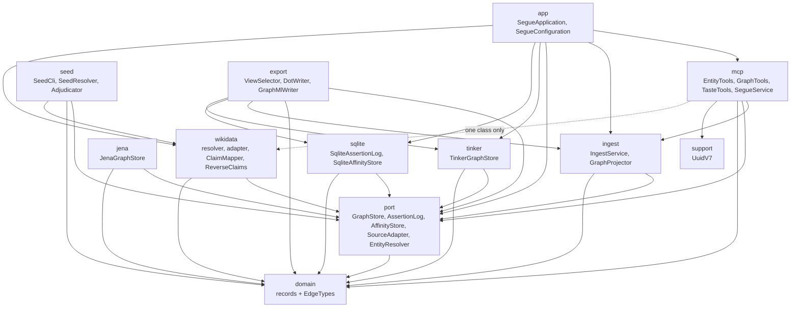
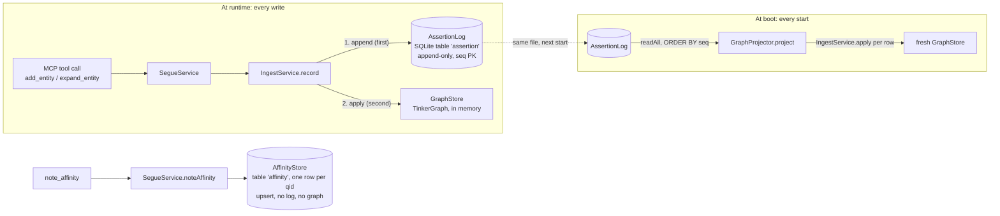
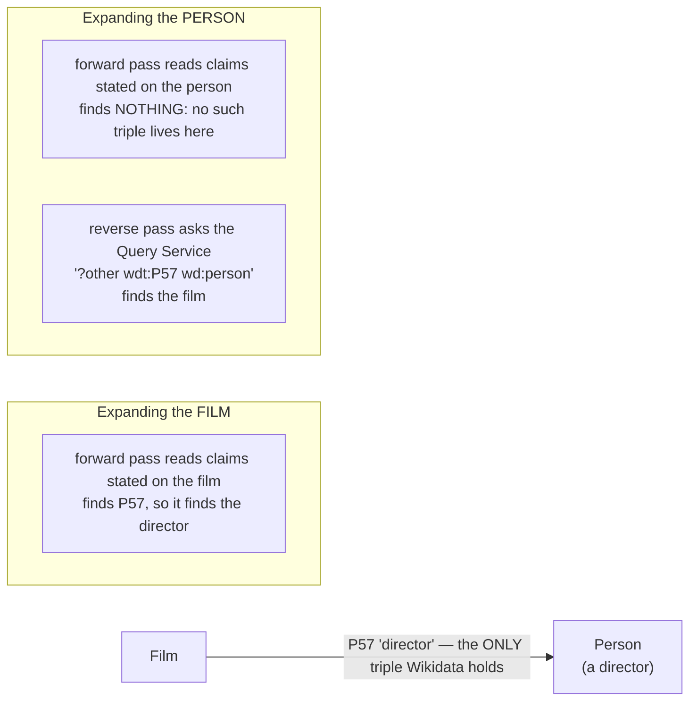
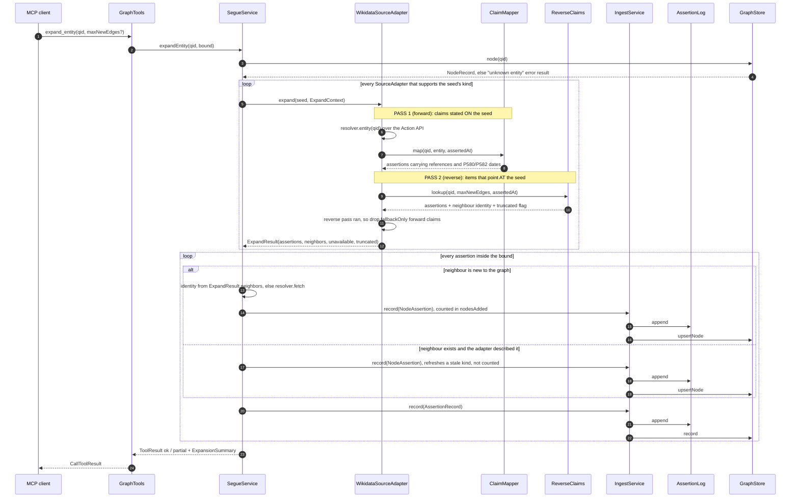

# Segue developer guide

Orientation and mechanism for someone about to change this codebase.

This guide answers **how the system fits together** and **where the load-bearing machinery is**. It
does not re-argue any decision: the [architecture decision records](adr/README.md) are the authority
on *why*, and every section below links to the ones that matter. Where this guide and an ADR
disagree, the ADR wins on intent and the code wins on fact — and the disagreement is a bug in one of
them, to be fixed rather than annotated.

Everything here was checked against the source in `src/main/java/com/robsartin/segue/` and
`src/test/java/com/robsartin/segue/arch/ArchitectureTest.java`, not against the ADRs.

## Contents

- [What segue is, in one pass](#what-segue-is-in-one-pass)
- [The layering](#the-layering)
- [The log is the truth; the graph is a projection](#the-log-is-the-truth-the-graph-is-a-projection)
- [Two-pass ingest](#two-pass-ingest)
- [The taste layer](#the-taste-layer)
- [Adding a source adapter](#adding-a-source-adapter)
- [The testing strategy](#the-testing-strategy)
- [The build and the gate](#the-build-and-the-gate)
- [Bulk seeding](#bulk-seeding)
- [Looking at the graph](#looking-at-the-graph)
- [How to read an ADR against the code](#how-to-read-an-adr-against-the-code)

## What segue is, in one pass

Segue is an MCP server over a personal interest graph. Nodes are entities identified by Wikidata
QIDs; edges are relationships, each carrying the provenance of who claimed it. The payoff feature is
`find_paths`: given two entities, return every route between them, ranked so the best-evidenced
route wins rather than the shortest one.

Three facts explain most of the design:

1. **Nothing is stored as a bare fact.** The unit of ingest is an *assertion* — one source's claim
   that a relationship exists, with a confidence grade and a timestamp. Edges are what you get when
   assertions about the same `(from, type, to)` are folded together.
   See [ADR 19: the assertion log is the source of truth](adr/0019-assertion-log-source-of-truth.md).
2. **The graph is disposable.** It is rebuilt from the log at every boot. That is what makes the
   graph-engine choice reversible, and it is why the log is appended before the graph is touched.
   See [ADR 24: SQLite assertion log](adr/0024-sqlite-assertion-log.md).
3. **What the user likes is not a fact about the world.** Ratings live in a separate table behind a
   separate port and never enter the log or the graph.
   See [ADR 33: taste layer separation](adr/0033-taste-layer-separation.md).

The tool surface is fixed at six tools by
[ADR 26: the MCP tool surface](adr/0026-mcp-tool-surface.md); the tools themselves are the
`@McpTool`-annotated methods on `EntityTools`, `GraphTools` and `TasteTools`, and
`ToolSurfaceTest` fails if a seventh appears.

## The layering

Packages live under `com.robsartin.segue`. The dependency graph below was derived by extracting
every `import com.robsartin.segue.*` from `src/main/java` — it is what the code does, not what the
ADRs describe.



**What the diagram shows.** Dependencies point downward and never back up. `domain` sits at the
bottom and depends on nothing else in the project. `port` depends only on `domain`. The four
adapters (`tinker`, `jena`, `sqlite`, `wikidata`) each depend on `port` and `domain` and on no
sibling adapter. `ingest` depends on `port` and `domain`. `mcp` depends on `ingest`, `port`,
`domain` and `support`, plus one dotted edge to `wikidata` (explained below). `app` depends on
almost everything, because wiring is its job. `support` depends on nothing and is used only by
`mcp`. Two things a reader might expect and will not find: `app` does not import `jena` at all —
the reference engine is reachable only from tests — and nothing imports `domain` from `app`.

`seed` and `export` are the two dev-side tools. Neither is reachable from the application — nothing
imports either, and both are entered through their own `main` behind a Gradle `JavaExec` task — and
their arrows are the interesting part. `seed` reaches `wikidata` and stops: it may not touch
`sqlite`, `tinker`, `jena`, `ingest`, `mcp` or `app`, which is the fence that makes a tool reading a
private list of names safe ([ADR 40](adr/0040-bulk-seeding-as-a-dev-tool.md)). `export` reaches
`sqlite`, `tinker` and `ingest`, because reading the graph is its whole job. Two tools with opposite
relationships to the store cannot share a package and keep either fence meaningful, which is why
[ADR 41](adr/0041-graph-exporter-views-and-formats.md) made them siblings.

### What each package is for

| Package | Contents | Depends on |
| --- | --- | --- |
| `domain` | Records and the borrowed edge vocabulary (`EdgeTypes`). No third-party dependencies at all. | nothing |
| `port` | The seams: `GraphStore`, `AssertionLog`, `AffinityStore`, `SourceAdapter`, `EntityResolver`, and their small value types. | `domain` |
| `tinker` | The chosen Gremlin adapter ([ADR 18](adr/0018-graph-engine-gremlin.md)). | `port`, `domain` |
| `jena` | The RDF reference adapter, kept working as a cross-check. | `port`, `domain` |
| `sqlite` | `SqliteAssertionLog` and `SqliteAffinityStore` — two tables in one file, two connections. | `port`, `domain` |
| `wikidata` | The first source: resolution, expansion, and the two mapping passes. Plain Java, no Spring. | `port`, `domain` |
| `ingest` | `IngestService` (the only write path) and `GraphProjector` (boot replay). | `port`, `domain` |
| `support` | Cross-cutting plain-Java helpers with no project dependencies — currently `UuidV7`. | nothing |
| `mcp` | The tool classes, `SegueService`, the view records, `CorrelationId`. Spring-aware. | `ingest`, `port`, `domain`, `support` |
| `app` | Entry point, all bean wiring, `application.yaml`, transport profiles. Spring-aware. | everything it wires |
| `seed` | The bulk seeding tool ([ADR 40](adr/0040-bulk-seeding-as-a-dev-tool.md)): a name list to `name → QID`, run as `./gradlew resolveNames`. Plain Java, never opens a store. | `port`, `domain`, `wikidata` |
| `export` | The graph exporter ([ADR 41](adr/0041-graph-exporter-views-and-formats.md)): `ViewSelector` and the two writers, run as `./gradlew exportGraph`. Plain Java, read-only. | `port`, `domain`, `ingest`, `sqlite`, `tinker` |

### Which rules a machine enforces

`src/test/java/com/robsartin/segue/arch/ArchitectureTest.java` is the authority here, and it is the
file to read if this table and it ever disagree. Its rules run over `src/main` only
(`ImportOption.DoNotIncludeTests`), so nothing below constrains test code.

| ArchUnit rule | What it forbids | Defends |
| --- | --- | --- |
| `domainHasNoThirdPartyDependencies` | anything in `domain` depending outside `domain`/`java`/`javax` | [ADR 18](adr/0018-graph-engine-gremlin.md) |
| `portDependsOnlyOnDomain` | `port` depending on anything but `domain` and itself | [ADR 18](adr/0018-graph-engine-gremlin.md) |
| `domainValueTypesAreRecordsOrEnums` | a `domain` class that is not a record, enum, package-private, or a private-constructor registry | [ADR 11](adr/0011-java-conventions.md) |
| `tinkerDoesNotDependOnJena`, `jenaDoesNotDependOnTinker`, `sqliteDoesNotDependOnOtherAdapters`, `wikidataDoesNotDependOnOtherAdapters` | adapters collaborating with each other | [ADR 32](adr/0032-layering-and-archunit.md) |
| `adaptersDoNotDependUpward` | any adapter depending on `ingest`, `mcp` or `app` | [ADR 32](adr/0032-layering-and-archunit.md) |
| `noPackageCycles` | any dependency cycle between slices of `com.robsartin.segue` | [ADR 32](adr/0032-layering-and-archunit.md) |
| `springOnlyInAppAndMcp` | `org.springframework.*` anywhere outside `app` and `mcp` | [ADR 25](adr/0025-source-adapter-spi.md), [ADR 32](adr/0032-layering-and-archunit.md) |
| `onlyIngestAppliesClaimsToTheGraph` | calling `GraphStore.record`, `GraphStore.upsertNode` or `AssertionLog.append` from outside `ingest` | [ADR 19](adr/0019-assertion-log-source-of-truth.md) |
| `seedNeverOpensAStore` | `seed` depending on `sqlite`, `tinker`, `jena`, `ingest`, `mcp` or `app` — it resolves names and must not open the database even to read it | [ADR 40](adr/0040-bulk-seeding-as-a-dev-tool.md) |
| `theExporterOnlyReads` | `export` calling `GraphStore.record`/`upsertNode` or `AssertionLog.append`, or depending on `IngestService` at all | [ADR 41](adr/0041-graph-exporter-views-and-formats.md) |
| `nothingWritesToStandardOut` | reading `System.out` anywhere except the one named exception, `SegueApplication` | [ADR 28](adr/0028-mcp-transports.md) |
| `nothingWritesToStandardError`, `noPrintStackTrace`, `noJavaUtilLogging` | bypassing SLF4J | [ADR 30](adr/0030-structured-logging.md) |
| `affinityNeverTouchesTheWorldFactLayer` | a taste-layer type depending on the log, the graph, `IngestService` or the claim records | [ADR 33](adr/0033-taste-layer-separation.md) |
| `theWorldFactLayerNeverTouchesAffinity` | `ingest` or any graph/source adapter depending on a taste-layer type | [ADR 33](adr/0033-taste-layer-separation.md) |
| `onlyJackson3` | Jackson 2's `core`/`databind`/`datatype` packages | [ADR 35](adr/0035-jackson-3-single-json-library.md) |

### Which rules are only convention

These are true of the code today and nothing will stop you breaking them:

- **Adapters depend on `port` and `domain` only.** The sibling and upward halves are enforced; the
  downward restriction is not. An adapter could import `support`, or a fifth adapter package, and
  the build would stay green. [ADR 32](adr/0032-layering-and-archunit.md) records this gap
  explicitly.
- **`ingest` depends on `port` and `domain` only.** No rule says so. Only `noPackageCycles` would
  notice, and only if the new dependency closed a cycle.
- **`mcp` does not reach into an adapter.** It does, once: `SegueService` imports
  `com.robsartin.segue.wikidata.WikidataUnavailableException` so it can catch source failure and
  turn it into a readable tool result. That is the dotted edge in the diagram. No rule forbids it —
  `adaptersDoNotDependUpward` guards the opposite direction — and generalising it (a port-level
  `SourceUnavailableException`) would be a deliberate change, not a tidy-up.
- **Tool names match MCP's charset and length rules.** Enforced by reflection in `ToolSurfaceTest`,
  not by ArchUnit; annotation *attribute values* are not what ArchUnit's structural rules are for.

## The log is the truth; the graph is a projection

Every write goes through `IngestService`, and `IngestService` does two things in a fixed order:
append to the log, then apply to the graph. The graph holds no state the log cannot reproduce.



**What the diagram shows.** Top: at runtime a tool call reaches `SegueService`, which calls
`IngestService.record`; that appends the claim to the SQLite `assertion` table first and applies it
to the in-memory graph second. Bottom: at boot, `GraphProjector.project` reads the whole log in
sequence order and replays each row into a fresh graph through the same apply step. The dotted line
is the same database file surviving between runs. Separately, `note_affinity` reaches
`SegueService.noteAffinity` and writes the `affinity` table directly — it touches neither the log
nor the graph.

### The ordering, and why it is not an accident

`IngestService.record` is three lines: `log.append(assertion)` then `apply(graph, assertion)`. The
two are deliberately **not** atomic. If the graph write fails, the log is ahead of the graph — the
recoverable direction, because the next boot replays it. The reverse order would lose the claim
permanently and leave the log authoritative in name only. Do not "fix" this by wrapping both in a
transaction that rolls the log back.

### Replay shares the apply step

`GraphProjector.project` does not have its own switch over assertion kinds. It calls the same
package-private `IngestService.apply(store, assertion)` that live ingest uses. Two copies of that
dispatch would be free to drift, and a rebuilt graph that silently differs from the one it replaced
defeats the point of keeping a log. Replay is fatal on the first failure and names the 1-based
sequence number: a log that will not project is corruption to surface at boot, not to limp past.

### Nodes are claims too

`LoggedAssertion` is a sealed interface permitting exactly `NodeAssertion` and `AssertionRecord`.
That is what makes replay complete — a mutable node table would be state not derived from the log,
which would break the invariant quietly. `IngestService.apply` pattern-matches on the two:
`NodeAssertion` becomes `graph.upsertNode`, `AssertionRecord` becomes `graph.record`.

### Where the graph engine sits

`GraphStore` is the seam. `TinkerGraphStore` is what `SegueConfiguration` wires;
`JenaGraphStore` is the reference implementation kept alive by the contract tests and by nothing
else. Path *ranking* deliberately lives above the port in `domain/PathRanking`, so both engines
order results identically and neither can drift — see
[ADR 31: rank paths by weakest confidence](adr/0031-path-ranking-by-confidence.md). The cap on how
many routes come back is a constant in `PathRanking`; read it there rather than trusting a number
quoted anywhere else.

## Two-pass ingest

**This is the least obvious mechanism in the codebase and the easiest to break by simplifying.**
`WikidataSourceAdapter.expand` makes two network calls, to two different endpoints, and both are
load-bearing.

### The problem it solves

Wikidata states each relation exactly once, on one of the two entities it connects — and usually not
on the one you are expanding.



**What the diagram shows.** Wikidata holds one triple, `film P57 person`, stated on the film.
Expanding the film reads its own claims and finds the director. Expanding the person reads the
person's claims and finds nothing at all, because the triple is not stored there — only a query
asking "which items point at this person through P57?" recovers it. `EdgeType.wikidataInverted`
fixes the stored *direction* of the edge; it does nothing about *discovery*, which is a different
problem and needs a second call.

The measured effect of adding the second pass, and everything else about the decision, is in
[ADR 36: reverse lookup via SPARQL](adr/0036-reverse-lookup-via-sparql.md).

### The full call, end to end



**What the diagram shows.** An `expand_entity` tool call reaches `SegueService`, which refuses
immediately if the seed is not already in the graph. For each source adapter supporting the seed's
kind, the Wikidata adapter runs the forward pass (`ClaimMapper` over the entity fetched from the
Action API) and then the reverse pass (`ReverseClaims`, one SPARQL query to the Query Service),
dropping fallback-only forward claims once the reverse pass has succeeded. `SegueService` then walks
the bounded assertion list; for each assertion naming a neighbour the graph has never seen it takes
identity from the adapter if the adapter supplied it and otherwise fetches it, records the node
through `IngestService`, and only then records the edge. Every write is log-then-graph. The call
returns a single `ToolResult` whose outcome is `ok` or `partial`, never a thrown exception.

**Identity the adapter supplied is recorded for a neighbour that already exists, too** (issue #55).
A node's kind comes from `KindMapper`'s whitelist, which grows as it is measured against real data,
so recording identity only for absent nodes froze every old node at whatever the mapper said the day
it was discovered — 73% of the CONCEPT nodes with degree ≥ 2 in a real graph were works or groups
the mapper had since learned to classify, and ADR 31's hub rule was demoting routes through them.
`upsertNode` is last-writer-wins and ADR 19 already treats a changed belief as a new claim, so the
refresh is a correction rather than an edit. It is bounded on both sides: an existing neighbour
nobody described is left alone rather than fetched (that would be a round trip each for every
neighbour of every expansion), and a refresh never increments `nodesAdded`, which answers how much
the graph grew. Note it is a different rule from the `described.putIfAbsent` first-writer-wins one a
few lines above it in the same method: that one settles two sources disagreeing *within one call*,
this one re-reads the *same* source *across runs*. Nodes correct themselves only when an expansion
touches them again, so a `KindMapper` improvement still wants a re-seed to propagate.

### Three couplings that must stay coupled

Each of these exists because a hand-kept second list silently stopped covering a relation type. They
look like duplication and are not:

| Coupling | Where | What breaks if you split it |
| --- | --- | --- |
| The forward whitelist **is** `EdgeTypes` | `ClaimMapper.BY_PROPERTY`, built in a static block from `EdgeTypes.all()` | Registering a new edge type stops changing what ingest reads |
| The reverse property set **is** the forward whitelist minus fallback-only | `ClaimMapper.reverseProperties()`, consumed by `ReverseClaims` | The reverse pass stops asking about newly registered types — the exact failure the reverse pass was added to fix |
| Direction is the same rule both ways | `ReverseClaims.assertion()` applies `ClaimMapper`'s rule with the subject swapped | Edges are stored in different directions depending on which pass discovered them |

`ClaimMapper` also throws at class-initialisation time if two `EdgeType`s claim the same Wikidata
property, because `Map.put` would otherwise silently keep the last one and drop the other from
ingest with no error.

### The fallback-only subtraction

Some Wikidata properties are the inverse of others already registered. Asking the reverse question
about both ends of such a pair records one relationship twice. `EdgeType.fallbackOnly` marks that
case, and it acts in two places:

- `ClaimMapper.reverseProperties()` leaves the property out of the SPARQL `VALUES` clause, so the
  reverse pass never asks about it. `ReverseClaims` also ignores such a row if one arrives anyway.
- `WikidataSourceAdapter` drops the *forward* fallback-only claims whenever `reverse.lookup`
  returned rather than threw — **before** `maxNewEdges` is applied, so a duplicate cannot spend a
  slot a real relation could have used.

When the Query Service is unreachable there is no better direction to defer to, so those claims are
kept and the expansion degrades gracefully instead of returning nothing. Registering a property that
is Wikidata's inverse of one already in `EdgeTypes` reintroduces the duplicate: mark it
`fallbackOnly` or do not register it. The measurement and the reasoning are in
[ADR 36](adr/0036-reverse-lookup-via-sparql.md)'s issue-#33 amendment.

### Ordering, bounds and degradation

- **Forward claims are concatenated first**, before `maxNewEdges` is applied. Forward claims can
  carry references and validity qualifiers; a truthy `wdt:` triple carries neither, so when the
  bound bites the better-evidenced claims survive.
- **The bound is spent server-side** in the reverse query, as `ORDER BY DESC(?sitelinks) LIMIT n+1`.
  The extra row is what makes `truncated` an observation rather than a guess.
- **Reverse-discovered edges are graded lower and carry no validity dates**, because a truthy triple
  exposes neither references nor qualifiers. That is a priced-in trade, not a bug.
- **Nothing throws.** An unreachable Action API returns `ExpandResult.unavailable()`; a Query
  Service that fails *after* the Action API succeeded returns the forward claims with
  `sourceUnavailable` set. The caller is a language model, and a partial result it can see beats an
  exception it can only retry.
- **`ReverseClaims` validates the seed QID before interpolating it into SPARQL.** That string
  originates in a model-supplied tool argument; the regex check is the injection defence.

If you are tempted to collapse the adapter to a single call, read
[ADR 36](adr/0036-reverse-lookup-via-sparql.md) first. The second pass is the whole fix.

## The taste layer

"I like this" is a claim about the user. "This band had these members" is a claim about the world.
[ADR 33](adr/0033-taste-layer-separation.md) keeps them apart, and
[ADR 39](adr/0039-affinity-capture-and-read.md) settles the shape of the first one.

Mechanically:

- `AffinityRecord` (`domain`), `AffinityStore` (`port`), `SqliteAffinityStore` (`sqlite`) and
  `TasteTools` (`mcp`) — plus the `AffinityView` the tool layer returns. The taste layer has **no
  package of its own**: each class sits where its layer's convention puts it.
- The affinity table lives in the same SQLite file as the assertion log, on its own connection, with
  no foreign key to anything. The join between the two layers happens exactly once, in
  `SegueService.getEntity`, above both ports.
- `AffinityStore` has no `append` and no `readAll`. Those absences are decisions, and the interface's
  Javadoc explains each one.
- `note_affinity` is the only writer. There is no read tool: `get_entity` carries the rating back.

### The two rules, and why they read differently

Because the boundary is not a package, the two ArchUnit rules match on **type name** rather than on
package name. `AFFINITY_TYPES` is a `DescribedPredicate<JavaClass>` matching any class under
`com.robsartin.segue` whose simple name contains `Affinity` or equals `TasteTools`.
`WORLD_FACT_TYPES` is an explicit set of fully-qualified names: `GraphStore`, `AssertionLog`,
`IngestService`, `LoggedAssertion`, `AssertionRecord`, `NodeAssertion`, `EdgeRecord`, `Provenance`.

| Rule | Direction | Catches |
| --- | --- | --- |
| `affinityNeverTouchesTheWorldFactLayer` | taste → world | giving `AffinityRecord` a `Provenance` so it "looks like everything else", or appending a "user rated this" row to the log |
| `theWorldFactLayerNeverTouchesAffinity` | world → taste | `IngestService` learning that ratings exist, or a source adapter being able to emit one |

Two consequences worth knowing before you add a class:

- **Naming a new class `*Affinity*` opts it into the first rule automatically.** That is usually what
  you want. If you name a taste-layer class something else, it is silently unguarded.
- **`WORLD_FACT_TYPES` is a literal list.** A new world-fact type is not covered until someone adds
  it to that set.

### The logging trap

[ADR 30](adr/0030-structured-logging.md) puts a logger in every service class, which makes the
reflex that improves the rest of `SegueService` wrong in exactly one method.
`SegueService.noteAffinity` logs nothing — not on success, not on any of its three refusals — and its
error strings never echo the rating or the note back. Separately, the sqlite-jdbc driver logs every
statement it executes at TRACE: the SQL text, never the bound parameters. The affinity write is a
prepared statement with `?` placeholders and must stay one, or a rating and a note would reach a log
line written by no code in this repository. `AffinityIsNeverLoggedTest` asserts both halves.

This repository is public. Any affinity example in a test, a document or a commit message must be
invented.

## Adding a source adapter

### Why the SPI is two interfaces

[ADR 25](adr/0025-source-adapter-spi.md) splits resolution from expansion because they are different
capabilities with different implementors. A statistical similarity source can expand an entity it is
given but has nothing to resolve a free-text name against; folding both into one interface would
force it to implement `search` and `fetch` by throwing. Wikidata happens to implement both, which is
what makes the split easy to miss.

| Interface | Answers | Implemented by |
| --- | --- | --- |
| `SourceAdapter` | "what relationships does this source claim about this entity?" | any source with relations to offer |
| `EntityResolver` | "what entity does this name refer to, and what is its identity?" | only sources with an identity space |

`SourceAdapter` is `id()`, `supports(NodeKind)` and `expand(NodeRecord, ExpandContext)` returning an
`ExpandResult`. `EntityResolver` is `id()`, `search(query, kind, limit)` and `fetch(qid)`. Read the
current signatures in `src/main/java/com/robsartin/segue/port/`; the SPI snippet in `CLAUDE.md`
predates `ExpandResult` and is stale on the return type.

`ExpandResult` carries four things, and the last three exist because an empty assertion list is
ambiguous on its own:

- `assertions` — what the source claims.
- `neighbors` — identity for entities on the far end, when the source already knows it. Optional; an
  absent neighbour falls back to a `fetch`. This is an optimisation only the adapter can supply, and
  it stopped an expansion needing one HTTP round trip per discovered neighbour.
- `sourceUnavailable` — the source could not be reached at all.
- `truncated` — there was more, and this is a prefix of it.

### A worked sketch: adding a similarity source

Suppose a "listeners also liked" service. It expands and does not resolve, so it implements one
interface:

```java
package com.robsartin.segue.similarity;

public final class SimilaritySourceAdapter implements SourceAdapter {

  private static final String SOURCE_ID = "similarity";   // also the provenance sourceId

  @Override public String id() { return SOURCE_ID; }

  @Override public boolean supports(NodeKind kind) {
    return kind == NodeKind.GROUP || kind == NodeKind.PERSON;   // narrow, honestly
  }

  @Override public ExpandResult expand(NodeRecord seed, ExpandContext ctx) {
    // 1. call the service, bounded by ctx.maxNewEdges()
    // 2. emit AssertionRecord, never EdgeRecord
    // 3. SIMILAR_TO is a derived type: confidence well below 1.00, no validity dates
    // 4. on failure: return ExpandResult.unavailable(), do not throw
  }
}
```

What you have to do, and in what order:

1. **New package under `com.robsartin.segue`.** Adapters are siblings; it must not import `tinker`,
   `jena`, `sqlite` or `wikidata`, and it must not import `ingest`, `mcp` or `app`. ArchUnit's
   `adaptersDoNotDependUpward` covers the second half; extend the sibling rules to name your package
   for the first.
2. **Plain Java, no Spring.** `springOnlyInAppAndMcp` fails the build otherwise, and the point is
   that the adapter is testable with no application context.
3. **Emit `AssertionRecord`, never `EdgeRecord`, and never touch a store.** `IngestService` is the
   only writer.
4. **Pick the confidence grade deliberately.** See
   [ADR 23: quarantine model-generated assertions](adr/0023-quarantine-model-generated-assertions.md).
   A source that guesses must not be graded like one that cites.
5. **Keep `id()` stable and consistent.** Provenance is keyed on it, and the audit query
   (`GraphStore.assertedBy`) is how you find the blast radius when a source turns out to be wrong.
6. **Wire it in `SegueConfiguration.sourceAdapters`.** That bean returns a `SourceAdapters` record
   wrapping the list — a bare `List<SourceAdapter>` bean would collide with Spring's own
   collection-injection machinery.
7. **Register a new edge type only through the vocabulary.** `EdgeTypes` is the single whitelist;
   adding a Wikidata-backed property that is the inverse of an existing one reintroduces the
   duplicate-edge bug. See [ADR 38](adr/0038-award-received-as-the-first-non-collaboration-edge.md)
   for the standard a new property is held to, and the questions it deliberately leaves open.

Nothing in the graph layer changes. That is the design rule the split exists to keep.

## The testing strategy

The suite is layered on purpose, and each layer catches something the layer below it cannot.

| Layer | Where | What only it can catch |
| --- | --- | --- |
| Domain unit tests | `domain/*Test` | Record invariants, the ranking comparator, edge folding |
| **Contract test, run against both engines** | `port/GraphStoreContract`, extended by `TinkerGraphStoreContractTest` and `JenaGraphStoreContractTest` | One engine drifting from the other. This was a standalone bake-off program; making it a contract test turned the cross-engine comparison into a merge gate |
| Shared fixture | `fixture/Fixture` | Nothing by itself — but it deliberately contains two different edge types between one pair, edges from two sources, overlapping band tenures, and a tempting low-confidence shortcut, so the multigraph, corroboration, time-travel and ranking tests all have something real to be wrong about |
| Stubbed HTTP | `wikidata/StubWikidataServer` on the JDK's own `HttpServer` | Deterministic, offline coverage of parsing, retries, `Retry-After`, and both ingest passes |
| Offline end-to-end | `ingest/WikidataIngestEndToEndTest`, `mcp/SharedAwardRouteTest` | Wikidata response → log → graph → replay, with no network |
| Spring context | `mcp/ToolSurfaceTest`, `app/*Test` | That the starter's own annotation scanner actually finds the tool beans, and that the transports are configured as intended |
| **Real subprocess** | `app/StdioPurityTest` | Output written by a *dependency* or by the framework's own startup. See below |
| Architecture | `arch/ArchitectureTest` | An invariant an ADR states being quietly abandoned |
| **Live, tagged and excluded** | `@Tag("live")` on `WikidataLiveSmokeTest`, `PersonSeededRouteLiveTest`, `SharedAwardRouteLiveTest` | The upstream API changing, and a wrong identifier baked into a fixture |

Three of those deserve more than a table row.

### `GraphStoreContract` is the bake-off

Both `GraphStore` implementations must satisfy the same abstract test. Its assertions compare full
result **sets**, not first elements — comparing only the shortest path is precisely what let a
multigraph bug pass CI once, when the RDF adapter's neighbour query walked nodes rather than edges
and collapsed two distinct relationships into one. If you add a `GraphStore` method, add it to the
contract.

### `StdioPurityTest` is not redundant with `nothingWritesToStandardOut`

On the stdio transport, stdout carries the JSON-RPC protocol and nothing else. That is defended
twice, and the two defences see different things. The ArchUnit rule scans this project's source, so
it cannot see a dependency's own write or the framework's startup output. `StdioPurityTest` launches
the built application as a real subprocess, performs a genuine MCP handshake, calls tools, and
asserts that every line on stdout parses as JSON. Flipping the banner back on under the `stdio`
profile leaves the ArchUnit suite green and turns `StdioPurityTest` red — which is the whole
argument for keeping both.

`SegueApplication` is the single named exception to the ArchUnit rule: `main` captures the real
stdout and redirects `System.out` to stderr before Spring runs, then hands the captured stream to
the MCP transport. That is why the exemption is by class name rather than by package.

### ArchUnit rules are executable ADRs

Each rule in `ArchitectureTest` carries a `.because(...)` naming the decision it defends. When a rule
fails, the message tells you which ADR you are about to contradict — so the choice is "amend the
ADR" or "change the code", not "delete the test".

## The build and the gate

Gradle, not Maven. The wrapper is committed. Versions live in `gradle/libs.versions.toml` and are
never named in `build.gradle.kts` or in prose — including here. The JDK toolchain, the `release`
target and the coverage thresholds all live in `build.gradle.kts`; read them there.

```bash
./gradlew check           # the full CI gate
./gradlew test            # tests only
./gradlew spotlessApply   # fix formatting
./gradlew liveTest        # tagged live tests against the real Wikidata API
./gradlew resolveNames    # bulk name to QID, the seeding tool (ADR 40); needs network
./gradlew exportGraph     # a bounded view of the graph to DOT or GraphML (ADR 41); read-only
```

### What `./gradlew check` actually runs

`check` is Gradle's standard lifecycle task, and this build attaches four things to it:

1. **`spotlessCheck`** — google-java-format over `src/**/*.java`, plus unused-import removal,
   trailing-whitespace and final-newline checks. It is a separate gate from compilation: formatting
   failures fail the build. `./gradlew spotlessApply` fixes them.
2. **`test`** — the JUnit suite, **excluding** `@Tag("live")`.
3. **`jacocoTestReport`** — attached to `check` explicitly in `build.gradle.kts`.
4. **`jacocoTestCoverageVerification`** — line, instruction and branch minimums, also attached
   explicitly. The thresholds are in `build.gradle.kts`.

`ArchitectureTest` is an ordinary JUnit test class, so the architecture rules run as part of step 2.
There is no separate arch task.

The `test` task also sets things that are easy to break:

- `segue.database` is pointed at a file under `build/`. Without it every `@SpringBootTest` would
  inherit the production default and open the developer's real graph.
- **This override is a `systemProperty`, not a `src/test/resources/application.yaml`.** Spring Boot
  resolves `classpath:/application.yaml` to the *first* match, and test resources come first — such a
  file does not override one key, it shadows main's entire configuration. Do not add one.
- `--enable-native-access=ALL-UNNAMED` for sqlite-jdbc's native library.
- `jdk.httpclient.allowRestrictedHeaders=host`, so `StreamableHttpTransportTest` can forge a `Host`
  header and prove the DNS-rebinding defence answers 421.
- `segue.mainRuntimeClasspath`, so `StdioPurityTest` launches a subprocess against exactly what this
  build just compiled rather than a possibly stale jar.

### Why `liveTest` is separate

`liveTest` is a second `Test` task that includes only `@Tag("live")` and is never up-to-date. Those
tests need the network and can fail for reasons that have nothing to do with a change, so they are
not a merge gate.

They are not optional either, and the reason is specific: a fixture asserts whatever its author
wrote. The live smoke test caught a wrong QID on its first run — a plan had used an identifier that
belonged to a different person entirely, and every fixture-backed test would have carried that error
forever. **Run `./gradlew liveTest` deliberately when you touch ingest.**

## Bulk seeding

`seed` turns a list of names into a `name → QID` mapping. It is a **dev-side tool**, not a seventh
MCP tool: ADR 26 pins the surface at six, and importing nine hundred names is a batch job with a
resume file rather than a conversation. ADR 40 is the decision.

```bash
./gradlew resolveNames --args="--list $HOME/names.csv"
```

The list is three columns — `name,kind,status`. Output is a mapping file and a review file beside
it, plus a summary in the log. **None of those files may enter this repository.** A list of who
someone listens to, reads and watches is the personal data ADR 33 governs, this repository is
public, and `*.csv` is gitignored beside `*.db`. Every name in a test, a fixture or a document here
is invented, and that is not a style choice.

### How it decides

Names are folded first, so several spellings of one act cost one lookup — 913 rows are 887 acts.
Then, per act, `search` on the literal spelling, one batched `wbgetentities` for every candidate the
whole chunk produced, and a pure decision in `Adjudicator`. A fallback spelling — a stripped `(N)`
suffix, a stripped honorific — is tried only if the literal one did not settle it, because a
fallback is a guess about what the user meant.

Auto-accept needs three independent signals to agree: the name (label or alias, with a label match
outranking an alias match), the kind (`P31` for the `NodeKind`, and `P106` for a person's
occupation), and a sitelink margin over the runner-up. Anything else goes to review with the reason
and the best candidate, so a person can accept or correct a line without repeating the search.

`P106` here is a **resolver filter, not an edge**. Issue #32 kept it out of the graph vocabulary
because "novelist" is a 36,000-item hub; reading it to choose between six humans with one name
creates no edge.

### Two things this is not allowed to do

It never writes. `ArchitectureTest.seedNeverOpensAStore` forbids `seed` from depending on `sqlite`,
`tinker`, `jena`, `ingest`, `mcp` or `app`, so it cannot open the database even to read it, and
cannot quietly become an MCP tool. It also never needs the network in `check`: the judgement is a
pure function, and everything that speaks HTTP is tested against `StubWikidataServer`.

## Looking at the graph

`export` turns the graph into a picture. It is a **dev-side tool** like `seed`, not a seventh MCP
tool, and it is **read-only**: it never appends to the log and never writes the graph.
[ADR 41](adr/0041-graph-exporter-views-and-formats.md) is the decision.

```bash
# one entity and its edges, to depth 2
./gradlew exportGraph --args="--view neighbourhood --qid Q42 --depth 2 --out $HOME/one.graphml"

# the best route between two entities, as find_paths ranks it — the .dot names the format
./gradlew exportGraph --args="--view route --from Q42 --to Q7 --out $HOME/route.dot"

# only the entities on a list, and the edges between them
./gradlew exportGraph --args="--view subgraph --qids $HOME/names-qids.csv --out $HOME/seeds.graphml"

# everything — needs the explicit flag, and prints its size first
./gradlew exportGraph --args="--view full --all --out $HOME/all.graphml"
```

`--db` defaults the way the server's does: `SEGUE_DB` if set, otherwise
`${user.home}/.segue/segue.db`. `--out` has no default, deliberately — the output belongs outside
the working tree, and a tool that picks a path for you is a tool that writes one into the
repository.

### The format comes from the file name unless you say otherwise

`--out` names a format as plainly as `--format` does, so the extension is read (issue #57, ADR 41's
amendment):

| what you pass | what gets written |
|---|---|
| `--out r.dot`, `--out r.gv` | DOT |
| `--out r.graphml`, `--out r.xml` | GraphML |
| `--out r.txt`, `--out r` | DOT, the residual default |
| `--out r.dot --format dot` | DOT — the two agree |
| `--out r.dot --format graphml` | **refused**, naming both the flag and the extension |

Case does not matter (`.DOT` is `.dot`) and only the file name is read, so `graphs.dot/r.graphml`
is GraphML.

**A contradiction is refused rather than resolved, and there is no override flag.** Neither answer
is safe: obeying `--format` writes the misnamed file that produced issue #57 — GraphML in
`route.dot`, success reported, then `syntax error in line 1 near '>'` inside Graphviz on the XML
declaration — and obeying the extension silently overrules something typed on purpose. When the two
disagree one of them is a typo, and nothing in the parser can tell which. Fix the flag or rename
the file; either is one edit.

The residual default is **DOT**, and it applies only when neither the flag nor the extension says
anything. It renders in one command with a tool that is already installed, where GraphML needs
Gephi first. Every example above that wants GraphML says so in the file name.

### The split that matters: selection, then serialisation

This is the part to preserve when changing anything here.

- **`ViewSelector` chooses what goes in the picture.** It produces a `GraphView` — a description, a
  list of `ViewNode`, a list of `ViewEdge` — and mentions no format anywhere. This is the durable
  layer: the stated destination for this work is an interactive app, and a UI reuses it whole.
- **A `ViewWriter` turns a `GraphView` into bytes.** `DotWriter` and `GraphMlWriter` are pure
  functions of the view: no store, no query, no clock, so both unit-test against invented fixtures
  with no database and no network.
- **They meet in two trivial places**: the `OutputFormat` enum, which maps a command-line word — or
  an `--out` extension — to a writer, and `ExportRun`, which selects, optionally decorates, reports
  the size and hands over.

Adding JSON is a third enum constant, its extensions, and a third writer. If you ever find yourself asking a
question about DOT inside `ViewSelector`, that is the bug.

### Why two readers

`route` and `neighbourhood` go through `GraphStore` — the real traversal and the shared
`PathRanking`, so an exported route is the route `find_paths` returns rather than a second
implementation that drifts.

`full` and `subgraph` go through `LogProjection`, which folds `AssertionLog.readAll()`. `GraphStore`
has no enumerate-all method and adding one would widen the port that exists to make the engine
choice reversible; [ADR 19](adr/0019-assertion-log-source-of-truth.md) makes the log the right place
to ask, because the graph is its projection. `LogProjection` performs the same fold the graph does,
so the two paths cannot disagree about what an edge is.

One number looks like a contradiction and is not: a depth-2 neighbourhood of 179 nodes carried 227
edges, while a subgraph over those same 179 nodes carried 256. The neighbourhood walks outward and
never traverses the edges *between* two nodes at its frontier; the subgraph keeps every edge whose
ends are both on the list.

### Two things this is not allowed to do

It never writes. `ArchitectureTest.theExporterOnlyReads` forbids `export` from calling
`GraphStore.record`, `GraphStore.upsertNode` or `AssertionLog.append`, and from depending on
`IngestService` at all — the second half is the one no other rule covers, and without it a class
here could route a claim through the one legitimate writer. `GraphProjector` is deliberately
allowed: the bounded views need a projection, and the exporter replays the log into a throwaway
in-memory `TinkerGraphStore` exactly as the application does at boot. Nothing durable changes.

It carries no affinity unless asked. [ADR 33](adr/0033-taste-layer-separation.md) is why a
world-fact export is uncontroversial — the world graph can be shared or made public without
carrying personal data — and `--include-affinity` is what makes that stop being true. The tool says
so at the point of export, before the view exists and long before the file does. `*.dot` and
`*.graphml` are gitignored beside `*.csv` and `*.db`; that is the second lock, not the first.

### Which layout engine

For DOT, use `sfdp` or `neato` above a few hundred nodes. `dot` is a hierarchical layout for
directed acyclic structures and degrades badly on a dense multigraph. Above a few thousand nodes,
stop using Graphviz: that is what the GraphML writer is for, and why it carries `kind`, `label`,
`typeCode`, `confidence` and `sourceId` as attributes a tool can filter and colour on.

### Why DOT says the kind twice

A DOT node carries `NodeKind` as **both** its shape and its fill, and that redundancy is the point:
shape survives greyscale printing and colour-blind viewing, colour survives being scaled down, and
neither survives both. The fills are tinted Okabe-Ito colours — the established colour-universal
palette from Okabe and Ito's "Color Universal Design", not one picked by eye — dark enough to stay
apart and light enough for black labels at WCAG AAA; `DotWriter.fill` records which six and why
PERSON and GROUP get the most-separated pair. GraphML gets none of this on purpose: it already
carries `kind` as an attribute and Gephi colours on it natively, so there the presentation stays
the reader's.

## How to read an ADR against the code

One thing looks like drift and is not: an ADR's Context section records what was measured **at the
time the decision was made**. Edge-type counts, edges per seed and route counts there are dated
observations, not claims about today, and correcting them would destroy the evidence the decision
rests on. `EdgeTypes.java` is the authority on the vocabulary and `gradle/libs.versions.toml` on
versions; a figure quoted anywhere else is either a citation or a bug.

A Decision section is different. It describes what the code is supposed to do now, so a Decision
bullet the code contradicts is drift, and the fix is to amend the ADR — dated, saying what it
corrects — or to change the code, whichever one is wrong. This guide used to end with a table of
such items; it was emptied by issues #44 and #46, and if it is ever needed again the table belongs
in an issue rather than here, where it reads as permission to leave the ADRs untrue.

## Where to look next

- [The ADR index](adr/README.md) — all decisions, grouped, each with a one-line summary.
- `CLAUDE.md` — working notes, invariants, and a long list of gotchas already paid for. It is not
  developer documentation and it is occasionally ahead of or behind the code; this guide and the
  ADRs are the ones to trust on structure.
- `docs/design/` — the slice 1 and 2 design document.
