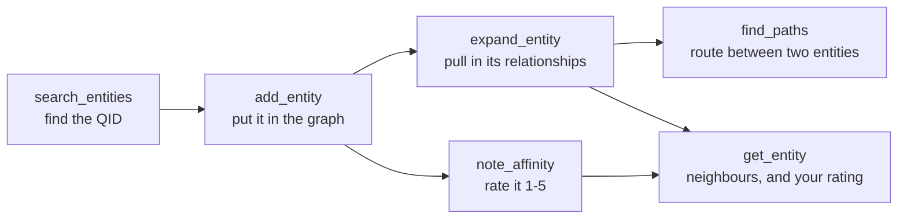
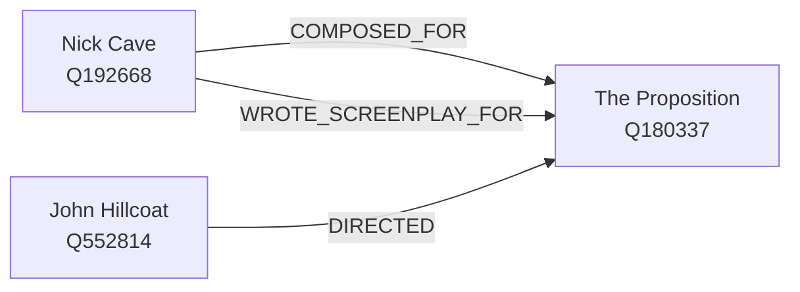
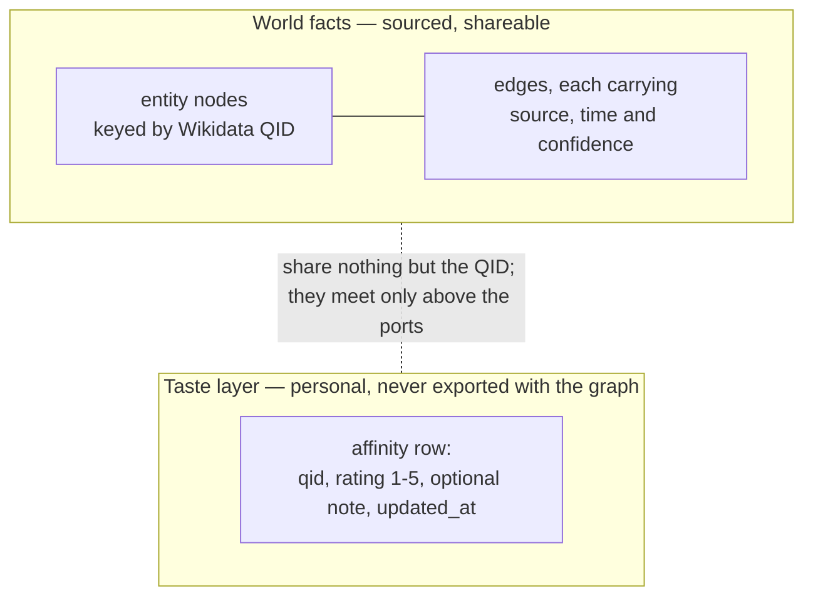

# Segue user guide

Segue is a personal interest graph. You put the things you care about into it — people, bands,
films, books, places — and it pulls in their real relationships from Wikidata. The payoff is an
**explanation**: ask it how two things connect and it hands back the route, hop by hop, with the
source behind every hop. "You like this because X → Y → Z", and every arrow is citable.

You do not use segue directly. You use it through an MCP client — Claude Code, Claude Desktop, or
anything else that speaks the Model Context Protocol — which launches or connects to the segue
server and calls its tools on your behalf. This guide takes you from an unbuilt checkout to a graph
you can ask questions of.

Everything below was executed against a real server before it was written down. See
[how the examples were captured](#how-the-examples-in-this-guide-were-captured) for the method and
the caveats.

## Contents

- [What you need first](#what-you-need-first)
- [Build it](#build-it)
- [Where your graph lives](#where-your-graph-lives)
- [Connect a client](#connect-a-client)
- [The workflow](#the-workflow)
- [The six tools](#the-six-tools)
- [A worked example: Nick Cave to John Hillcoat](#a-worked-example-nick-cave-to-john-hillcoat)
- [A second example: two novelists with no shared credit](#a-second-example-two-novelists-with-no-shared-credit)
- [The taste layer](#the-taste-layer)
- [Honest limits](#honest-limits)
- [Errors you will actually see](#errors-you-will-actually-see)
- [Where to go next](#where-to-go-next)

## What you need first

| You need | Why |
|---|---|
| A JDK | Segue is a Spring Boot application. The toolchain version and the `release` level it compiles at are in `build.gradle.kts`. |
| An internet connection | `add_entity` and `expand_entity` call the live Wikidata API and the Wikidata Query Service. Nothing else does. |
| An MCP client | Segue exposes tools, not a UI. Your client does the talking. |

No database to install and no API key to obtain. Wikidata needs neither.

## Build it

From the repository root:

```bash
./gradlew bootJar
```

That produces a single runnable jar under `build/libs/`. The filename carries the project version,
so check what your build actually produced:

```bash
ls build/libs/segue-*.jar
```

On the run behind this guide that printed:

```
build/libs/segue-0.1.0-SNAPSHOT.jar
```

The examples below use the `build/libs/segue-*.jar` glob so they keep working across version bumps.
An MCP client config file cannot glob, so those blocks spell out an absolute path — substitute the
real filename from the command above.

## Where your graph lives

Everything segue stores — the assertion log, the projected graph and your ratings — is one SQLite
file. By default that is `~/.segue/segue.db`. The `SEGUE_DB` environment variable moves it, and the
default is declared in `src/main/resources/application.yaml` under `segue.database`.

Two reasons to care:

- **`SEGUE_DB` is how you get a scratch graph.** Point it at a temp path and you can experiment
  without touching the graph you have been building. That is exactly what this guide did.
- **The file is personal data and it lives outside the repository on purpose.** Your ratings are in
  it. See [the taste layer](#the-taste-layer).

## Connect a client

Segue speaks two transports, and which one you get is a launch-time choice. They are mutually
exclusive: the `stdio` profile starts no HTTP listener at all, and without that profile nothing
reads stdin. The reasoning is in
[ADR 28, on MCP transports](adr/0028-mcp-transports.md) and
[ADR 37, on the Streamable HTTP transport](adr/0037-streamable-http-transport-on-the-servlet-stack.md).

| Transport | Use it when | Lifecycle |
|---|---|---|
| stdio | Your client can launch a subprocess. This is the normal case. | The client starts and stops segue with the conversation. |
| Streamable HTTP | You want one long-lived segue that several clients share, or you want to poke it with `curl`. | You start and stop the process yourself. |

The tool surface, the protocol revision and the graph behind them are identical either way.

### stdio

```bash
java -Dspring.profiles.active=stdio -jar build/libs/segue-*.jar
```

The server speaks newline-delimited JSON-RPC on stdin and stdout, and logs structured JSON to
stderr. Nothing else is ever allowed to touch stdout — that channel belongs to the protocol.

The client config block:

```json
{
  "mcpServers": {
    "segue": {
      "command": "java",
      "args": [
        "-Dspring.profiles.active=stdio",
        "-jar",
        "/absolute/path/to/segue/build/libs/segue-0.1.0-SNAPSHOT.jar"
      ]
    }
  }
}
```

To keep a separate graph for one client, add an `env` block setting `SEGUE_DB`.

### Streamable HTTP

No profile — plain HTTP is what a bare launch gives you.

```bash
java -jar build/libs/segue-*.jar
```

The endpoint is `http://127.0.0.1:8080/mcp`, and `SEGUE_HTTP_PORT` moves it. The client config
block:

```json
{
  "mcpServers": {
    "segue": {
      "type": "http",
      "url": "http://127.0.0.1:8080/mcp"
    }
  }
}
```

Driving it by hand takes two things every Streamable HTTP client must do: send
`Accept: application/json, text/event-stream` on every POST, and echo back the `Mcp-Session-Id`
that `initialize` returns. Here is the handshake, run against a server started with `SEGUE_DB`
pointing at a scratch file and `SEGUE_HTTP_PORT=8899`:

```bash
curl -si -X POST http://127.0.0.1:8899/mcp \
  -H 'Content-Type: application/json' \
  -H 'Accept: application/json, text/event-stream' \
  -d '{"jsonrpc":"2.0","id":1,"method":"initialize","params":{"protocolVersion":"2025-11-25","capabilities":{},"clientInfo":{"name":"curl","version":"1"}}}'
```

What came back (headers kept, because the session id is one of them):

```http
HTTP/1.1 200
Mcp-Session-Id: 0c956971-d635-4e94-bf72-f186d098890a
Content-Type: application/json

{"jsonrpc":"2.0","id":1,"result":{"protocolVersion":"2025-11-25","capabilities":{"completions":{},"logging":{},"prompts":{"listChanged":true},"resources":{"subscribe":false,"listChanged":true},"tools":{"listChanged":true}},"serverInfo":{"name":"segue","version":"0.1.0-SNAPSHOT"},"instructions":"A personal interest graph. Search for entities, add them, expand them from Wikidata, and find citable routes between two things. Every relationship carries the provenance of who claimed it.\n"}}
```

The protocol revision segue answers with is pinned deliberately, not picked up from whatever is
newest — [ADR 27, on MCP protocol conformance](adr/0027-mcp-protocol-conformance.md) says why and
what would change it.

Send `notifications/initialized` with that session id, and then tool calls work. A
`tools/call` for `search_entities` came back as a Server-Sent Event, which is normal for this
transport:

```
id:0c956971-d635-4e94-bf72-f186d098890a
event:message
data:{"jsonrpc":"2.0","id":2,"result":{"content":[{"type":"text","text":"{\"outcome\":\"ok\",\"detail\":\"2 candidate(s) for \\\"Nick Cave\\\"\",...}"}],"isError":false,"structuredContent":{"outcome":"ok","detail":"2 candidate(s) for \"Nick Cave\"","payload":[{"qid":"Q192668","label":"Nick Cave","description":"Australian musician and singer","kind":"CONCEPT"},{"qid":"Q1051182","label":"Nick Cave and the Bad Seeds","description":"Australian rock band","kind":"CONCEPT"}]}}}
```

*(The `text` block is the same JSON as `structuredContent`, escaped; it is elided above so the
line fits. Every tool returns both, so a client that renders only `content` still sees the answer.)*

### It is deliberately reachable only from this machine

The HTTP server binds to `127.0.0.1` and refuses any request whose `Origin` or `Host` is not
loopback. That is not belt-and-braces. Binding to loopback alone would still let a web page open in
your own browser POST to `localhost:8080` — the DNS-rebinding attack. A request with a foreign
`Origin` is rejected outright:

```bash
curl -si -X POST http://127.0.0.1:8899/mcp \
  -H 'Content-Type: application/json' \
  -H 'Accept: application/json, text/event-stream' \
  -H 'Origin: http://evil.example' \
  -d '{"jsonrpc":"2.0","id":3,"method":"initialize","params":{...}}'
```

```http
HTTP/1.1 403
Content-Type: text/plain;charset=UTF-8
```

There is no authentication, because there is nothing to authenticate to a server only you can
reach. Making segue reachable from anywhere else is a code change plus a decision about auth — see
[ADR 37](adr/0037-streamable-http-transport-on-the-servlet-stack.md).

## The workflow

Four tools in a line get you from a name to an explanation, and two more sit off to the side.



**What that diagram shows.** `search_entities` leads to `add_entity`, which leads to
`expand_entity`, which leads to `find_paths` — that is the main line. Two side branches leave it:
`add_entity` also leads to `note_affinity`, and both `expand_entity` and `note_affinity` lead to
`get_entity`, which is where you read back neighbours and ratings together.

The shape to hold on to: **nothing works on an entity you have not added, and `find_paths` needs
both ends added *and* enough expansion to have built an edge between them.** Two entities you added
but never expanded have no route between them, because there are no edges yet.

## The six tools

There are six, and there will not be a seventh without an ADR saying why —
[ADR 26, on the MCP tool surface](adr/0026-mcp-tool-surface.md) pins the count.

| Tool | What it does | Writes? | Calls the network? |
|---|---|---|---|
| `search_entities` | Free-text search for candidates carrying Wikidata QIDs | No | Yes |
| `add_entity` | Fetch one QID's canonical identity and put it in the graph | Yes | Yes |
| `expand_entity` | Discover an entity's relationships and record them as edges | Yes | Yes |
| `get_entity` | One entity, its neighbours grouped by relationship, and your rating | No | No |
| `find_paths` | Every route between two entities, ranked, with citations | No | No |
| `note_affinity` | Record what you think of one entity | Yes (taste layer only) | No |

Each tool ships a long description that your MCP client reads. What follows is the part a person
needs, especially the traps.

### `search_entities(query, kind?, limit?)`

Turns a name into candidates. Each candidate has a QID, a label and a short **description** — use
the description to disambiguate, because "Nick Cave" matches a musician, a band, a veterinary
researcher, a fabric sculptor and a painting by Howard Arkley. Writes nothing.

**Trap: the `kind` argument does not filter.** Wikidata's search endpoint cannot report an entity's
kind at search time, so `kind` is accepted and then ignored, and every candidate's `kind` field is a
placeholder — in the capture below, every one of five results came back as `CONCEPT`, including
three people, a band and a painting. Do not read it as fact. The real kind is settled when you add the entity. An
empty result means the text matched nothing; it never means "no entity of that kind exists".

The default limit is set in the tool itself and is capped by the resolver; pass `limit` to change
it.

### `add_entity(qid)`

Fetches one entity's canonical identity from Wikidata and stores it. Calling it twice with the same
QID is safe — it re-fetches. Returns the stored node, or an error if Wikidata has no entity at that
QID.

This adds the **node only**. It adds no relationships. A freshly added entity has no neighbours and
takes part in no routes until you expand it.

### `expand_entity(qid, maxNewEdges?)`

The one that does the work. It asks every source adapter that supports the entity's kind (currently
Wikidata) for its relationships, and records what comes back as new edges plus, where needed, new
neighbour nodes.

It works on a **person or a band**, not only on a film or an album, and that took a fix to be true:
Wikidata states a creative relation once, on the work ("this film's director is X"), so expanding a
person also has to ask which items name them. See
[ADR 36, on reverse lookup via SPARQL](adr/0036-reverse-lookup-via-sparql.md).

**Trap: it takes a few seconds, and your client may look hung.** It makes two network calls for the
expansion itself plus one per neighbour whose identity the source could not supply. On the capture
run, expanding a well-linked musician took 3.1 seconds and expanding a film director took 0.5
seconds, wall clock, on a warm connection. Expect a wait; do not assume a stall.

**Trap: `maxNewEdges` bounds it, and the bound bites.** Omit it to use the server's configured
default (declared as `segue.max-new-edges` in `src/main/resources/application.yaml`). The bound
keeps the most-linked neighbours rather than an arbitrary slice, so a small bound still returns the
famous ones first — but the result tells you when it stopped early, and you should believe it.

### `get_entity(qid)`

Reads one entity back: the node, its neighbours **grouped by the relationship type** connecting
them, and your affinity if you have rated it. Read-only and purely local — it never calls Wikidata.

Neighbours only appear after `expand_entity` has run for that entity. Returns an error, not an
empty result, if the QID has not been added.

### `find_paths(fromQid, toQid, maxHops?)`

The payoff. Every route between two entities up to `maxHops` relationships apart, ranked
most-explanatory-first. Two things decide the order, and the second one settles ties in the first:
a route is demoted if it passes through a **hub**, and among routes that are equally specific, one
built on well-corroborated edges outranks a shorter one resting on a single unconfirmed source. A
node is a hub either way it can be empty: a concept so many entities touch that sharing it says
nothing about either end (a Walk of Fame star, the standard example), or a body one is *elected*
to rather than works in — an academy, a learned society, a guild — where "we are both members"
reports a career rather than anything the two did together. See
[ADR 31, on path ranking by confidence](adr/0031-path-ranking-by-confidence.md). Each route comes
back hop by hop with the assertions behind it, so you can cite it.

**Trap: both ends must already be in the graph.** If either is missing you get an error, not an
empty result — that distinction is deliberate, so you can tell "not connected" from "you forgot to
add it".

**Trap: empty is not the same as unrelated.** An empty result means no route exists *within
`maxHops`*. Try a larger bound. It also, very often, means you have not expanded enough — see the
worked example, where the first `find_paths` returned nothing for exactly that reason.

### `note_affinity(qid, rating, note?)`

Covered in [the taste layer](#the-taste-layer) below.

## A worked example: Nick Cave to John Hillcoat

This is the whole loop, start to finish. Every response below is pasted from the run.

### 1. Search for a name

```json
{ "name": "search_entities", "arguments": { "query": "Nick Cave", "limit": 5 } }
```

```json
{
  "outcome": "ok",
  "detail": "5 candidate(s) for \"Nick Cave\"",
  "payload": [
    { "qid": "Q192668",   "label": "Nick Cave",                     "description": "Australian musician and singer", "kind": "CONCEPT" },
    { "qid": "Q1051182",  "label": "Nick Cave and the Bad Seeds",   "description": "Australian rock band",           "kind": "CONCEPT" },
    { "qid": "Q79330082", "label": "Nick Cave",                     "description": "veterinary researcher",          "kind": "CONCEPT" },
    { "qid": "Q24218",    "label": "Nick Cave",                     "description": "African-American fabric sculptor, dancer, and performance artist (born 1959)", "kind": "CONCEPT" },
    { "qid": "Q104373893","label": "Nick Cave",                     "description": "painting by Howard Arkley",      "kind": "CONCEPT" }
  ]
}
```

Five candidates, and only the first is the musician. The `description` field is what tells them
apart; the `kind` field, as promised, is `CONCEPT` for all five and tells you nothing.

### 2. Add the one you meant

```json
{ "name": "add_entity", "arguments": { "qid": "Q192668" } }
```

```json
{
  "outcome": "ok",
  "detail": "added Q192668 (Nick Cave)",
  "payload": { "qid": "Q192668", "kind": "PERSON", "label": "Nick Cave" }
}
```

The real kind — `PERSON` — arrives here, not at search time.

### 3. Look at what you have (nothing yet)

```json
{ "name": "get_entity", "arguments": { "qid": "Q192668" } }
```

```json
{
  "outcome": "ok",
  "detail": "Nick Cave: 0 edge(s), 0 type(s)",
  "payload": {
    "node": { "qid": "Q192668", "kind": "PERSON", "label": "Nick Cave" },
    "neighborsByType": [],
    "affinity": null
  }
}
```

Adding gives you an identity, not a neighbourhood.

### 4. Expand

```json
{ "name": "expand_entity", "arguments": { "qid": "Q192668" } }
```

```json
{
  "outcome": "partial",
  "detail": "9 neighbour(s) could not be resolved and were skipped (correlation 01a03bd8-a4ea-7ee7-bd80-9ed89600db5b)",
  "payload": {
    "qid": "Q192668",
    "nodesAdded": 80,
    "edgesAdded": 90,
    "skippedNeighbors": 9,
    "truncated": false,
    "sourceUnavailable": false
  }
}
```

This call took 3.1 seconds. Three things in that response are worth reading every time:

- **`outcome: "partial"` is not a failure.** It means the call did its job and has something to
  tell you. Here, nine neighbours could not be resolved to identities and were left out.
- **`truncated`** says whether `maxNewEdges` cut the result short. It did not.
- **`sourceUnavailable`** says whether a source was down and the expansion fell back to a degraded
  path.

The `correlation` id in the detail string is a per-request trace id. Quote it if you are reading
logs.

### 5. Add the other end, and expand that too

```json
{ "name": "add_entity", "arguments": { "qid": "Q552814" } }
```

```json
{
  "outcome": "ok",
  "detail": "added Q552814 (John Hillcoat)",
  "payload": { "qid": "Q552814", "kind": "PERSON", "label": "John Hillcoat" }
}
```

Asking for routes at this point returns nothing, and this is the single most common way to be
confused by segue:

```json
{ "name": "find_paths", "arguments": { "fromQid": "Q192668", "toQid": "Q552814", "maxHops": 3 } }
```

```json
{ "outcome": "ok", "detail": "0 route(s) from Q192668 to Q552814", "payload": [] }
```

Cave's expansion put *The Proposition* in the graph and connected Cave to it. Nothing has yet said
that Hillcoat **directed** it, because Hillcoat has only been added, not expanded. So expand him:

```json
{ "name": "expand_entity", "arguments": { "qid": "Q552814" } }
```

```json
{
  "outcome": "partial",
  "detail": "1 neighbour(s) could not be resolved and were skipped (correlation 01a03bd9-cd87-797d-9b21-8c10611352d0)",
  "payload": {
    "qid": "Q552814",
    "nodesAdded": 6,
    "edgesAdded": 10,
    "skippedNeighbors": 1,
    "truncated": false,
    "sourceUnavailable": false
  }
}
```

### 6. Ask for the route

```json
{ "name": "find_paths", "arguments": { "fromQid": "Q192668", "toQid": "Q552814", "maxHops": 3 } }
```

```json
{ "outcome": "ok", "detail": "8 route(s) from Q192668 to Q552814", "payload": [ ... ] }
```

Eight routes. Summarised — this table is a condensation of the eight `hops` arrays in that
response, not extra output:

| # | First hop | Second hop |
|---|---|---|
| 1 | Nick Cave `ACTED_IN` Ghosts… of the Civil Dead | Hillcoat `DIRECTED` it |
| 2 | Nick Cave `COMPOSED_FOR` The Proposition | Hillcoat `DIRECTED` it |
| 3 | Nick Cave `COMPOSED_FOR` The Road | Hillcoat `DIRECTED` it |
| 4 | Nick Cave `COMPOSED_FOR` Lawless | Hillcoat `DIRECTED` it |
| 5 | Nick Cave `COMPOSED_FOR` Ghosts… of the Civil Dead | Hillcoat `DIRECTED` it |
| 6 | Nick Cave `WROTE_SCREENPLAY_FOR` Lawless | Hillcoat `DIRECTED` it |
| 7 | Nick Cave `WROTE_SCREENPLAY_FOR` The Proposition | Hillcoat `DIRECTED` it |
| 8 | Nick Cave `WROTE_SCREENPLAY_FOR` Ghosts… of the Civil Dead | Hillcoat `DIRECTED` it |

Rows 2 and 7 are the same two films and the same two people, and they are **not** a duplicate.
Cave scored *The Proposition* and Cave wrote *The Proposition*. Two relationships between one pair
of nodes, and segue keeps both as distinct routes. That is the multigraph property the whole design
rests on, and it is why row 2 and row 7 are different answers to "how are these two connected".



**What that diagram shows.** Three nodes. Nick Cave has *two separate arrows* to The Proposition,
one labelled `COMPOSED_FOR` and one labelled `WROTE_SCREENPLAY_FOR`. John Hillcoat has one arrow to
The Proposition labelled `DIRECTED`. Cave and Hillcoat are not directly connected to each other at
all — the film is the bridge, and there are two ways over it.

Here is one of those eight routes in full, verbatim, so you can see the citations:

```json
{
  "hops": [
    {
      "from": { "qid": "Q192668", "kind": "PERSON", "label": "Nick Cave" },
      "edge": {
        "fromQid": "Q192668",
        "toQid": "Q180337",
        "typeCode": "COMPOSED_FOR",
        "validFrom": null,
        "validTo": null,
        "sources": [
          {
            "sourceId": "wikidata",
            "sourceRef": "wdqs:Q180337:P86:Q192668",
            "assertedAt": "2026-08-26T02:14:09.011784Z",
            "confidence": 0.8
          }
        ]
      },
      "to": { "qid": "Q180337", "kind": "WORK", "label": "The Proposition" },
      "traversedBackwards": false
    },
    {
      "from": { "qid": "Q180337", "kind": "WORK", "label": "The Proposition" },
      "edge": {
        "fromQid": "Q552814",
        "toQid": "Q180337",
        "typeCode": "DIRECTED",
        "validFrom": null,
        "validTo": null,
        "sources": [
          {
            "sourceId": "wikidata",
            "sourceRef": "wdqs:Q180337:P57:Q552814",
            "assertedAt": "2026-08-26T02:15:25.109685Z",
            "confidence": 0.8
          }
        ]
      },
      "to": { "qid": "Q552814", "kind": "PERSON", "label": "John Hillcoat" },
      "traversedBackwards": true
    }
  ]
}
```

Reading a hop:

| Field | Means |
|---|---|
| `edge.sources[].sourceRef` | The exact claim behind this hop. `wdqs:Q180337:P86:Q192668` is a Wikidata Query Service triple: on item Q180337, property P86 (composer), value Q192668. |
| `edge.sources[].confidence` | How much this claim is trusted. A Wikidata statement that cites a reference grades 1.00; an unreferenced statement, and any relationship discovered by reverse lookup, grades 0.80. The scale is [ADR 23](adr/0023-quarantine-model-generated-assertions.md). |
| `edge.sources[].assertedAt` | When *segue* learned it — not when it was true in the world. Those are separate dimensions. |
| `validFrom` / `validTo` | When it was true in the world. `null` here, and that is expected for a reverse-discovered edge, which carries no qualifiers to derive them from. |
| `traversedBackwards` | Whether the walk crossed this edge against its stored direction. `true` on hop two, because the edge is stored Hillcoat → film and the route runs film → Hillcoat. |

That last column is why a route reads naturally in both directions without segue having to store
each relationship twice.

## A second example: two novelists with no shared credit

Films and bands connect through shared credits. Single-authored novels do not, and for a while that
broke literature in segue entirely: three science-fiction novelists added and expanded shared no
node, and `find_paths` returned zero routes for every pair (issue #32). The fix was to register exactly one
non-collaboration relationship — `RECEIVED_AWARD` — and it is worth seeing, because it is a
different *kind* of route.

Add and expand both, then ask:

```json
{ "name": "find_paths", "arguments": { "fromQid": "Q188987", "toQid": "Q277308", "maxHops": 3 } }
```

```json
{ "outcome": "ok", "detail": "2 route(s) from Q188987 to Q277308", "payload": [ ... ] }
```

Two routes, in the order returned:

| # | Route | Weakest confidence on the route |
|---|---|---|
| 1 | William Gibson `RECEIVED_AWARD` Hugo Award for Best Novel ← `RECEIVED_AWARD` John Scalzi | 1.0 |
| 2 | William Gibson `RECEIVED_AWARD` Seiun Award for Best Translated Long Work ← `RECEIVED_AWARD` John Scalzi | 0.8 |

The order is the ranking doing its job: both routes are two hops, so length cannot separate them,
and the route built entirely from *referenced* Wikidata statements is returned ahead of the one
whose statements cite no source. That is
[ADR 31](adr/0031-path-ranking-by-confidence.md) in one observation.

Awards are the *only* non-collaboration edge in the vocabulary, and that restraint is deliberate —
"shares a genre" or "shares an occupation" would connect everybody to everybody through a hub node
with tens of thousands of members. The measurements behind that are in
[ADR 38, on award received as the first non-collaboration edge](adr/0038-award-received-as-the-first-non-collaboration-edge.md).
The practical consequence for you: **a person who has won nothing and collaborated with nobody in
your graph will connect to nothing.**

Some awards turn out to be hubs too, which is what the specificity half of the ranking is for. An
award for one *work* — a Hugo for a particular novel, an Oscar for a particular performance — is a
real thing two people share. Recognition of a *career* — a Walk of Fame star, a hall of fame, a
lifetime achievement award — is collected by everyone notable, so it connects everyone to everyone.
Those edges are still in the graph and those routes are still returned; they are returned **last**,
behind anything that explains more. If the only route between two people runs through a Walk of
Fame star, that is the honest answer and you will see it — after everything better.

Membership works the same way and needed its own rule, because bands are memberships too and they
are exactly the connectors this is for. An academy, a learned society or a guild is something you
are elected to, so a route through one says what a lifetime achievement award says; a band is
something you were *in*. What separates them is the kind of body Wikidata says it is, not how many
members the graph happens to hold — see ADR 31's second amendment for the measurement.

## The taste layer

`note_affinity(qid, rating, note?)` records what *you* think of one entity. It is the only tool
that writes personal data, and it is kept rigorously apart from the sourced world facts.



**What that diagram shows.** Two boxes that do not overlap. The upper box, "world facts", holds
entity nodes keyed by QID and edges carrying source, time and confidence. The lower box, "taste
layer", holds a single affinity row per entity: qid, rating, optional note, timestamp. A dashed
line joins them, labelled to say they share nothing but the QID and meet only above the ports — the
two layers never touch below the service boundary. The reasoning is
[ADR 33, on taste layer separation](adr/0033-taste-layer-separation.md) and
[ADR 39, on affinity capture and read](adr/0039-affinity-capture-and-read.md).

### Rating something

**The values below are invented for this guide.** This repository is public and real ratings never
appear in it.

```json
{
  "name": "note_affinity",
  "arguments": {
    "qid": "Q192668",
    "rating": 4,
    "note": "Placeholder note for the docs, not a real opinion."
  }
}
```

```json
{
  "outcome": "ok",
  "detail": "noted affinity for Q192668",
  "payload": {
    "rating": 4,
    "note": "Placeholder note for the docs, not a real opinion.",
    "updatedAt": "2026-08-26T02:14:15.940813Z"
  }
}
```

### Reading it back

There is no seventh tool for this. `get_entity` returns the affinity beside the neighbours (trimmed
here to two type groups and two neighbours each, so the affinity block is visible):

```json
{
  "outcome": "ok",
  "detail": "Nick Cave: 89 edge(s), 9 type(s), rated",
  "payload": {
    "node": { "qid": "Q192668", "kind": "PERSON", "label": "Nick Cave" },
    "neighborsByType": [
      { "typeCode": "ACTED_IN", "neighbors": [
        { "qid": "Q104894274", "kind": "WORK", "label": "The Myth" },
        { "qid": "Q97798779",  "kind": "WORK", "label": "Idiot Prayer" } ] },
      { "typeCode": "AUTHORED", "neighbors": [
        { "qid": "Q2715462", "kind": "WORK", "label": "And the Ass Saw the Angel" },
        { "qid": "Q6411731", "kind": "WORK", "label": "King Ink II" } ] }
    ],
    "affinity": {
      "rating": 4,
      "note": "Placeholder note for the docs, not a real opinion.",
      "updatedAt": "2026-08-26T02:14:15.940813Z"
    }
  }
}
```

Note the `detail` string gains the word `rated`, and there is no way to list everything you have
ever rated. That absence is a decision, not a gap — a bulk read would hand out the entire taste
layer in one call for a use case that does not exist yet.

### The rules, and why each one

| Rule | Consequence for you |
|---|---|
| A rating is a **required integer from 1 to 5** | There is no rating-free note. "Not for me" is a 1 or a 2, not a separate concept — low ratings are as useful as high ones. |
| The note is **optional** | A bare rating is a complete entry. Nothing should press you for words you did not offer. |
| **Re-rating overwrites** | One row per entity, latest wins, with a timestamp of the change. There is no history, and taste drift is deliberately not retained. |
| **The entity must already be in the graph** | Something Wikidata does not have cannot be rated at all. That is an accepted cost of having one identity spine. |
| **Affinity never enters the graph** | The world graph can be exported or shared with none of it attached. |

Re-rating, observed:

```json
{ "name": "note_affinity", "arguments": { "qid": "Q192668", "rating": 3 } }
```

```json
{
  "outcome": "ok",
  "detail": "noted affinity for Q192668",
  "payload": { "rating": 3, "note": null, "updatedAt": "2026-08-26T02:14:15.949211Z" }
}
```

The previous rating and its note are gone, replaced. `updatedAt` moved.

### Privacy

Affinity is never logged — not the rating, not the note, not in an error message. Refusals do not
echo the value they refused: rating an entity 9 returns "rating must be an integer from 1 to 5",
never "…, got 9", because an error string is the likeliest thing on that path to be logged by
something upstream. Your ratings live in the SQLite file under your home directory, outside this
repository, and that is the actual protection — not the repository's visibility.

## Honest limits

All but one of these were observed directly on the capture run, and the exception says so where it
appears. None of them is a bug you should report.

### Wikidata does not have everything, and what it does not have cannot be added

```json
{ "name": "search_entities", "arguments": { "query": "Eliot Peper" } }
```

```json
{ "outcome": "ok", "detail": "0 candidate(s) for \"Eliot Peper\"", "payload": [] }
```

No candidates means no QID, which means no `add_entity`, which means no rating and no routes. Segue
is a graph of things Wikidata knows about. That is a deliberate consequence of pinning identity to
one spine, and there is no workaround inside segue today.

### Being *in* Wikidata is not the same as being connected in it

Reina del Cid is in Wikidata, so she can be found and added:

```json
{ "outcome": "ok", "detail": "1 candidate(s) for \"Reina del Cid\"",
  "payload": [ { "qid": "Q24525280", "label": "Reina del Cid",
                 "description": "American singer-songwriter", "kind": "CONCEPT" } ] }
```

And expanding her finds nothing at all:

```json
{
  "outcome": "ok",
  "detail": "expanded Q24525280: 0 edge(s), 0 new node(s)",
  "payload": { "qid": "Q24525280", "nodesAdded": 0, "edgesAdded": 0,
               "skippedNeighbors": 0, "truncated": false, "sourceUnavailable": false }
}
```

A sparsely-linked entity is a valid node with no neighbourhood. It will appear in no route. Nothing
went wrong; there is simply nothing recorded about who she worked with. Expect this for
independent, regional and recent artists.

### Expansion is bounded, and the bound is visible

Passing a deliberately tiny `maxNewEdges`:

```json
{ "name": "expand_entity", "arguments": { "qid": "Q1051182", "maxNewEdges": 5 } }
```

```json
{
  "outcome": "partial",
  "detail": "the result was truncated at the bound of 5 (correlation 01a03bd9-d109-7ec3-bdf0-f171569cbd99)",
  "payload": { "qid": "Q1051182", "nodesAdded": 4, "edgesAdded": 5,
               "skippedNeighbors": 0, "truncated": true, "sourceUnavailable": false }
}
```

`truncated: true` is the signal, and the detail string names the bound that was hit. Raise
`maxNewEdges` and call again — expanding the same entity twice is safe, and the second call is
faster because its neighbours are already known nodes.

One subtlety worth knowing if your graph is literary: forward claims are considered before
reverse-discovered ones, so a novelist's awards are kept ahead of their discovered works. At a small
bound you can get an expansion that is almost all awards. That is by design — forward claims carry
references and qualifiers that truthy triples do not — and it is documented in
[ADR 36](adr/0036-reverse-lookup-via-sparql.md).

### `AUTHORED` under-reports for academic seeds

Wikidata's main Query Service holds only the main graph; scholarly articles have moved to a
separate endpoint. So `AUTHORED` (Wikidata's P50) silently returns fewer works than exist for
anyone whose output is mostly papers. There is no error — just a smaller number. The measurement,
and why segue documents this rather than federating the two endpoints, is in
[ADR 36](adr/0036-reverse-lookup-via-sparql.md).

*(This one was not re-measured for this guide; the figures live in that ADR.)*

### Some neighbours are skipped

`skippedNeighbors` counts neighbours the source could not resolve to an identity. They are dropped
rather than guessed at. Every expansion of a well-connected entity in the capture run skipped at
least one.

### There is no way to remove anything

Nothing in the tool surface retracts a claim, deletes an entity or unrates something. Retraction is
expressible against the assertion log but deliberately unexposed. Re-rating overwrites, which is the
only "undo" available.

## Errors you will actually see

Every one of these is a readable error result with `isError: true`, not a protocol crash — your
client can show it to you and carry on. All captured verbatim, minus the correlation ids.

| What you did | What comes back |
|---|---|
| `find_paths` with an end that was never added | `unknown entity: Q42 — add it before searching for routes` |
| `get_entity` on an entity that was never added | `unknown entity: Q42` |
| `note_affinity` with a rating outside 1-5 | `rating must be an integer from 1 to 5` |
| `add_entity` with a QID Wikidata does not have | `no such entity: Q999999999` |

The trailing `(correlation …)` on each is a per-request trace id, useful for matching an error to a
log line.

## How the examples in this guide were captured

Captured on 2026-08-26 against the jar built from this branch by `./gradlew bootJar`.

- The stdio examples were produced by a small Python driver that speaks newline-delimited JSON-RPC
  to `java -Dspring.profiles.active=stdio -jar build/libs/segue-*.jar`: `initialize` with protocol
  revision `2025-11-25`, then `notifications/initialized`, then `tools/call` per step.
- The HTTP examples were produced with the `curl` commands shown, against a plain
  `java -jar build/libs/segue-*.jar` on `SEGUE_HTTP_PORT=8899`.
- **`SEGUE_DB` pointed at a throwaway file in a temp directory for every call.** No real graph and
  no real ratings were involved anywhere in this guide.
- Every rating and note shown is invented.
- Responses are pasted as returned. Whitespace in the JSON blocks is reflowed to fit the page and
  long arrays are elided with `...`, but no value is altered; where a response is trimmed, the
  trimming is stated next to it. Timings are wall clock from that run on one machine and one connection —
  treat them as an order of magnitude, not a benchmark.

## Where to go next

- [The architecture decision records](adr/README.md) — every design choice, with its alternatives and its
  consequences. Start with [ADR 26](adr/0026-mcp-tool-surface.md) if you want to know why there are
  six tools and not seven.
- `docs/developer-guide.md` — building, testing and extending segue.
- [The engine bake-off](engine-bake-off.md) — the two-engine comparison that chose the graph
  database underneath all of this.
- [The project README](../README.md) — the short version of everything above.
